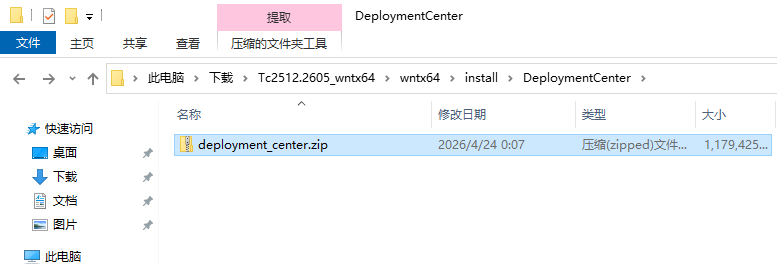
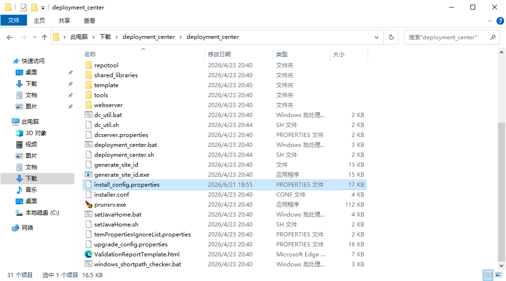
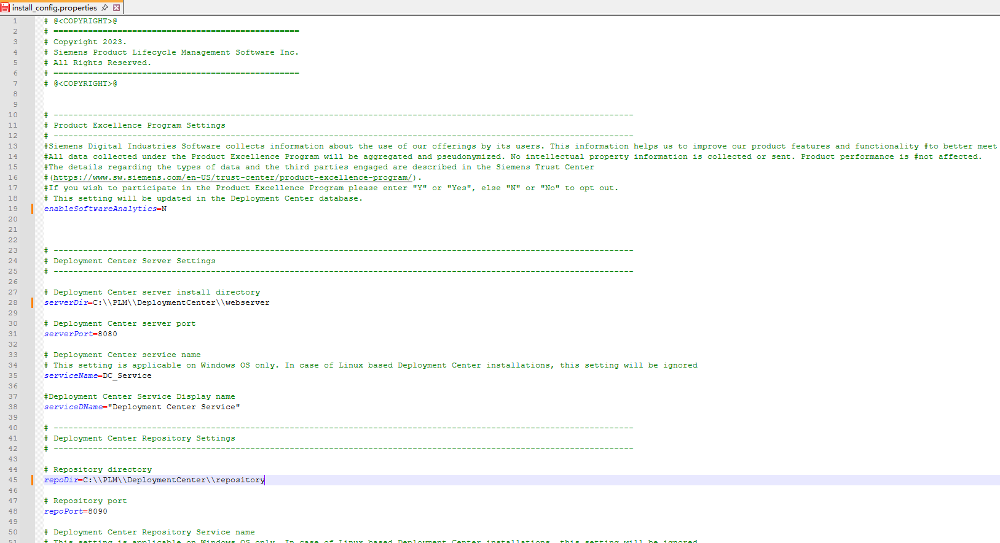
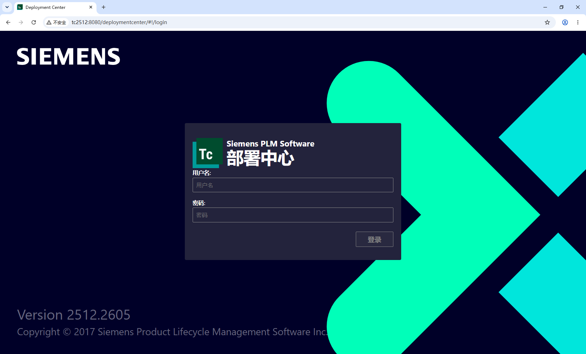

## 1 准备安装介质

在 Tc 安装介质的 install\DeploymentCenter 下找到 deployment_center.zip 将其解压



## 2 配置安装属性

在安装介质的 deployment_center 目录下找到并编辑 install_config.properties 文件



主要设置一些安装位置、端口号、用户名密码等，例如 serverDir、serverPort、repoDir、repoPort、user 和 password 等，enableSoftwareAnalytics 表示是否开启数据分析并参加产品创优计划，可以提前设置，否则安装时终端会提示输入，详细属性解释可以参考：https://docs.sw.siemens.com/en-US/doc/282219420/PL20250520748650994.deployment_center/qgs1458431640130 （Tc2512）



## 3 运行安装脚本

运行安装脚本前需要提前安装好 JDK 并设置好环境变量，安装脚本支持指定一些属性，也可以直接指定配置文件，这里我们指定配置文件。

打开 cmd 到配置文件的目录，运行：deployment_center.bat -install -inputFile=install_config.properties

```cmd
C:\Users\Administrator\Downloads\deployment_center\deployment_center>deployment_center.bat -install -inputFile=install_config.properties
----------------------------------------------------------------------------------------------------
---------------------------------   产品创优计划  -------------------------------------------
Siemens Digital Industries Software 收集有关用户使用我们产品的信息。这些信息有助于我们改进产品特征和功能，从而更好地满足客户需求。
根据产品创优计划收集的所有数据都将进行汇总和假名化。我们不会收集或发送任何知识产权信息。产品性能不受影响。
有关数据类型和参与的第三方的详细信息，请参见西门子信任中心 (https://www.sw.siemens.com/en-US/trust-center/product-excellence-program/)。该设置将在部署中心数据库中更新。
您还可以通过运行维护操作撤回您的同意，从而停止产品创优计划中的任何数据处理。
----------------------------------------------------------------------------------------------------
---------------------------------   安装部署中心   ---------------------------------
----------------------------------------------------------------------------------------------------
部署中心安装日志
日期和时间 : 6月 22, 2026 08:13 下午
日志文件位置：C:\Users\ADMINI~1\DOWNLO~1\DEPLOY~1\DEPLOY~1\logs
----------------------------------------------------------------------------------------------------
输入参数：
-install
-inputFile=install_config.properties
----------------------------------------------------------------------------------------------------

Deployment Center installation has started...

[Step  1 of 14] Creating Deployment Center Server Directory...
[Step  2 of 14] Creating Deployment Center Repository Directory...
[Step  3 of 14] Deploying Deployment Center Database...

[Step  4 of 14] Populating Default Database Settings...
Populating user info for DB authentication
[Step  5 of 14] Deploying Deployment Center Open source Vault...
Waiting for vault server to start for a minute
Enabling the Admin Capability for Vault.
[Step  6 of 14] Deploying Deployment Center WAR file...

[Step  7 of 14] Updating Deployment Center Server properties...
[Step  8 of 14] Copying media file...
[Step  9 of 14] Copying Deployment Center Utilities...

[Step 10 of 14] Populating Deployment Center Repository...
[Step 11 of 14] Deploying Deployment Center Service [DC_Service]...
[Step 12 of 14] Deploying Repository Service [DC_RepoService]...

[Step 13 of 14] Deploying Publisher Service [DC_RepoService_Publisher]...
----------------------------------------------------------------------------------------------------
成功：部署中心安装已完成。
----------------------------------------------------------------------------------------------------
部署中心服务（"DC_Service"）已安装并启动。
部署中心存储库服务（"DC_RepoService"）已安装并启动。
部署中心发布者服务（"DC_RepoService_Publisher"）已安装并启动。
部署中心数据仓库服务（"DC_Vault_Service"）已安装并启动。
----------------------------------------------------------------------------------------------------
在以下 URL 访问部署中心：
http://TC2512:8080/部署中心/

注意：部署中心实用程序在 "C:\PLM\DEPLOY~1\WEBSER~1\additional_tools\" 目录下可用，部署中心工具包目录中不再提供。

NOTE: The input file "install_config.properties" contains sensitive information, such as passwords. It is recommended that you delete the input file after the installation/upgrade is completed.
----------------------------------------------------------------------------------------------------
```

这里有一个错误，终端中提示的 URL 是翻译后的

## 4 验证

浏览器访问：http://tc2512:8080/deploymentcenter （替换为合适的URL）


