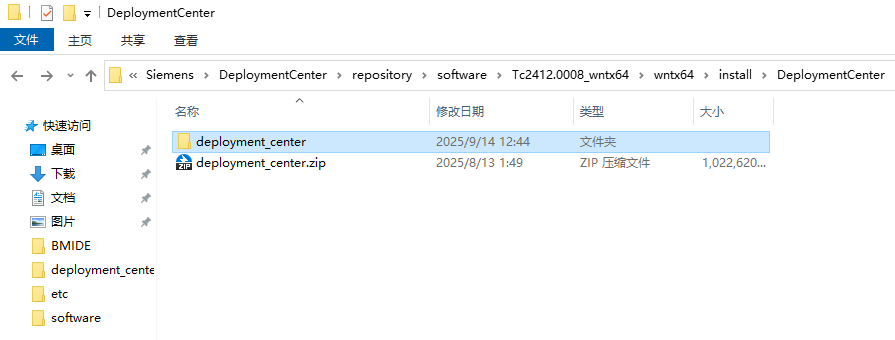
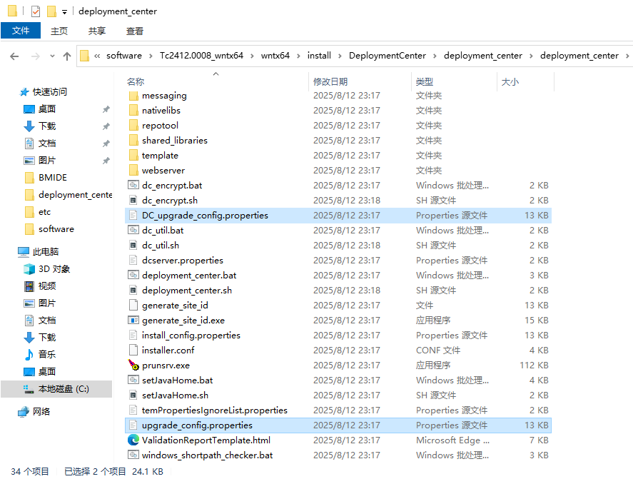
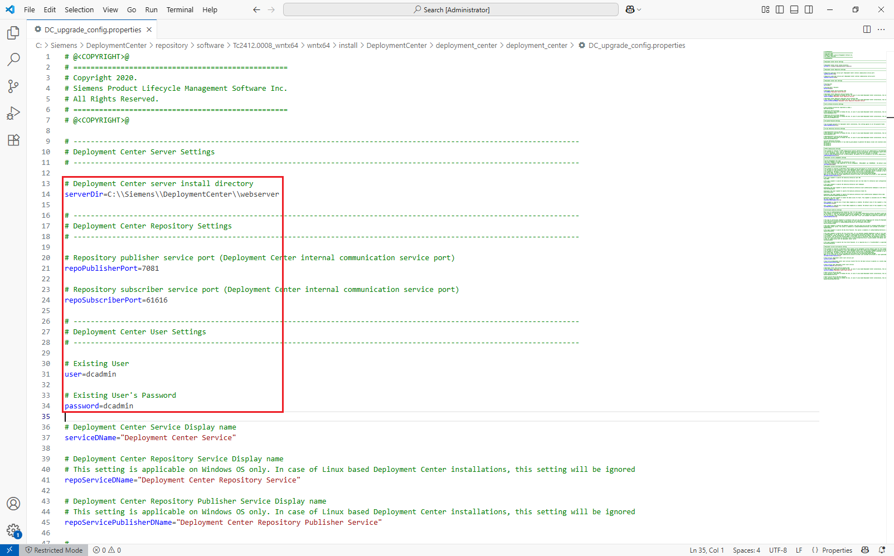
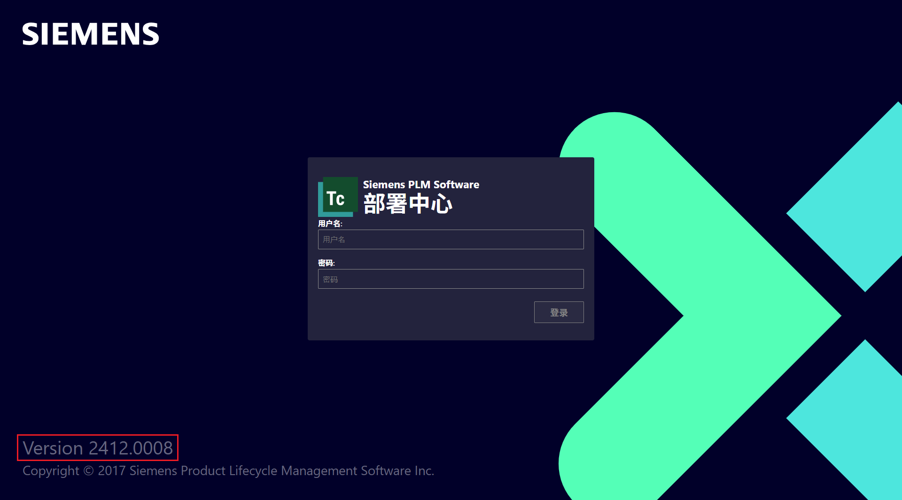

## 1 准备升级介质

一般 DC 的升级是为 TC 升级准备的，要先准备好升级介质：



## 2 配置升级文件

复制 upgrade_config.properties 文件为 DC_upgrade_config.properties



注意这里的配置信息要和已安装的DC配置一致，重点是安装路径、端口号和用户名密码，当然如果改过服务名等其它配置，也需要和已安装的配置保持一致：



## 3 运行升级脚本

deployment_center.bat -upgrade -inputFile=DC_upgrade_config.properties

```cmd
C:\Users\Administrator>cd C:\Siemens\DeploymentCenter\repository\software\Tc2412.0008_wntx64\wntx64\install\DeploymentCenter\deployment_center\deployment_center

C:\Siemens\DeploymentCenter\repository\software\Tc2412.0008_wntx64\wntx64\install\DeploymentCenter\deployment_center\deployment_center>deployment_center.bat -upgrade -inputFile=DC_upgrade_config.properties
----------------------------------------------------------------------------------------------------
----------------------------------------------------------------------------------------------------
----------------------------------   Upgrading Deployment Center   ---------------------------------
----------------------------------------------------------------------------------------------------
Deployment Center upgrade log
Date and time : 9月 14, 2025 02:35 下午
Log file location: C:\Siemens\DEPLOY~1\REPOSI~1\software\TC2412~2.000\wntx64\install\DEPLOY~1\DEPLOY~1\DEPLOY~1\logs
----------------------------------------------------------------------------------------------------
Input arguments:
-upgrade
-inputFile=DC_upgrade_config.properties
----------------------------------------------------------------------------------------------------

Deployment Center upgrade has started...

[Step  1 of 24] Stopping Deployment Center Publisher Service [DC_RepoService_Publisher]...
[Step  2 of 24] Stopping Repository Service [DC_RepoService]...
[Step  3 of 24] Stopping Deployment Center Service [DC_Service]...

[Step  4 of 24] Stopping Deployment Center Vault Service [DC_Vault_Service]...
[Step  5 of 24] Backing up Deployment Center Database...
                        Source Location: C:\Siemens\DeploymentCenter\webserver\db\deploy_center.mv.db
                        Backup Location: C:\Siemens\DeploymentCenter\webserver\db\deploy_center.mv.db.2412.0007.2025-09-14-14-35-41

[Step  6 of 24] Backing up Deployment Center Server Directory...

[Step  7 of 24] Backing up Repository...
                --> Backing up the 'dc_contributions' directory...
                        Source Location: C:\Siemens\DEPLOY~1\REPOSI~1\dc_contributions
                        Backup Location: C:\Siemens\DEPLOY~1\REPOSI~1\backup\REPOSI~1\dc_contributions

                        --> Processing [tcmsf 5.1.8], Overall progress: 100% complete.

                --> Backing up the 'deploy_scripts' directory...
                        Source Location: C:\Siemens\DEPLOY~1\REPOSI~1\deploy_scripts
                        Backup Location: C:\Siemens\DEPLOY~1\REPOSI~1\backup\REPOSI~1\deploy_scripts

                --> Backing up the 'quick_deploy_config' directory...
                        Source Location: C:\Siemens\DEPLOY~1\REPOSI~1\quick_deploy_config
                        Backup Location: C:\Siemens\DEPLOY~1\REPOSI~1\backup\REPOSI~1\quick_deploy_config

                --> Backing up the 'snapshot' directory...
                        Source Location: C:\Siemens\DEPLOY~1\REPOSI~1\snapshot
                        Backup Location: C:\Siemens\DEPLOY~1\REPOSI~1\backup\REPOSI~1\snapshot

                --> Backing up the 'system' directory...
                        Source Location: C:\Siemens\DEPLOY~1\REPOSI~1\system
                        Backup Location: C:\Siemens\DEPLOY~1\REPOSI~1\backup\REPOSI~1\system

                --> Transferring the backup directory to a zipped archive.
                        Backup Directory: C:\Siemens\DEPLOY~1\REPOSI~1\backup\REPOSI~1
                        Target Location: C:\Siemens\DEPLOY~1\REPOSI~1\backup\REPOSI~1.2412.0007.2025-09-14-14-35-41.zip

[Step  8 of 24] Backing up DC Vault directory...
[Step  9 of 24] Cleaning Repository system directory...

[Step 10 of 24] Cleaning up C:\Siemens\DeploymentCenter\webserver\temp directory...
[Step 11 of 24] Cleaning Repository dc_contributions directory...
[Step 12 of 24] Cleaning Deployment Center utilities directory...

[Step 13 of 24] Updating Deployment Center Database...
Hibernate: SELECT CONSTRAINT_NAME FROM INFORMATION_SCHEMA.CONSTRAINT_COLUMN_USAGE where TABLE_NAME='COMPONENT' and COLUMN_NAME='UNINSTALLRULE_UNINSTALL_RULE_ID' and CONSTRAINT_SCHEMA ='DEPLOY_CENTER'
Hibernate: SELECT INDEX_NAME FROM INFORMATION_SCHEMA.INDEX_COLUMNS where TABLE_NAME='COMPONENT' and COLUMN_NAME='UNINSTALLRULE_UNINSTALL_RULE_ID' and  INDEX_SCHEMA ='DEPLOY_CENTER'
Hibernate: DROP TABLE IF EXISTS DEPLOY_CENTER.uninstall_property
Hibernate: DROP TABLE IF EXISTS DEPLOY_CENTER.UNINSTALL_RULE
9月 14, 2025 2:38:00 下午 liquibase.database
信息: Set default schema name to PUBLIC
9月 14, 2025 2:38:00 下午 liquibase.database
信息: Set default schema name to PUBLIC
BEST PRACTICE: The changelog generated by diffChangeLog/generateChangeLog should be inspected for correctness and completeness before being deployed. Some database objects and their dependencies cannot be represented automatically, and they may need to be manually updated before being deployed.
9月 14, 2025 2:38:01 下午 liquibase.servicelocator
信息: Cannot load service: liquibase.serializer.ChangeLogSerializer: Provider liquibase.serializer.core.json.JsonChangeLogSerializer could not be instantiated
9月 14, 2025 2:38:01 下午 liquibase.servicelocator
信息: Cannot load service: liquibase.serializer.ChangeLogSerializer: Provider liquibase.serializer.core.yaml.YamlChangeLogSerializer could not be instantiated
9月 14, 2025 2:38:01 下午 liquibase.diff
信息: changeSets count: 6
9月 14, 2025 2:38:01 下午 liquibase.diff
信息: C:\Siemens\DeploymentCenter\webserver\db\temp\deployment_center_database_change_log.xml does not exist, creating and adding 6 changesets.
9月 14, 2025 2:38:01 下午 liquibase.database
信息: Set default schema name to PUBLIC
9月 14, 2025 2:38:01 下午 liquibase.lockservice
信息: Successfully acquired change log lock
9月 14, 2025 2:38:01 下午 liquibase.servicelocator
信息: Cannot load service: liquibase.change.Change: liquibase.change.core.LoadDataChange Unable to get public no-arg constructor
9月 14, 2025 2:38:01 下午 liquibase.servicelocator
信息: Cannot load service: liquibase.change.Change: liquibase.change.core.LoadUpdateDataChange Unable to get public no-arg constructor
9月 14, 2025 2:38:02 下午 liquibase.changelog
信息: Creating database history table with name: DEPLOY_CENTER.DATABASECHANGELOG
9月 14, 2025 2:38:02 下午 liquibase.changelog
信息: Reading from DEPLOY_CENTER.DATABASECHANGELOG
9月 14, 2025 2:38:02 下午 liquibase.servicelocator
信息: Cannot load service: liquibase.hub.HubService: Provider liquibase.hub.core.StandardHubService could not be instantiated
Running Changeset: deployment_center_database_change_log.xml::1757831881262-1::Administrator (generated)
9月 14, 2025 2:38:02 下午 liquibase.changelog
信息: Table UNINSTALL_PROPERTY created
9月 14, 2025 2:38:02 下午 liquibase.changelog
信息: ChangeSet deployment_center_database_change_log.xml::1757831881262-1::Administrator (generated) ran successfully in 0ms
Running Changeset: deployment_center_database_change_log.xml::1757831881262-2::Administrator (generated)
9月 14, 2025 2:38:02 下午 liquibase.changelog
信息: Table UNINSTALL_RULE created
9月 14, 2025 2:38:02 下午 liquibase.changelog
信息: ChangeSet deployment_center_database_change_log.xml::1757831881262-2::Administrator (generated) ran successfully in 0ms
Running Changeset: deployment_center_database_change_log.xml::1757831881262-3::Administrator (generated)
9月 14, 2025 2:38:02 下午 liquibase.changelog
信息: Unique constraint added to UNINSTALL_RULE(COMPONENT_ID)
9月 14, 2025 2:38:02 下午 liquibase.changelog
信息: ChangeSet deployment_center_database_change_log.xml::1757831881262-3::Administrator (generated) ran successfully in 0ms
Running Changeset: deployment_center_database_change_log.xml::1757831881262-4::Administrator (generated)
9月 14, 2025 2:38:02 下午 liquibase.changelog
信息: Index FKOOHLDH6KMT0VFLY0WQY2HFDXE_INDEX_B created
9月 14, 2025 2:38:02 下午 liquibase.changelog
信息: ChangeSet deployment_center_database_change_log.xml::1757831881262-4::Administrator (generated) ran successfully in 0ms
Running Changeset: deployment_center_database_change_log.xml::1757831881262-5::Administrator (generated)
9月 14, 2025 2:38:02 下午 liquibase.changelog
信息: Foreign key constraint added to UNINSTALL_PROPERTY (UNINSTALL_RULE)
9月 14, 2025 2:38:02 下午 liquibase.changelog
信息: ChangeSet deployment_center_database_change_log.xml::1757831881262-5::Administrator (generated) ran successfully in 17ms
Running Changeset: deployment_center_database_change_log.xml::1757831881262-6::Administrator (generated)
9月 14, 2025 2:38:02 下午 liquibase.changelog
信息: Foreign key constraint added to UNINSTALL_RULE (COMPONENT_ID)
9月 14, 2025 2:38:02 下午 liquibase.changelog
信息: ChangeSet deployment_center_database_change_log.xml::1757831881262-6::Administrator (generated) ran successfully in 0ms
9月 14, 2025 2:38:02 下午 liquibase.lockservice
信息: Successfully released change log lock
9月 14, 2025 2:38:02 下午 liquibase.lockservice
信息: Successfully acquired change log lock
9月 14, 2025 2:38:02 下午 liquibase.changelog
信息: Reading from DEPLOY_CENTER.DATABASECHANGELOG
9月 14, 2025 2:38:02 下午 liquibase.lockservice
信息: Successfully released change log lock
[Step 14 of 24] Deploying Deployment Center Open source Vault...
Waiting for vault server to start for a minute
Enabling the Admin Capability for Vault.
[Step 15 of 24] Updating Deployment Center Repository...

[Step 16 of 24] Updating Deployment Center Server...
[Step 17 of 24] Copying Deployment Center utilities...
[Step 18 of 24] Updating Deployment Center Service [DC_Service]...

[Step 19 of 24] Updating Deployment Center Repository Service [DC_RepoService]...
[Step 20 of 24] Updating Deployment Center Publisher Service [DC_RepoService_Publisher]...
[Step 21 of 24] Waiting for Deployment Center Server to start...

.[Step 22 of 24] Waiting for Repository Scanning to complete...
...........[Step 23 of 24] Updating Deployment Center Environments...
[Step 24 of 24] Successfully updated Deployment Center environments.

----------------------------------------------------------------------------------------------------
Success : Deployment Center upgrade completed.
----------------------------------------------------------------------------------------------------
Deployment Center service ("DC_Service") is installed and started.
Deployment Center Repository service ("DC_RepoService") is installed and started.
Deployment Center Publisher service ("DC_RepoService_Publisher") is installed and started.
Deployment Center Vault service ("DC_Vault_Service") is installed and started.
----------------------------------------------------------------------------------------------------
Access Deployment Center at the URL:
http://TC2412:7080/deploymentcenter/
----------------------------------------------------------------------------------------------------

NOTE: The Deployment Center utilities are available under the "C:\\Siemens\\DeploymentCenter\\webserver\additional_tools\" directory and will no longer be available inside the Deployment Center kit directory.
----------------------------------------------------------------------------------------------------
```

## 4 验证

查看 DC 登录页面左下角的版本信息


