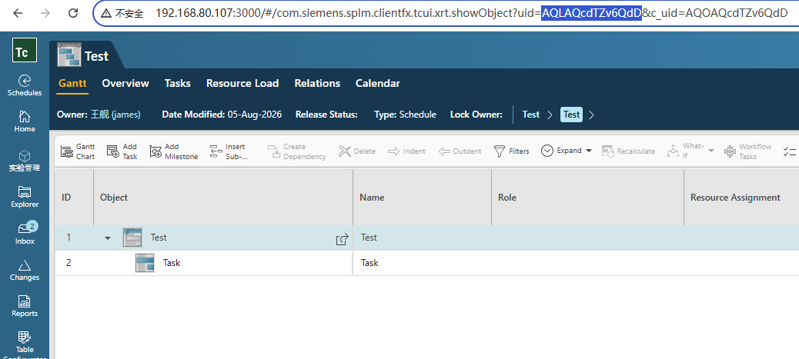
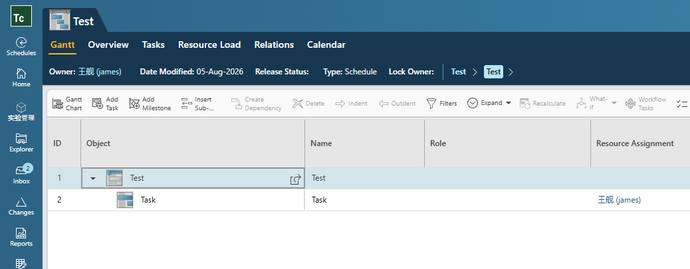

## 1 Core code

```c++
std::vector<AssignmentCreate_t> newAssignments;

tag_t schedule = NULLTAG;
ITK__convert_uid_to_tag("AUEAQYmgZv6QdD", &schedule);

tag_t summaryTask = TcUtil::askValueTag(schedule, "fnd0SummaryTask");
std::vector<tag_t> tasks = TcUtil::askValueTags(summaryTask, "child_task_taglist");
for (auto& task : tasks)
{
    AssignmentCreate_t newAssignment{};
    newAssignment.taskID = _strdup(TcUtil::convertTag2Uid(task).data());
    tag_t user = TcUtil::findUserById("james");
    newAssignment.assigneeID = _strdup(TcUtil::convertTag2Uid(user).data());
    newAssignment.assignedPercentage = 100;
    newAssignments.push_back(newAssignment);
    break;
}

TcUtil::createAssignments(schedule, newAssignments);
```

It is necessary to include the **schmgt/schmgt_bridge_itk.h** and then call the **SCHMGT_creare_assignments** function, passing in a structure of type **AssignmentCreate_t**.

Generally, only three properties need to be set: the task UID, the user UID, and the percentage.

More TcUtil code, see https://github.com/james-wangx/tc-itk-util

## 2 Test

Open a schedule and copy it uid into the code from url:



run test:

```cmd
D:\Siemens\Teamcenter2506\bin>xc_itk_demo_create_assignments.exe -u=james -p=james -g=dba
DEBUG - Call ITK_initialize_text_services(0)
DEBUG - Call ITK_init_module(usr, upw, ugp)
INFO  - Login to Teamcenter success as james
DEBUG - Call AOM_ask_value_tag(object, propName.c_str(), &propValue)
DEBUG - Call AOM_ask_value_tags(object, propName.c_str(), &num, &values)
DEBUG - Call SA_find_user2(id.c_str(), &user)
DEBUG - Call SCHMGT_create_assignments(schedule, (int)createInputs.size(), createInputs.data(), &createdNum, &createdAssignmentsPtr)
```


