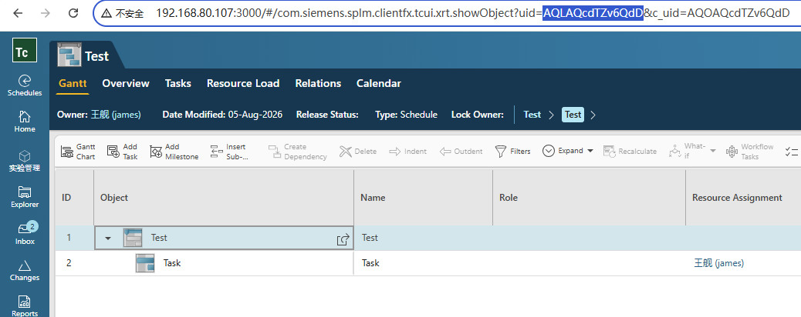
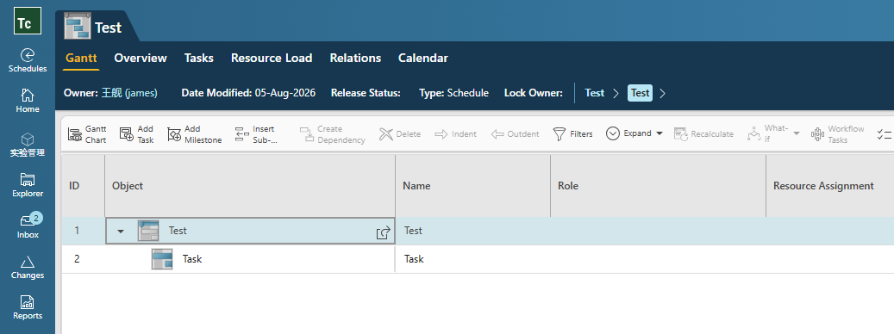

## 1 Core code

```c++
std::vector<tag_t> oldAssignments;

tag_t schedule = NULLTAG;
ITK__convert_uid_to_tag("AUEAQYmgZv6QdD", &schedule);

tag_t summaryTask = TcUtil::askValueTag(schedule, "fnd0SummaryTask");
std::vector<tag_t> tasks = TcUtil::askValueTags(summaryTask, "child_task_taglist");
for (auto& task : tasks)
{
    std::vector<tag_t> resourceAssignments = TcUtil::askValueTags(task, "ResourceAssignment");
    for (const auto& resourceAssignment : resourceAssignments)
    {
        tag_t relation = TcUtil::findRelation(task, resourceAssignment, "ResourceAssignment");
        oldAssignments.push_back(relation);
    }
    break;
}

TcUtil::deleteAssignments(schedule, oldAssignments);
```

A part of code in TcUtil:

```c++
void TcUtil::deleteAssignments(tag_t schedule, std::vector<tag_t> assignments)
{
    ResultStatus ok;

    LOGGER_ITK(SCHMGT_delete_assignments(schedule, (int)assignments.size(), assignments.data()));
}
```

It is necessary to include the **schmgt/schmgt_bridge_itk.h** and then call the **SCHMGT_delete_assignments** function.

Note the array here is passing a **relation** object, not a resource object, so after obtaining resources under a task, you alse need to get the relationship between the task and earch resource.

## 2 Test

Open a schedule and copy uid into code from url:



run test:

```cmd
D:\Siemens\Teamcenter2506\bin>demo_delete_assignments.exe -u=james -p=james -g=dba
DEBUG - Call ITK_initialize_text_services(0)
DEBUG - Call ITK_init_module(usr, upw, ugp)
INFO  - Login to Teamcenter success as james
DEBUG - Call AOM_ask_value_tag(object, propName.c_str(), &propValue)
DEBUG - Call AOM_ask_value_tags(object, propName.c_str(), &num, &values)
DEBUG - Call AOM_ask_value_tags(object, propName.c_str(), &num, &values)
DEBUG - Call GRM_find_relation_type(relationTypeName.c_str(), &relationType)
DEBUG - Call GRM_find_relation(primaryObject, secondaryObject, relationTypeOpt, &relation)
DEBUG - Call SCHMGT_delete_assignments(schedule, (int)assignments.size(), assignments.data())
```


