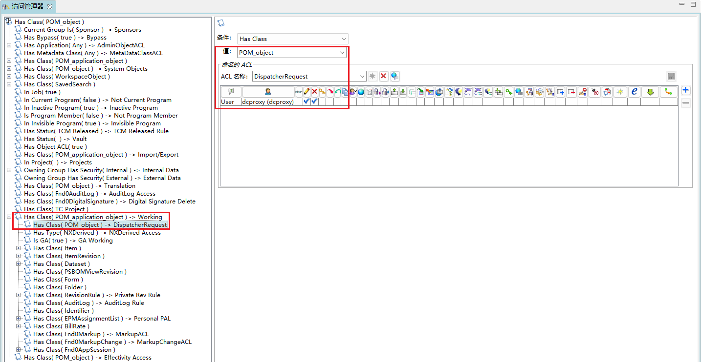
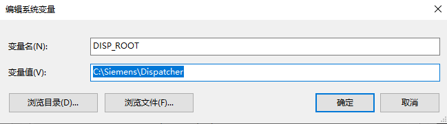

## 1 应用程序配置

应用程序选择 Dispatcher


## 2 组件配置

Dispatcher Client


Dispatcher Module


可以选择合适的转换器，否则需要装完后手动配置


Dispatcher Scheduler


## 3 部署

部署日志

```cmd
C:\Users\Administrator>cd C:\Siemens\DeploymentCenter\repository\deploy_scripts\Env_001\install\20250917125839CST\deploy_TC2412

C:\Siemens\DeploymentCenter\repository\deploy_scripts\Env_001\install\20250917125839CST\deploy_TC2412>.\deploy.bat -dcusername=dcadmin -dcpassword=dcadmin -softwareLocation=default -diagnosticChecks
Validating that the scripts are running on machine "TC2412"...Success
Validating that the TC2412 OS is "wntx64"...Success
Validating Java version for Teamcenter 2412...Success

Diagnostic check is in progress...
Scanning software for the deployment actions...
  ** Note: The duration of the scanning process may vary depending on the number of software, applications, and components being deployed.
Executing Deployment Steps
Setting the environment variable for Windows OS
Executing the following command to set environment variable: cmd /c setx.exe VAULT_TLS_ROOT "C:\Siemens\TEAMCE~1\tc_vault_tls"
Response Message: SUCCESS|
成功: 指定的值已得到保存。

Response Code: 0
Deployment Center Deploy Task [diagnosticChecks]: 1 of 10 for [Dispatcher Module] Component --> fnd0_dispatcherModuleArtifact...Success
Deployment Center Deploy Task [diagnosticChecks]: 2 of 10 for [Dispatcher Module] Component --> fnd0_tpcArtifact...Success
Deployment Center Deploy Task [diagnosticChecks]: 3 of 10 for [Dispatcher Client (4-tier)] Component --> fnd0_tpcArtifact...Success
Deployment Center Deploy Task [diagnosticChecks]: 4 of 10 for [Corporate Server] Component --> fnd0_tpcArtifact...Success
Deployment Center Deploy Task [diagnosticChecks]: 5 of 10 for [Corporate Server] Component --> fnd0_dataModelArtifact...Success
Deployment Center Deploy Task [diagnosticChecks]: 6 of 10 for [Corporate Server] Component --> fnd0_dbArtifact...Success
Deployment Center Deploy Task [diagnosticChecks]: 7 of 10 for [Dispatcher Scheduler] Component --> fnd0_dispatcherSchedulerArtifact...Success
Deployment Center Deploy Task [diagnosticChecks]: 8 of 10 for [Dispatcher Scheduler] Component --> fnd0_tpcArtifact...Success
Deployment Center Deploy Task [diagnosticChecks]: 9 of 10 for [Dispatcher Client] Application/Package --> fnd0_dispatcherClientArtifact...Success
Deployment Center Deploy Task [analyseDiagnosticChecks]: 10 of 10 for [Dispatcher Module] Component --> fnd0_dispatcherModuleArtifact...Success

Diagnostic Check successfully completed.

C:\Siemens\DeploymentCenter\repository\deploy_scripts\Env_001\install\20250917125839CST\deploy_TC2412>.\deploy.bat -dcusername=dcadmin -dcpassword=dcadmin -softwareLocation=default

Performing deployment operations for envrionment:"Env_001"

Validating connection to the Deployment Center server "http://TC2412:7080/deploymentcenter"
Deployment Center Authentication Successful...
Validating that the scripts are running on machine "TC2412"...Success
Validating that the TC2412 OS is "wntx64"...Success
Validating Java version for Teamcenter 2412.0008...Success
Scanning software for the deployment actions...
  ** Note: The duration of the scanning process may vary depending on the number of software, applications, and components being deployed.
Executing Deployment Steps
Setting the environment variable for Windows OS
Executing the following command to set environment variable: cmd /c setx.exe VAULT_TLS_ROOT "C:\Siemens\TEAMCE~1\tc_vault_tls"
Response Message: SUCCESS|
成功: 指定的值已得到保存。

Response Code: 0
Deployment Center Deploy Task [envSettings]: 1 of 89 for [Dispatcher Module] Component --> fnd0_vcredistArtifact...Success
Deployment Center Deploy Task [envSettings]: 2 of 89 for [Dispatcher Module] Component --> fnd0_tpcArtifact...Success
Deployment Center Deploy Task [envSettings]: 3 of 89 for [Dispatcher Internal] Application/Package --> fnd0_translatorArtifact...Success
Deployment Center Deploy Task [envSettings]: 4 of 89 for [Dispatcher Client (4-tier)] Component --> fnd0_tpcArtifact...Success
Deployment Center Deploy Task [envSettings]: 5 of 89 for [Corporate Server] Component --> fnd0_tpcArtifact...Success
Deployment Center Deploy Task [envSettings]: 6 of 89 for [Corporate Server] Component --> fnd0_serverArtifact...Success
Deployment Center Deploy Task [envSettings]: 7 of 89 for [Corporate Server] Component --> fnd0_dataModelArtifact...Success
Deployment Center Deploy Task [envSettings]: 8 of 89 for [Corporate Server] Component --> fnd0_vcredistArtifact...Success
Deployment Center Deploy Task [envSettings]: 9 of 89 for [Dispatcher Scheduler] Component --> fnd0_vcredistArtifact...Success
Deployment Center Deploy Task [envSettings]: 10 of 89 for [Dispatcher Scheduler] Component --> fnd0_tpcArtifact...Success
Deployment Center Deploy Task [diagnosticChecks]: 11 of 89 for [Dispatcher Module] Component --> fnd0_dispatcherModuleArtifact...Success
Deployment Center Deploy Task [diagnosticChecks]: 12 of 89 for [Dispatcher Module] Component --> fnd0_tpcArtifact...Success
Deployment Center Deploy Task [diagnosticChecks]: 13 of 89 for [Dispatcher Client (4-tier)] Component --> fnd0_tpcArtifact...Success
Deployment Center Deploy Task [diagnosticChecks]: 14 of 89 for [Corporate Server] Component --> fnd0_tpcArtifact...Success
Deployment Center Deploy Task [diagnosticChecks]: 15 of 89 for [Corporate Server] Component --> fnd0_dataModelArtifact...Success
Deployment Center Deploy Task [diagnosticChecks]: 16 of 89 for [Corporate Server] Component --> fnd0_dbArtifact...Success
Deployment Center Deploy Task [diagnosticChecks]: 17 of 89 for [Dispatcher Scheduler] Component --> fnd0_dispatcherSchedulerArtifact...Success
Deployment Center Deploy Task [diagnosticChecks]: 18 of 89 for [Dispatcher Scheduler] Component --> fnd0_tpcArtifact...Success
Deployment Center Deploy Task [diagnosticChecks]: 19 of 89 for [Dispatcher Client] Application/Package --> fnd0_dispatcherClientArtifact...Success
Deployment Center Deploy Task [analyseDiagnosticChecks]: 20 of 89 for [Dispatcher Module] Component --> fnd0_dispatcherModuleArtifact...Success
Deployment Center Deploy Task [preRequisite]: 21 of 89 for [Dispatcher Module] Component --> fnd0_tpcArtifact...Success
Deployment Center Deploy Task [preRequisite]: 22 of 89 for [Dispatcher Client (4-tier)] Component --> fnd0_tpcArtifact...Success
Deployment Center Deploy Task [preRequisite]: 23 of 89 for [Corporate Server] Component --> fnd0_tpcArtifact...Success
Deployment Center Deploy Task [preRequisite]: 24 of 89 for [Dispatcher Scheduler] Component --> fnd0_tpcArtifact...Success
Deployment Center Deploy Task [stop]: 25 of 89 for [Corporate Server] Component --> fnd0_serverArtifact...Success
Deployment Center Deploy Task [stop]: 26 of 89 for [Corporate Server] Component --> fnd0_dataModelArtifact...Success
Deployment Center Deploy Task [stop]: 27 of 89 for [Dispatcher Scheduler] Component --> fnd0_dispatcherSchedulerArtifact...Success
Deployment Center Deploy Task [stop]: 28 of 89 for [Dispatcher Client] Application/Package --> fnd0_dispatcherClientArtifact...Success
Deployment Center Deploy Task [fileProcessing]: 29 of 89 for [Dispatcher Client (4-tier)] Component --> fnd0_dispatcherClientArtifact...Success
Deployment Center Deploy Task [fileProcessing]: 30 of 89 for [Dispatcher Scheduler] Component --> fnd0_dispatcherCommonArtifact...Success
Deployment Center Deploy Task [fileProcessing]: 31 of 89 for [Dispatcher Client] Application/Package --> fnd0_dispatcherClientArtifact...Success
Deployment Center Deploy Task [fileProcessing]: 32 of 89 for [Dispatcher Client] Application/Package --> fnd0_dataModelArtifact...Success
Deployment Center Deploy Task [fileProcessing]: 33 of 89 for [Dispatcher] Application/Package --> fnd0_dispatcherSchedulerArtifact...Success
Deployment Center Deploy Task [fileProcessing]: 34 of 89 for [Dispatcher Internal] Application/Package --> fnd0_dispatcherSchedulerArtifact...Success
Deployment Center Deploy Task [fileProcessing]: 35 of 89 for [Dispatcher Internal] Application/Package --> fnd0_dispatcherCommonArtifact...Success
Deployment Center Deploy Task [fileProcessing]: 36 of 89 for [Active Workspace Dispatcher Internal] Application/Package --> fnd0_dispatcherCommonArtifact...Success
Deployment Center Deploy Task [preDatabaseUpdate]: 37 of 89 for [Corporate Server] Component --> fnd0_serverArtifact...Success
Deployment Center Deploy Task [preDatabaseUpdate]: 38 of 89 for [Dispatcher Scheduler] Component --> fnd0_dispatcherSchedulerArtifact...Success
Deployment Center Deploy Task [preDatabaseUpdate]: 39 of 89 for [Dispatcher Client] Application/Package --> fnd0_dispatcherClientArtifact...Success
Deployment Center Deploy Task [preDatabaseUpdate]: 40 of 89 for [Dispatcher Internal] Application/Package --> fnd0_dispatcherSchedulerArtifact...Success
Deployment Center Deploy Task [databaseUpdate]: 41 of 89 for [Corporate Server] Component --> fnd0_serverArtifact...Success
Deployment Center Deploy Task [databaseUpdate]: 42 of 89 for [Corporate Server] Component --> fnd0_dataModelArtifact...Success
Deployment Center Deploy Task [postDatabaseUpdateInit]: 43 of 89 for [Corporate Server] Component --> fnd0_serverArtifact...Success
Deployment Center Deploy Task [postDatabaseUpdateInit]: 44 of 89 for [Corporate Server] Component --> fnd0_dataModelArtifact...Success
Deployment Center Deploy Task [postDatabaseUpdate]: 45 of 89 for [Corporate Server] Component --> fnd0_serverArtifact...Success
Deployment Center Deploy Task [postDatabaseUpdate]: 46 of 89 for [Corporate Server] Component --> fnd0_dataModelArtifact...Success
Deployment Center Deploy Task [postDatabaseUpdate]: 47 of 89 for [Dispatcher Scheduler] Component --> fnd0_dispatcherSchedulerArtifact...Success
Deployment Center Deploy Task [postDatabaseUpdate]: 48 of 89 for [Dispatcher Client] Application/Package --> fnd0_dispatcherClientArtifact...Success
Deployment Center Deploy Task [postDatabaseUpdate]: 49 of 89 for [Dispatcher Client] Application/Package --> fnd0_dataModelArtifact...Success
Deployment Center Deploy Task [finalization]: 50 of 89 for [Corporate Server] Component --> fnd0_dataModelArtifact...Success
Deployment Center Deploy Task [finalization]: 51 of 89 for [Dispatcher Scheduler] Component --> fnd0_dispatcherSchedulerArtifact...Success
Deployment Center Deploy Task [finalization]: 52 of 89 for [Dispatcher Client] Application/Package --> fnd0_dispatcherClientArtifact...Success
Deployment Center Deploy Task [stop]: 53 of 89 for [Dispatcher Module] Component --> fnd0_dispatcherModuleArtifact...Success
Deployment Center Deploy Task [fileProcessing]: 54 of 89 for [Dispatcher Module] Component --> fnd0_dispatcherModuleArtifact...Success
Deployment Center Deploy Task [fileProcessing]: 55 of 89 for [Dispatcher Module] Component --> fnd0_dispatcherCommonArtifact...Success
Deployment Center Deploy Task [fileProcessing]: 56 of 89 for [Dispatcher Internal] Application/Package --> fnd0_dispatcherModuleArtifact...Success
Deployment Center Deploy Task [fileProcessing]: 57 of 89 for [Dispatcher Internal] Application/Package --> fnd0_translatorArtifact...Success
Deployment Center Deploy Task [fileProcessing]: 58 of 89 for [Dispatcher Internal] Application/Package --> fnd0_dispatcherCommonArtifact...Success
Deployment Center Deploy Task [fileProcessing]: 59 of 89 for [Active Workspace Dispatcher Internal] Application/Package --> fnd0_dispatcherCommonArtifact...Success
Deployment Center Deploy Task [fileProcessing]: 60 of 89 for [NX Translator] Application/Package --> fnd0_translatorArtifact...Success
Deployment Center Deploy Task [preDatabaseUpdate]: 61 of 89 for [Dispatcher Module] Component --> fnd0_dispatcherModuleArtifact...Success
Deployment Center Deploy Task [preDatabaseUpdate]: 62 of 89 for [Dispatcher Internal] Application/Package --> fnd0_translatorArtifact...Success
Deployment Center Deploy Task [preDatabaseUpdate]: 63 of 89 for [Active Workspace Dispatcher Internal] Application/Package --> fnd0_dispatcherModuleArtifact...Success
Deployment Center Deploy Task [databaseUpdate]: 64 of 89 for [Dispatcher Module] Component --> fnd0_translatorArtifact...Success
Deployment Center Deploy Task [databaseUpdate]: 65 of 89 for [NX to PV Translator] Application/Package --> fnd0_translatorArtifact...Success
Deployment Center Deploy Task [postDatabaseUpdate]: 66 of 89 for [Dispatcher Module] Component --> fnd0_dispatcherModuleArtifact...Success
Deployment Center Deploy Task [finalization]: 67 of 89 for [Dispatcher Module] Component --> fnd0_dispatcherModuleArtifact...Success
Deployment Center Deploy Task [stop]: 68 of 89 for [Indexing Engine] Component --> aws2_indexingEngineArtifact...Success
Deployment Center Deploy Task [stop]: 69 of 89 for [Indexing Engine] Component --> aws2_solrCloudArtifact...Success
Deployment Center Deploy Task [preDatabaseUpdateInit]: 70 of 89 for [Teamcenter Foundation] Application/Package --> fnd0_dataArtifact...Success
Deployment Center Deploy Task [maintenanceUpdate]: 71 of 89 for [Indexing Engine] Component --> aws2_indexingEngineArtifact...Success
Deployment Center Deploy Task [maintenanceUpdate]: 72 of 89 for [Indexing Engine] Component --> aws2_solrCloudArtifact...Success
Deployment Center Deploy Task [maintenanceUpdate]: 73 of 89 for [Teamcenter Foundation] Application/Package --> fnd0_serverArtifact...Success
Deployment Center Deploy Task [maintenanceUpdate]: 74 of 89 for [Teamcenter Foundation] Application/Package --> fnd0_dataArtifact...Success
Deployment Center Deploy Task [maintenanceUpdate]: 75 of 89 for [Active Workspace Base] Application/Package --> fnd0_dataModelArtifact...Success
Deployment Center Deploy Task [maintenanceUpdate]: 76 of 89 for [Teamcenter Read Expression Manager Service] Application/Package --> fnd0_dataModelArtifact...Success
Deployment Center Deploy Task [maintenanceUpdate]: 77 of 89 for [Business Modeler IDE 2 tier] Component --> fnd0_bmideClientArtifact...Success
Deployment Center Deploy Task [maintenanceUpdate]: 78 of 89 for [Business Modeler IDE 2 tier] Component --> fnd0_bmideTemplatesArtifact...Success
Deployment Center Deploy Task [maintenanceUpdate]: 79 of 89 for [Business Modeler IDE 2 tier] Component --> fnd0_jdkArtifact...Success
Deployment Center Deploy Task [start]: 80 of 89 for [Dispatcher Module] Component --> fnd0_dispatcherModuleArtifact...Success
Deployment Center Deploy Task [start]: 81 of 89 for [Corporate Server] Component --> fnd0_serverArtifact...Success
Deployment Center Deploy Task [start]: 82 of 89 for [Corporate Server] Component --> fnd0_dataModelArtifact...Success
Deployment Center Deploy Task [start]: 83 of 89 for [Dispatcher Scheduler] Component --> fnd0_dispatcherSchedulerArtifact...Success
Deployment Center Deploy Task [start]: 84 of 89 for [Dispatcher Client] Application/Package --> fnd0_dispatcherClientArtifact...Success
Deployment Center Deploy Task [start]: 85 of 89 for [Indexing Engine] Component --> aws2_indexingEngineArtifact...Success
Deployment Center Deploy Task [start]: 86 of 89 for [Indexing Engine] Component --> aws2_solrCloudArtifact...Success
Deployment Center Deploy Task [ssoEnablement]: 87 of 89 for [Teamcenter Foundation] Application/Package --> fnd0_dataArtifact...Success
Deployment Center Deploy Task [ssoEnablement]: 88 of 89 for [Active Workspace Base] Application/Package --> fnd0_dataArtifact...Success
Deploy Task: 89 of 89 Interoperability started...Success

Location of software installed/updated directory: [C:\Siemens\Teamcenter2412]

Status: Deploy Script Execution Successful !!!
```

## 4 配置访问规则

打开胖客户端的访问管理器，在 Has Class (POM_application_object)→Working 下加上如下的规则：



## 5 启动服务

给 Dispatcher 根目录设置一个环境变量



启动脚本：

```cmd
%DISP_ROOT%\Scheduler\bin\runscheduler.bat && %DISP_ROOT%\Module\bin\runmodule.bat && %DISP_ROOT%\DispatcherClient\bin\runDispatcherClient.bat
```

Dispatcher Scheduler

```cmd
2025/09/17-09:56:38.970 UTC - INFO  - - 0989E14E9 - - - Release Version     : V2412.0008.2025090400
2025/09/17-09:56:38.974 UTC - INFO  - - 0989E14E9 - - - Home Directory      : C:\Siemens\DISPAT~1\SCHEDU~1\bin\\..
2025/09/17-09:56:38.975 UTC - INFO  - - 0989E14E9 - - - Log files Directory : C:\Siemens\Dispatcher\Logs\Dispatcher
2025/09/17-09:56:38.980 UTC - INFO  - - 0989E14E9 - - - Java Version        : 17.0.3
2025/09/17-09:56:38.982 UTC - INFO  - - 0989E14E9 - - - Start Time          : 9月 17, 2025 17:56:38
2025/09/17-09:56:38.993 UTC - INFO  - - 0989E14E9 - - - Scheduler URL rmi://localhost:2001
2025/09/17-09:56:39.997 UTC - INFO  - - 0989E14E9 - - -
2025/09/17-09:56:40.000 UTC - INFO  - - 0989E14E9 - - - Scheduler is ready to accept tasks.
2025/09/17-09:56:40.147 UTC - INFO  -
2025/09/17-09:56:40.148 UTC - INFO  -  Following module connected to the scheduler:
2025/09/17-09:56:40.148 UTC - INFO  -  --------------------------------------------
2025/09/17-09:56:40.149 UTC - INFO  -  HostName   : TC2412
2025/09/17-09:56:40.150 UTC - INFO  -  HostAddress: 192.168.80.101
2025/09/17-09:56:40.150 UTC - INFO  -  ModuleName : Module_3dd26efb_e04f22f_TC2412
2025/09/17-09:56:40.151 UTC - INFO  -  ModuleURL  : rmi://192.168.80.101:1999
2025/09/17-09:56:40.151 UTC - INFO  -
```

Dispatcher Module

```cmd
2025/09/17-09:56:39.895 UTC - INFO  - - 088AE677D - - - Release Version     : V2412.0008.2025090400
2025/09/17-09:56:39.900 UTC - INFO  - - 088AE677D - - - Home Directory      : C:\Siemens\DISPAT~1\Module\bin\\..
2025/09/17-09:56:39.901 UTC - INFO  - - 088AE677D - - - Log files Directory : C:\Siemens\Dispatcher\Logs\Dispatcher
2025/09/17-09:56:39.902 UTC - INFO  - - 088AE677D - - - Java Version        : 17.0.3
2025/09/17-09:56:39.903 UTC - INFO  - - 088AE677D - - - Start Time          : 9月 17, 2025 17:56:39
2025/09/17-09:56:39.904 UTC - INFO  - - 088AE677D - - - Module Name         : Module_3dd26efb_e04f22f_TC2412
2025/09/17-09:56:39.906 UTC - INFO  - - 088AE677D - - - Module Host Name    : TC2412
2025/09/17-09:56:39.907 UTC - INFO  - - 088AE677D - - - Module URL          : rmi://192.168.80.101:1999
2025/09/17-09:56:39.910 UTC - INFO  - - 088AE677D - - - Module Log FileName : Module_3dd26efb_e04f22f_TC2412.log
2025/09/17-09:56:39.911 UTC - INFO  - - 088AE677D - - -
2025/09/17-09:56:39.911 UTC - INFO  - - 088AE677D - - - Translators Available
2025/09/17-09:56:39.915 UTC - INFO  - - 088AE677D - - - --------------------------------------------
2025/09/17-09:56:39.915 UTC - INFO  - - 088AE677D - - - Provider: SIEMENS   Service: nxtransdirect
2025/09/17-09:56:39.922 UTC - INFO  - - 088AE677D - - - Provider: SIEMENS   Service: tozipfile
2025/09/17-09:56:39.924 UTC - INFO  - - 088AE677D - - - --------------------------------------------
2025/09/17-09:56:40.181 UTC - INFO  - - 088AE677D - - - Connected to Scheduler at rmi://TC2412:2001
2025/09/17-09:56:40.184 UTC - INFO  - - 088AE677D - - - Module is ready for the tasks.
```

Dispatcher Client

```cmd
2025/09/17-09:56:41.250 UTC - INFO  - - 05C56CE65 - - - 正在启动服务...
2025/09/17-09:56:41.266 UTC - INFO  - - 05C56CE65 - - - In 4tier mode. Url is http://TC2412:7001/tc
2025/09/17-09:56:41.274 UTC - WARN  - - 05C56CE65 - - - TC_USE_KEYMANAGER environment variable is configured to not use KeyManager.
2025/09/17-09:56:45.767 UTC - INFO  - - 05C56CE65 - - - Syslog tcserver.exe1c20a19c.syslog
OS name is Windows Server 2022
JVM vendor is Azul Systems, Inc.
Data model is 64
2025/09/17-09:56:45.887 UTC - INFO  - - 05C56CE65 - - - TC Server 登录完成。
2025/09/17-09:56:46.059 UTC - INFO  - - 05C56CE65 - - -
2025/09/17-09:56:46.059 UTC - INFO  - - 05C56CE65 - - - Connected to Scheduler on Url rmi://TC2412:2001
2025/09/17-09:56:46.096 UTC - INFO  - - 05C56CE65 - - - Scheduling request state management task. Interval in minutes: 30
2025/09/17-09:56:46.099 UTC - INFO  - - 05C56CE65 - - - Start processing requests in database.
```

