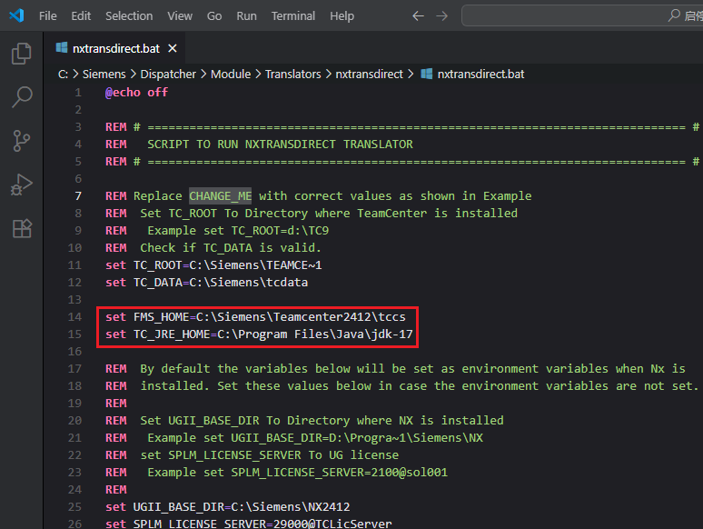
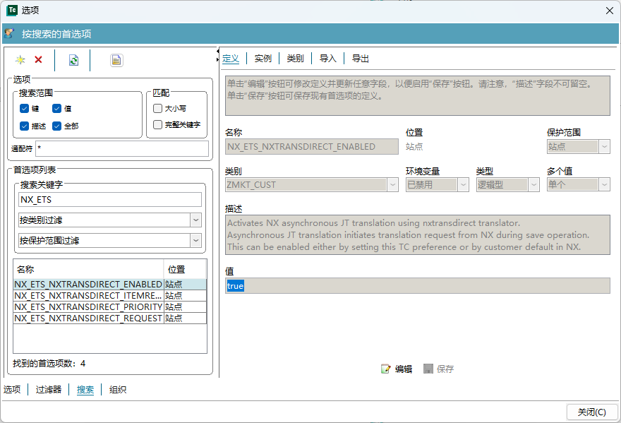
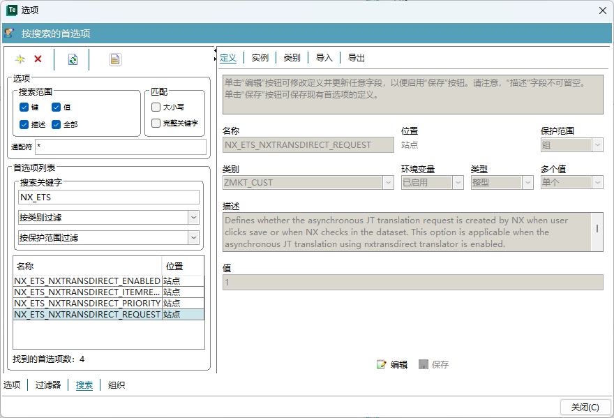
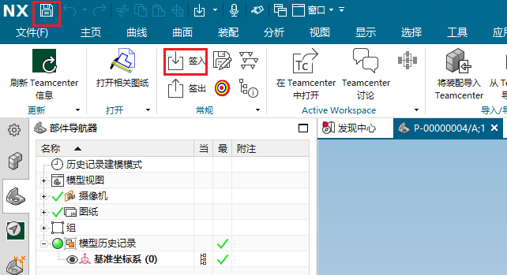
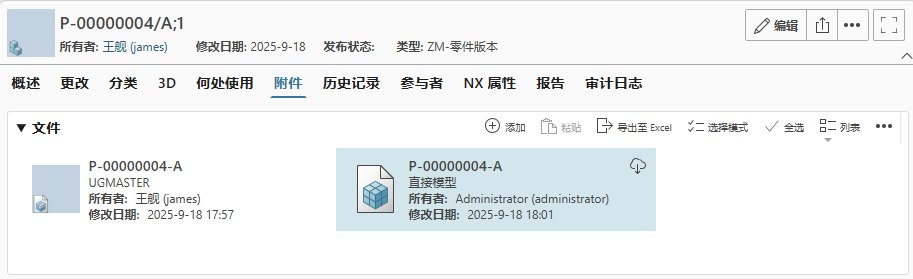

## 1 配置转换器

用 DC 安装 Dispatcher Module 时，勾选 NX Direct Translator


安装完后编辑 %DISP_ROOT%\Module\Translators\nxtransdirect\nxtransdirect.bat



## 2 首选项设置

NX_ETS_NXTRANSDIRECT_ENABLED = true

在保存 prt 时使用异步的转换器



NX_ETS_NXTRANSDIRECT_REQUEST = 1

当保存或签入时会异步调用转换器保存为 JT 文件



## 3 测试

开启四层服务和 Dispatcher，在 NX 中保存或者签入，会触发 Dispatcher 的转换器



相关日志：

Dispatcher Scheduler：

```cmd
2025/09/18-09:57:09.559 UTC - INFO  -  Following module connected to the scheduler:
2025/09/18-09:57:09.559 UTC - INFO  -  --------------------------------------------
2025/09/18-09:57:09.560 UTC - INFO  -  HostName   : TC2412
2025/09/18-09:57:09.560 UTC - INFO  -  HostAddress: 192.168.80.101
2025/09/18-09:57:09.560 UTC - INFO  -  ModuleName : Module_3dd26efb_e04f22f_TC2412
2025/09/18-09:57:09.562 UTC - INFO  -  ModuleURL  : rmi://192.168.80.101:1999
2025/09/18-09:57:09.562 UTC - INFO  -
2025/09/18-10:01:15.377 UTC - INFO  - - 099B0B76B - - - Task = Ud6de52ab468cbd82ee94x, Status = Task Saved
2025/09/18-10:01:15.434 UTC - INFO  - - 099B0B76B - - - Task = Ud6de52ab468cbd82ee94x, Status = Task in Module Queue
2025/09/18-10:01:15.522 UTC - INFO  - - 099B0B76B - - - Task = Ud6de52ab468cbd82ee94x, Status = Started Translation!!!
2025/09/18-10:01:37.938 UTC - INFO  - - 099B0B76B - - - Task = Ud6de52ab468cbd82ee94x, Status = 成功地完成！
```

Dispatcher Module：

```cmd
2025/09/18-10:01:15.498 UTC - INFO  - - 07BAB32C3 - - - Task = Ud6de52ab468cbd82ee94x, Status = Module started downloading files
2025/09/18-10:01:15.508 UTC - INFO  - - 07BAB32C3 - - - Task = Ud6de52ab468cbd82ee94x, Status = Module completed downloading files
2025/09/18-10:01:15.514 UTC - INFO  - - 07BAB32C3 - - - Task = Ud6de52ab468cbd82ee94x, Status = Started Translation!!!
2025/09/18-10:01:15.533 UTC - INFO  - - 07BAB32C3 - - - Command string:
C:\Siemens\DISPAT~1\Module/Translators/nxtransdirect\nxtransdirect.bat -inputFile=C:\Siemens\Dispatcher\Staging\DC\Ud6de52ab468cbd82ee94x\nxtrans.xml -u=james -p=weQx4BSvsxfymEOQ6O9cghux/qMlmYG+DRIHTdVHP/Yg7XAB8F3IzO37YjBZnaLBfHidTPxvvhjR24ZVejDhCw -g=dba -encrypt=true -autologin=true -storeInSourceVolume=false -updateExistingVisData=true -changeOwnerToCad=false

2025/09/18-10:01:15.554 UTC - INFO  - - 07BAB32C3 - - - Translator log messages are in: C:\Siemens\Dispatcher\Staging\DC\Ud6de52ab468cbd82ee94x\result\SIEMENS_nxtransdirect.log
2025/09/18-10:01:19.860 UTC - INFO  - - 07BAB32C3 - - - Standard Input :
2025/09/18-10:01:19.861 UTC - INFO  - - 07BAB32C3 - - - Standard Input : ============================================================================
2025/09/18-10:01:19.862 UTC - INFO  - - 07BAB32C3 - - - Standard Input :         NX JT Export (version - NX 2412.8300 - Build date - Apr 15 2025)
2025/09/18-10:01:19.863 UTC - INFO  - - 07BAB32C3 - - - Standard Input :  Copyright 2021 by Siemens Product Lifecycle Management Software Inc.
2025/09/18-10:01:19.863 UTC - INFO  - - 07BAB32C3 - - - Standard Input :                    5800 Granite Parkway, Suite 600.
2025/09/18-10:01:19.863 UTC - INFO  - - 07BAB32C3 - - - Standard Input :                          Plano, TX 75024.
2025/09/18-10:01:19.863 UTC - INFO  - - 07BAB32C3 - - - Standard Input :                               USA.
2025/09/18-10:01:19.864 UTC - INFO  - - 07BAB32C3 - - - Standard Input :                       Phone: 1 (972) 987-3000
2025/09/18-10:01:19.864 UTC - INFO  - - 07BAB32C3 - - - Standard Input :                        Fax: 1 (972) 987-3299
2025/09/18-10:01:19.874 UTC - INFO  - - 07BAB32C3 - - - Standard Input :                    Web site: www.siemens.com\plm
2025/09/18-10:01:19.876 UTC - INFO  - - 07BAB32C3 - - - Standard Input : ============================================================================
2025/09/18-10:01:19.876 UTC - INFO  - - 07BAB32C3 - - - Standard Input :
2025/09/18-10:01:27.554 UTC - INFO  - - 07BAB32C3 - - - Standard Input : FCC interface version fms2412.20241030.00.
2025/09/18-10:01:27.554 UTC - INFO  - - 07BAB32C3 - - - Standard Input : Loaded implementation library 'C:\Siemens\Teamcenter2412\tccs\lib\FCCClientProxyDllv17064.dll'.
2025/09/18-10:01:27.555 UTC - INFO  - - 07BAB32C3 - - - Standard Input : FCC Interface Implementation fms2412.20250609.00 initialized.
2025/09/18-10:01:27.557 UTC - INFO  - - 07BAB32C3 - - - Standard Input : FCC interface version fms.13.3.20220304.00.
2025/09/18-10:01:27.557 UTC - INFO  - - 07BAB32C3 - - - Standard Input : Loaded implementation library 'C:\Siemens\Teamcenter2412\tccs\lib\FCCClientProxyDllv15064.dll'.
2025/09/18-10:01:27.557 UTC - INFO  - - 07BAB32C3 - - - Standard Input : FCC Interface Implementation fms2412.20250609.00 initialized.
2025/09/18-10:01:27.558 UTC - INFO  - - 07BAB32C3 - - - Standard Input : Looking for config file: tessUG.config
2025/09/18-10:01:27.558 UTC - INFO  - - 07BAB32C3 - - - Standard Input : Looking for config file: tess.config
2025/09/18-10:01:27.560 UTC - INFO  - - 07BAB32C3 - - - Standard Input : Looking for config file: C:\Siemens\NX2412\pvtrans\tessUG.config .... Found!
2025/09/18-10:01:27.566 UTC - INFO  - - 07BAB32C3 - - - Standard Input : Translator Log File created at: C:\Users\ADMINI~1\AppData\Local\Temp\nxtrans.log
2025/09/18-10:01:34.183 UTC - INFO  - - 07BAB32C3 - - - Standard Input : 在非交互模式下。导出目录 C:\Siemens\Dispatcher\Staging\DC\Ud6de52ab468cbd82ee94x\P-00000004_1 已被删除。
2025/09/18-10:01:37.932 UTC - INFO  - - 07BAB32C3 - - - Task = Ud6de52ab468cbd82ee94x, Status = The translator completed successfully
2025/09/18-10:01:37.934 UTC - INFO  - - 07BAB32C3 - - - Task = Ud6de52ab468cbd82ee94x, Status = Module started uploading result files
2025/09/18-10:01:37.936 UTC - INFO  - - 07BAB32C3 - - - Task = Ud6de52ab468cbd82ee94x, Status = Module completed uploading result files
2025/09/18-10:01:37.936 UTC - INFO  - - 07BAB32C3 - - - Task = Ud6de52ab468cbd82ee94x, Status = 成功地完成！
```

Dispatcher Client：

```cmd
2025/09/18-10:01:14.564 UTC - INFO  - - 0811975DB - - - 开始抽取请求 Ud6de52ab468cbd82ee94x
2025/09/18-10:01:14.566 UTC - INFO  - - 0811975DB - - - 开始抽取请求 Ud6de52ab468cbd82ee94x
2025/09/18-10:01:15.078 UTC - INFO  - - 0811975DB - - - 正在验证请求
2025/09/18-10:01:15.126 UTC - INFO  - - 0811975DB - - - ------------------------------------------------------------
2025/09/18-10:01:15.127 UTC - INFO  - - 0811975DB - - - 正在进入以下对象的定制 TaskPrep 类： SIEMENS nxtransdirect com.teamcenter.ets.translator.ugs.nxtransdirect.TaskPrep@59d6642a
2025/09/18-10:01:15.157 UTC - INFO  - - 0811975DB - - - 正在退出以下对象的定制 TaskPrep 类： SIEMENS nxtransdirect com.teamcenter.ets.translator.ugs.nxtransdirect.TaskPrep@59d6642a
2025/09/18-10:01:15.168 UTC - INFO  - - 0811975DB - - - ------------------------------------------------------------
2025/09/18-10:01:15.213 UTC - INFO  - - 0811975DB - - - 转换输入文件已经传入 C:/Siemens/DISPAT~1/Staging\DC\Ud6de52ab468cbd82ee94x
2025/09/18-10:01:15.214 UTC - INFO  - - 0811975DB - - - 开始计划请求 Ud6de52ab468cbd82ee94x
2025/09/18-10:01:15.288 UTC - INFO  - - 0811975DB - - - Task = Ud6de52ab468cbd82ee94x, Status = Submitted the task successfully.
2025/09/18-10:01:15.298 UTC - INFO  - - 0811975DB - - - 抽取和提交已完成。
2025/09/18-10:01:15.410 UTC - INFO  - - 0811975DB - - - Task = Ud6de52ab468cbd82ee94x, Status = Task Saved
2025/09/18-10:01:15.450 UTC - INFO  - - 0811975DB - - - Task = Ud6de52ab468cbd82ee94x, Status = Task in Module Queue
2025/09/18-10:01:15.528 UTC - INFO  - - 0811975DB - - - Task = Ud6de52ab468cbd82ee94x, Status = Started Translation!!!
2025/09/18-10:01:37.947 UTC - INFO  - - 0811975DB - - - Task = Ud6de52ab468cbd82ee94x, Status = 成功地完成！
2025/09/18-10:01:37.986 UTC - INFO  - - 0811975DB - - - Output Files = C:/Siemens/DISPAT~1/Staging\DC\Ud6de52ab468cbd82ee94x\result\SIEMENS_nxtransdirect.log
2025/09/18-10:01:37.998 UTC - INFO  - - 0811975DB - - - Post Processor obtained class com.teamcenter.translationservice.process.BasicPostProcessor
2025/09/18-10:01:38.000 UTC - INFO  - - 0811975DB - - - DBHelper Class = class com.teamcenter.ets.load.Loader
2025/09/18-10:01:38.021 UTC - INFO  - - 0811975DB - - - 开始加载请求 Ud6de52ab468cbd82ee94x
2025/09/18-10:01:38.021 UTC - INFO  - - 0811975DB - - - 开始加载请求 Ud6de52ab468cbd82ee94x
2025/09/18-10:01:38.174 UTC - INFO  - - 0811975DB - - - 2025-09-18 18:01:38 - Ud6de52ab468cbd82ee94x,COMPLETE,SIEMENS,nxtransdirect,3,james,dba,dcproxy,2025-09-18 18:01:38,1,P-00000004/A;1,1,P-00000004/A;1,6,INITIAL,2025-09-18 18:00:14,PREPARING,2025-09-18 18:01:14,SCHEDULED,2025-09-18 18:01:15,TRANSLATING,2025-09-18 18:01:15,LOADING,2025-09-18 18:01:37,COMPLETE,2025-09-18 18:01:38
2025/09/18-10:01:38.175 UTC - INFO  - - 0811975DB - - - 加载完成 Ud6de52ab468cbd82ee94x
2025/09/18-10:01:38.176 UTC - INFO  - - 0811975DB - - - 加载完成
2025/09/18-10:01:38.176 UTC - INFO  - - 0811975DB - - - Done processing TaskId Ud6de52ab468cbd82ee94x
```

保存的 JT 文件：



