## 1 准备升级介质

将升级需要的介质解压放到 DC 的 software 目录下

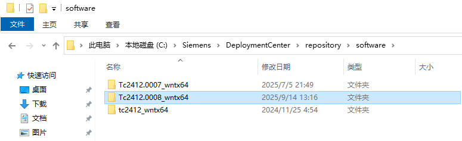

## 2 DC 设置

在 DC 的选项中勾选刚才加进来的介质，然后点击更新选定的组件

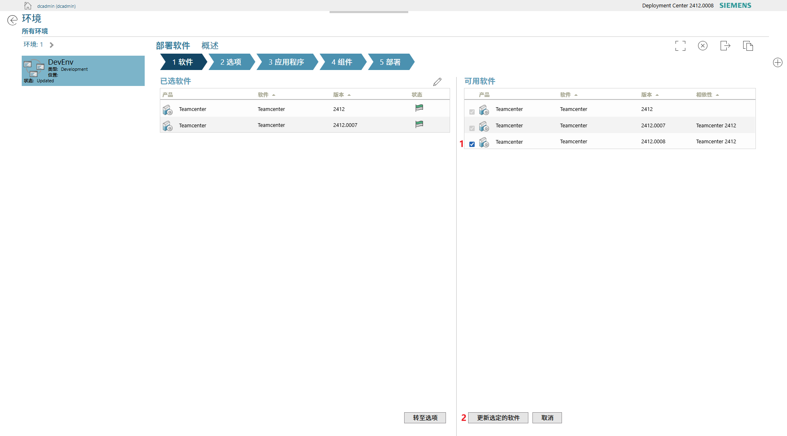

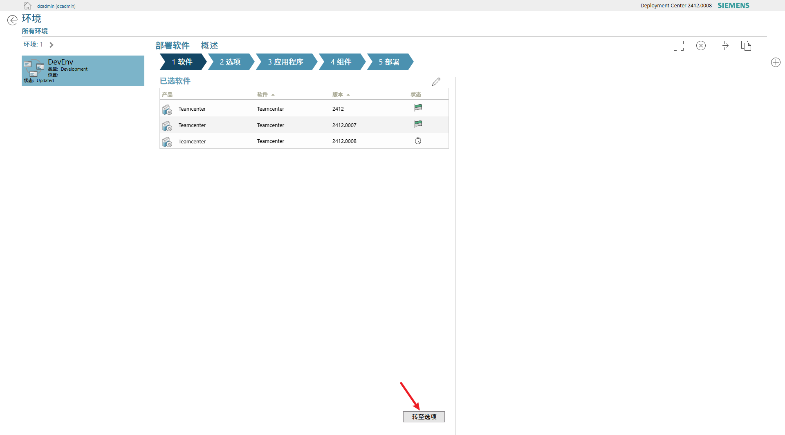

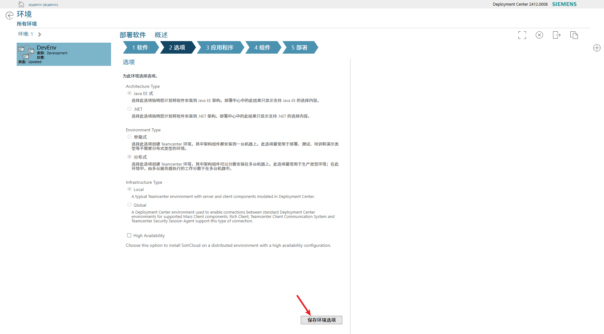

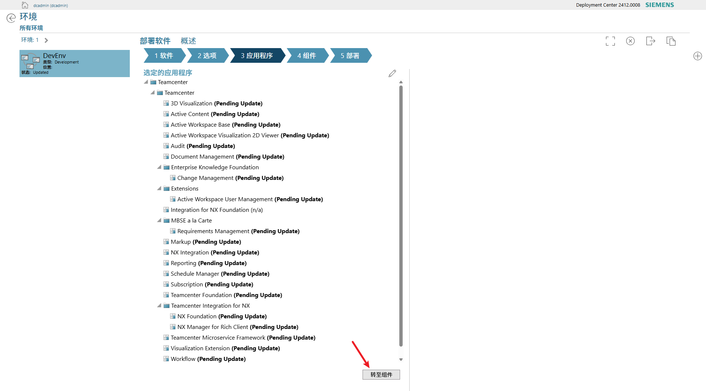

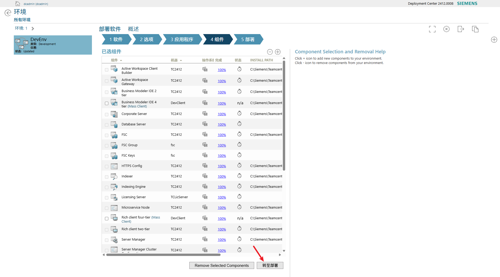

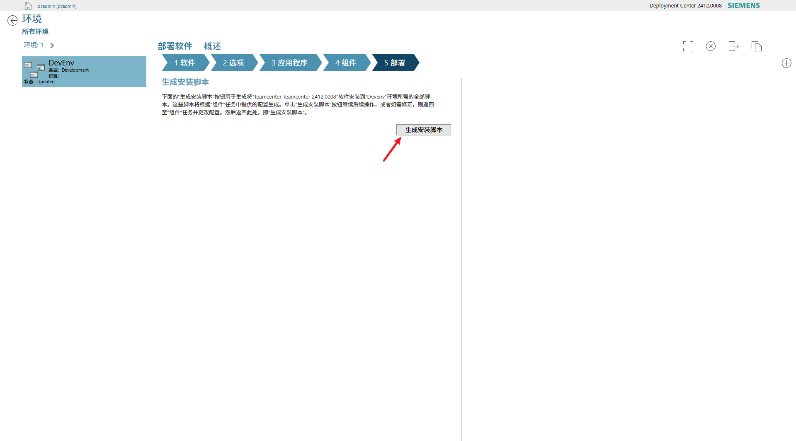

可以看到生成了三个压缩包，每个机器上都需要部署

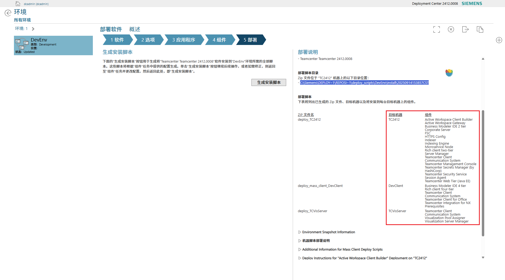

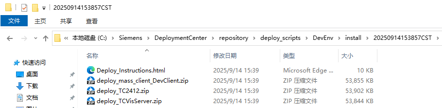

## 3 开始部署

```cmd
C:\Users\Administrator>cd C:\Siemens\DeploymentCenter\repository\deploy_scripts\DevEnv\install\20250914153857CST\deploy_TC2412

C:\Siemens\DeploymentCenter\repository\deploy_scripts\DevEnv\install\20250914153857CST\deploy_TC2412>.\deploy.bat -dcusername=dcadmin -dcpassword=dcadmin -softwareLocation=default -diagnosticChecks
Validating that the scripts are running on machine "TC2412"...Success
Validating that the TC2412 OS is "wntx64"...Success
Validating Java version for Teamcenter 2412...Success

Diagnostic check is in progress...
Scanning software for the deployment actions...
  ** Note: The duration of the scanning process may vary depending on the number of software, applications, and components being deployed.
Executing Deployment Steps
Setting the environment variable for Windows OS
Executing the following command to set environment variable: cmd /c setx.exe VAULT_TLS_ROOT "C:\Siemens\TEAMCE~1\tc_vault_tls"
Response Message: SUCCESS|
成功: 指定的值已得到保存。

Response Code: 0
Deployment Center Deploy Task [diagnosticChecks]: 1 of 30 for [Business Modeler IDE 2 tier] Component --> fnd0_tpcArtifact...Success
Deployment Center Deploy Task [diagnosticChecks]: 2 of 30 for [Business Modeler IDE 2 tier] Component --> fnd0_2TierBmideClientArtifact...Success
Deployment Center Deploy Task [diagnosticChecks]: 3 of 30 for [Rich client two-tier] Component --> fnd0_tpcArtifact...Success
Deployment Center Deploy Task [diagnosticChecks]: 4 of 30 for [Rich client two-tier] Component --> fnd0_2TierRichclientArtifact...Success
Deployment Center Deploy Task [diagnosticChecks]: 5 of 30 for [Rich client two-tier] Component --> fnd0_tccsConfigArtifact...Success
Deployment Center Deploy Task [diagnosticChecks]: 6 of 30 for [Microservice Node] Component --> fnd0_msfArtifact...Success
Deployment Center Deploy Task [diagnosticChecks]: 7 of 30 for [Microservice Node] Component --> fnd0_tpcArtifact...Success
Deployment Center Deploy Task [diagnosticChecks]: 8 of 30 for [Indexer] Component --> aws2_ftsIndexerArtifact...Success
Deployment Center Deploy Task [diagnosticChecks]: 9 of 30 for [Indexer] Component --> fnd0_tpcArtifact...Success
Deployment Center Deploy Task [diagnosticChecks]: 10 of 30 for [FSC] Component --> fnd0_fscArtifact...Success
Deployment Center Deploy Task [diagnosticChecks]: 11 of 30 for [Server Manager] Component --> fnd0_serverManagerArtifact...Success
Deployment Center Deploy Task [diagnosticChecks]: 12 of 30 for [Server Manager] Component --> fnd0_tpcArtifact...Success
Deployment Center Deploy Task [diagnosticChecks]: 13 of 30 for [Teamcenter Secrets Manager (by HashiCorp)] Component --> fnd0_vaultArtifact...Success
Deployment Center Deploy Task [diagnosticChecks]: 14 of 30 for [Teamcenter Management Console] Component --> fnd0_serverMgrConsoleArtifact...Success
Deployment Center Deploy Task [diagnosticChecks]: 15 of 30 for [Teamcenter Security Service Session Agent] Component --> fnd0_tcsssessionagentArtifact...Success
Deployment Center Deploy Task [diagnosticChecks]: 16 of 30 for [Corporate Server] Component --> fnd0_tpcArtifact...Success
Deployment Center Deploy Task [diagnosticChecks]: 17 of 30 for [Corporate Server] Component --> fnd0_dataModelArtifact...Success
Deployment Center Deploy Task [diagnosticChecks]: 18 of 30 for [Corporate Server] Component --> fnd0_dbArtifact...Success
Deployment Center Deploy Task [diagnosticChecks]: 19 of 30 for [Indexing Engine] Component --> aws2_indexingEngineArtifact...Success
Deployment Center Deploy Task [diagnosticChecks]: 20 of 30 for [Teamcenter Web Tier (Java EE)] Component --> fnd0_j2eeWebtierArtifact...Success
Deployment Center Deploy Task [diagnosticChecks]: 21 of 30 for [Teamcenter Web Tier (Java EE)] Component --> fnd0_tpcArtifact...Success
Deployment Center Deploy Task [diagnosticChecks]: 22 of 30 for [Teamcenter Client Communication System] Component --> fnd0_tccsArtifact...Success
Deployment Center Deploy Task [diagnosticChecks]: 23 of 30 for [Teamcenter Client Communication System] Component --> fnd0_tccsConfigArtifact...Success
Deployment Center Deploy Task [diagnosticChecks]: 24 of 30 for [Active Workspace Client Builder] Component --> aws2_clientArtifact...Success
Deployment Center Deploy Task [diagnosticChecks]: 25 of 30 for [Active Workspace Gateway] Component --> fnd0_tpcArtifact...Success
Deployment Center Deploy Task [diagnosticChecks]: 26 of 30 for [Teamcenter Foundation] Application/Package --> fnd0_dataModelArtifact...Success
Deployment Center Deploy Task [diagnosticChecks]: 27 of 30 for [Teamcenter Foundation] Application/Package --> fnd0_dataArtifact...Success
Deployment Center Deploy Task [diagnosticChecks]: 28 of 30 for [Active Workspace Base] Application/Package --> aws2_clientBuilderArtifact...Success
Deployment Center Deploy Task [diagnosticChecks]: 29 of 30 for [File Repository Service] Application/Package --> fnd0_microserviceArtifact...Success
Deployment Center Deploy Task [analyseDiagnosticChecks]: 30 of 30 for [Business Modeler IDE 2 tier] Component --> fnd0_tpcArtifact...Success

Diagnostic Check successfully completed.

C:\Siemens\DeploymentCenter\repository\deploy_scripts\DevEnv\install\20250914153857CST\deploy_TC2412>.\deploy.bat -dcusername=dcadmin -dcpassword=dcadmin -softwareLocation=default

Performing deployment operations for envrionment:"DevEnv"

Validating connection to the Deployment Center server "http://TC2412:7080/deploymentcenter"
Deployment Center Authentication Successful...
Validating that the scripts are running on machine "TC2412"...Success
Validating that the TC2412 OS is "wntx64"...Success
Validating Java version for Teamcenter 2412.0008...Success
Scanning software for the deployment actions...
  ** Note: The duration of the scanning process may vary depending on the number of software, applications, and components being deployed.
Executing Deployment Steps
Setting the environment variable for Windows OS
Executing the following command to set environment variable: cmd /c setx.exe VAULT_TLS_ROOT "C:\Siemens\TEAMCE~1\tc_vault_tls"
Response Message: SUCCESS|
成功: 指定的值已得到保存。

Response Code: 0
Deployment Center Deploy Task [envSettings]: 1 of 566 for [Business Modeler IDE 2 tier] Component --> fnd0_tpcArtifact...Success
Deployment Center Deploy Task [envSettings]: 2 of 566 for [Business Modeler IDE 2 tier] Component --> fnd0_vcredistArtifact...Success
Deployment Center Deploy Task [envSettings]: 3 of 566 for [Rich client two-tier] Component --> fnd0_tpcArtifact...Success
Deployment Center Deploy Task [envSettings]: 4 of 566 for [Rich client two-tier] Component --> fnd0_vcredistArtifact...Success
Deployment Center Deploy Task [envSettings]: 5 of 566 for [Rich client two-tier] Component --> fnd0_webview2Artifact...Success
Deployment Center Deploy Task [envSettings]: 6 of 566 for [Microservice Node] Component --> fnd0_tpcArtifact...Success
Deployment Center Deploy Task [envSettings]: 7 of 566 for [Indexer] Component --> fnd0_vcredistArtifact...Success
Deployment Center Deploy Task [envSettings]: 8 of 566 for [Indexer] Component --> fnd0_tpcArtifact...Success
Deployment Center Deploy Task [envSettings]: 9 of 566 for [FSC] Component --> fnd0_vcredistArtifact...Success
Deployment Center Deploy Task [envSettings]: 10 of 566 for [Server Manager] Component --> fnd0_serverManagerArtifact...Success
Deployment Center Deploy Task [envSettings]: 11 of 566 for [Server Manager] Component --> fnd0_tpcArtifact...Success
Deployment Center Deploy Task [envSettings]: 12 of 566 for [Corporate Server] Component --> fnd0_tpcArtifact...Success
Deployment Center Deploy Task [envSettings]: 13 of 566 for [Corporate Server] Component --> fnd0_serverArtifact...Success
Deployment Center Deploy Task [envSettings]: 14 of 566 for [Corporate Server] Component --> fnd0_dataModelArtifact...Success
Deployment Center Deploy Task [envSettings]: 15 of 566 for [Corporate Server] Component --> fnd0_vcredistArtifact...Success
Deployment Center Deploy Task [envSettings]: 16 of 566 for [Indexing Engine] Component --> fnd0_vcredistArtifact...Success
Deployment Center Deploy Task [envSettings]: 17 of 566 for [Teamcenter Web Tier (Java EE)] Component --> fnd0_vcredistArtifact...Success
Deployment Center Deploy Task [envSettings]: 18 of 566 for [Teamcenter Web Tier (Java EE)] Component --> fnd0_tpcArtifact...Success
Deployment Center Deploy Task [envSettings]: 19 of 566 for [Teamcenter Client Communication System] Component --> fnd0_vcredistArtifact...Success
Deployment Center Deploy Task [envSettings]: 20 of 566 for [Active Workspace Client Builder] Component --> fnd0_vcredistArtifact...Success
Deployment Center Deploy Task [envSettings]: 21 of 566 for [Active Workspace Gateway] Component --> fnd0_vcredistArtifact...Success
Deployment Center Deploy Task [envSettings]: 22 of 566 for [Active Workspace Gateway] Component --> fnd0_tpcArtifact...Success
Deployment Center Deploy Task [envSettings]: 23 of 566 for [Teamcenter Foundation] Application/Package --> fnd0_serverArtifact...Success
Deployment Center Deploy Task [envSettings]: 24 of 566 for [Teamcenter Foundation] Application/Package --> fnd0_dbdrevcfgaccArtifact...Success
Deployment Center Deploy Task [diagnosticChecks]: 25 of 566 for [Business Modeler IDE 2 tier] Component --> fnd0_tpcArtifact...Success
Deployment Center Deploy Task [diagnosticChecks]: 26 of 566 for [Business Modeler IDE 2 tier] Component --> fnd0_2TierBmideClientArtifact...Success
Deployment Center Deploy Task [diagnosticChecks]: 27 of 566 for [Rich client two-tier] Component --> fnd0_tpcArtifact...Success
Deployment Center Deploy Task [diagnosticChecks]: 28 of 566 for [Rich client two-tier] Component --> fnd0_2TierRichclientArtifact...Success
Deployment Center Deploy Task [diagnosticChecks]: 29 of 566 for [Rich client two-tier] Component --> fnd0_tccsConfigArtifact...Success
Deployment Center Deploy Task [diagnosticChecks]: 30 of 566 for [Microservice Node] Component --> fnd0_msfArtifact...Success
Deployment Center Deploy Task [diagnosticChecks]: 31 of 566 for [Microservice Node] Component --> fnd0_tpcArtifact...Success
Deployment Center Deploy Task [diagnosticChecks]: 32 of 566 for [Indexer] Component --> aws2_ftsIndexerArtifact...Success
Deployment Center Deploy Task [diagnosticChecks]: 33 of 566 for [Indexer] Component --> fnd0_tpcArtifact...Success
Deployment Center Deploy Task [diagnosticChecks]: 34 of 566 for [FSC] Component --> fnd0_fscArtifact...Success
Deployment Center Deploy Task [diagnosticChecks]: 35 of 566 for [Server Manager] Component --> fnd0_serverManagerArtifact...Success
Deployment Center Deploy Task [diagnosticChecks]: 36 of 566 for [Server Manager] Component --> fnd0_tpcArtifact...Success
Deployment Center Deploy Task [diagnosticChecks]: 37 of 566 for [Teamcenter Secrets Manager (by HashiCorp)] Component --> fnd0_vaultArtifact...Success
Deployment Center Deploy Task [diagnosticChecks]: 38 of 566 for [Teamcenter Management Console] Component --> fnd0_serverMgrConsoleArtifact...Success
Deployment Center Deploy Task [diagnosticChecks]: 39 of 566 for [Teamcenter Security Service Session Agent] Component --> fnd0_tcsssessionagentArtifact...Success
Deployment Center Deploy Task [diagnosticChecks]: 40 of 566 for [Corporate Server] Component --> fnd0_tpcArtifact...Success
Deployment Center Deploy Task [diagnosticChecks]: 41 of 566 for [Corporate Server] Component --> fnd0_dataModelArtifact...Success
Deployment Center Deploy Task [diagnosticChecks]: 42 of 566 for [Corporate Server] Component --> fnd0_dbArtifact...Success
Deployment Center Deploy Task [diagnosticChecks]: 43 of 566 for [Indexing Engine] Component --> aws2_indexingEngineArtifact...Success
Deployment Center Deploy Task [diagnosticChecks]: 44 of 566 for [Teamcenter Web Tier (Java EE)] Component --> fnd0_j2eeWebtierArtifact...Success
Deployment Center Deploy Task [diagnosticChecks]: 45 of 566 for [Teamcenter Web Tier (Java EE)] Component --> fnd0_tpcArtifact...Success
Deployment Center Deploy Task [diagnosticChecks]: 46 of 566 for [Teamcenter Client Communication System] Component --> fnd0_tccsArtifact...Success
Deployment Center Deploy Task [diagnosticChecks]: 47 of 566 for [Teamcenter Client Communication System] Component --> fnd0_tccsConfigArtifact...Success
Deployment Center Deploy Task [diagnosticChecks]: 48 of 566 for [Active Workspace Client Builder] Component --> aws2_clientArtifact...Success
Deployment Center Deploy Task [diagnosticChecks]: 49 of 566 for [Active Workspace Gateway] Component --> fnd0_tpcArtifact...Success
Deployment Center Deploy Task [diagnosticChecks]: 50 of 566 for [Teamcenter Foundation] Application/Package --> fnd0_dataModelArtifact...Success
Deployment Center Deploy Task [diagnosticChecks]: 51 of 566 for [Teamcenter Foundation] Application/Package --> fnd0_dataArtifact...Success
Deployment Center Deploy Task [diagnosticChecks]: 52 of 566 for [Active Workspace Base] Application/Package --> aws2_clientBuilderArtifact...Success
Deployment Center Deploy Task [diagnosticChecks]: 53 of 566 for [File Repository Service] Application/Package --> fnd0_microserviceArtifact...Success
Deployment Center Deploy Task [analyseDiagnosticChecks]: 54 of 566 for [Business Modeler IDE 2 tier] Component --> fnd0_tpcArtifact...Success
Deployment Center Deploy Task [preRequisite]: 55 of 566 for [Business Modeler IDE 2 tier] Component --> fnd0_tpcArtifact...Success
Deployment Center Deploy Task [preRequisite]: 56 of 566 for [Rich client two-tier] Component --> fnd0_tpcArtifact...Success
Deployment Center Deploy Task [preRequisite]: 57 of 566 for [Rich client two-tier] Component --> fnd0_tccsConfigArtifact...Success
Deployment Center Deploy Task [preRequisite]: 58 of 566 for [Microservice Node] Component --> fnd0_tpcArtifact...Success
Deployment Center Deploy Task [preRequisite]: 59 of 566 for [Indexer] Component --> fnd0_tpcArtifact...Success
Deployment Center Deploy Task [preRequisite]: 60 of 566 for [Server Manager] Component --> fnd0_tpcArtifact...Success
Deployment Center Deploy Task [preRequisite]: 61 of 566 for [Corporate Server] Component --> fnd0_tpcArtifact...Success
Deployment Center Deploy Task [preRequisite]: 62 of 566 for [Teamcenter Web Tier (Java EE)] Component --> fnd0_tpcArtifact...Success
Deployment Center Deploy Task [preRequisite]: 63 of 566 for [Teamcenter Client Communication System] Component --> fnd0_tccsConfigArtifact...Success
Deployment Center Deploy Task [preRequisite]: 64 of 566 for [HTTPS Config] Component --> fnd0_httpsconfigArtifact...Success
Deployment Center Deploy Task [preRequisite]: 65 of 566 for [Active Workspace Gateway] Component --> fnd0_tpcArtifact...Success
Deployment Center Deploy Task [backup]: 66 of 566 for [FSC] Component --> fnd0_fscArtifact...Success
Deployment Center Deploy Task [backup]: 67 of 566 for [Teamcenter Secrets Manager (by HashiCorp)] Component --> fnd0_vaultArtifact...Success
Deployment Center Deploy Task [backup]: 68 of 566 for [Corporate Server] Component --> fnd0_dataModelArtifact...Success
Deployment Center Deploy Task [backup]: 69 of 566 for [Active Workspace Client Builder] Component --> aws2_clientArtifact...Success
Deployment Center Deploy Task [stop]: 70 of 566 for [Microservice Node] Component --> fnd0_msfArtifact...Success
Deployment Center Deploy Task [stop]: 71 of 566 for [Microservice Node] Component --> fnd0_microserviceArtifact...Success
Deployment Center Deploy Task [stop]: 72 of 566 for [Indexer] Component --> aws2_ftsIndexerArtifact...Success
Deployment Center Deploy Task [stop]: 73 of 566 for [FSC] Component --> fnd0_fscArtifact...Success
Deployment Center Deploy Task [stop]: 74 of 566 for [Server Manager] Component --> fnd0_serverManagerArtifact...Success
Deployment Center Deploy Task [stop]: 75 of 566 for [Corporate Server] Component --> fnd0_serverArtifact...Success
Deployment Center Deploy Task [stop]: 76 of 566 for [Corporate Server] Component --> fnd0_dataModelArtifact...Success
Deployment Center Deploy Task [stop]: 77 of 566 for [Indexing Engine] Component --> aws2_indexingEngineArtifact...Success
Deployment Center Deploy Task [stop]: 78 of 566 for [Teamcenter Foundation] Application/Package --> fnd0_dataModelArtifact...Success
Deployment Center Deploy Task [stop]: 79 of 566 for [Teamcenter Foundation] Application/Package --> fnd0_dbdrevcfgaccArtifact...Success
Deployment Center Deploy Task [stop]: 80 of 566 for [Active Workspace Base] Application/Package --> fnd0_dataModelArtifact...Success
Deployment Center Deploy Task [stop]: 81 of 566 for [Active Workspace Base] Application/Package --> fnd0_serverArtifact...Success
Deployment Center Deploy Task [stop]: 82 of 566 for [Teamcenter Read Expression Manager Service] Application/Package --> fnd0_dataModelArtifact...Success
Deployment Center Deploy Task [cleanUp]: 83 of 566 for [Microservice Node] Component --> fnd0_microserviceArtifact...Success
Deployment Center Deploy Task [cleanUp]: 84 of 566 for [Microservice Node] Component --> fnd0_tpcArtifact...Success
Deployment Center Deploy Task [cleanUp]: 85 of 566 for [Indexer] Component --> aws2_ftsIndexerArtifact...Success
Deployment Center Deploy Task [cleanUp]: 86 of 566 for [Indexer] Component --> fnd0_tpcArtifact...Success
Deployment Center Deploy Task [cleanUp]: 87 of 566 for [FSC] Component --> fnd0_fscArtifact...Success
Deployment Center Deploy Task [cleanUp]: 88 of 566 for [Server Manager] Component --> fnd0_serverManagerArtifact...Success
Deployment Center Deploy Task [cleanUp]: 89 of 566 for [Server Manager] Component --> fnd0_tpcArtifact...Success
Deployment Center Deploy Task [cleanUp]: 90 of 566 for [Teamcenter Management Console] Component --> fnd0_serverMgrConsoleArtifact...Success
Deployment Center Deploy Task [cleanUp]: 91 of 566 for [Teamcenter Security Service Session Agent] Component --> fnd0_tcsssessionagentArtifact...Success
Deployment Center Deploy Task [cleanUp]: 92 of 566 for [Corporate Server] Component --> fnd0_tpcArtifact...Success
Deployment Center Deploy Task [cleanUp]: 93 of 566 for [Corporate Server] Component --> fnd0_serverArtifact...Success
Deployment Center Deploy Task [cleanUp]: 94 of 566 for [Corporate Server] Component --> fnd0_dataModelArtifact...Success
Deployment Center Deploy Task [cleanUp]: 95 of 566 for [Indexing Engine] Component --> aws2_indexingEngineArtifact...Success
Deployment Center Deploy Task [cleanUp]: 96 of 566 for [Teamcenter Web Tier (Java EE)] Component --> fnd0_j2eeWebtierArtifact...Success
Deployment Center Deploy Task [cleanUp]: 97 of 566 for [Teamcenter Web Tier (Java EE)] Component --> fnd0_j2eeWebtierArtifact...Success
Deployment Center Deploy Task [cleanUp]: 98 of 566 for [Teamcenter Web Tier (Java EE)] Component --> fnd0_tpcArtifact...Success
Deployment Center Deploy Task [cleanUp]: 99 of 566 for [Teamcenter Client Communication System] Component --> fnd0_tccsArtifact...Success
Deployment Center Deploy Task [cleanUp]: 100 of 566 for [Active Workspace Client Builder] Component --> aws2_clientArtifact...Success
Deployment Center Deploy Task [cleanUp]: 101 of 566 for [Active Workspace Gateway] Component --> aws2_gatewayclientArtifact...Success
Deployment Center Deploy Task [cleanUp]: 102 of 566 for [Active Workspace Gateway] Component --> fnd0_processManagerArtifact...Success
Deployment Center Deploy Task [cleanUp]: 103 of 566 for [Active Workspace Gateway] Component --> fnd0_tpcArtifact...Success
Deployment Center Deploy Task [cleanUp]: 104 of 566 for [Teamcenter Foundation] Application/Package --> fnd0_dataModelArtifact...Success
Deployment Center Deploy Task [cleanUp]: 105 of 566 for [Teamcenter Foundation] Application/Package --> fnd0_serverArtifact...Success
Deployment Center Deploy Task [cleanUp]: 106 of 566 for [Teamcenter Foundation] Application/Package --> fnd0_dbdrevcfgaccArtifact...Success
Deployment Center Deploy Task [cleanUp]: 107 of 566 for [Active Workspace Base] Application/Package --> aws2_clientBuilderArtifact...Success
Deployment Center Deploy Task [cleanUp]: 108 of 566 for [Teamcenter Read Expression Manager Service] Application/Package --> fnd0_dataModelArtifact...Success
Deployment Center Deploy Task [cleanUp]: 109 of 566 for [Audit] Application/Package --> aws2_clientArtifact...Success
Deployment Center Deploy Task [cleanUp]: 110 of 566 for [Teamcenter Microservice Framework] Application/Package --> fnd0_msfArtifact...Success
Deployment Center Deploy Task [cleanUp]: 111 of 566 for [File Repository Service] Application/Package --> fnd0_microserviceArtifact...Success
Deployment Center Deploy Task [cleanUp]: 112 of 566 for [Microservice Parameter Store] Application/Package --> fnd0_microserviceArtifact...Success
Deployment Center Deploy Task [cleanUp]: 113 of 566 for [Teamcenter GraphQL Service] Application/Package --> fnd0_microserviceArtifact...Success
Deployment Center Deploy Task [cleanUp]: 114 of 566 for [Declarative Artifact Service] Application/Package --> fnd0_microserviceArtifact...Success
Deployment Center Deploy Task [init]: 115 of 566 for [Teamcenter Secrets Manager (by HashiCorp)] Component --> fnd0_vaultArtifact...
###############################################################################
Error while executing deployment actions for --> Teamcenter Secrets Manager (by HashiCorp) --> fnd0_vaultArtifact --> init...
Deploy task will retry in 10 seconds...
Retrying Failed Deploy Task --> Teamcenter Secrets Manager (by HashiCorp) --> fnd0_vaultArtifact --> init...
Debug settings are turned ON
###############################################################################

## Error while executing deployment actions for Teamcenter Secrets Manager (by HashiCorp)-->init Failed

Location of attempted software installed/updated directory: [C:\Siemens\Teamcenter2412]

Deployment Log File Location: C:\Siemens\DEPLOY~1\REPOSI~1\DEPLOY~1\DevEnv\install\206C97~1\DEPLOY~1\logs\deployer_2025-09-14_15_44_28.log

Location of BMIDE and Teamcenter utility logs:[C:\Siemens\Teamcenter2412\logs]

Please review deployment Debug Log present in Location: C:\Siemens\DEPLOY~1\REPOSI~1\DEPLOY~1\DevEnv\install\206C97~1\DEPLOY~1\logs\deployer_debug_2025-09-14_15_44_28.log
#################################################
Status: Deploy Script Execution Failed ##########
#################################################

Please review the above log file to find the failed step and identify the issue.
If the issue can be fixed on this machine, fix the issue then rerun this deploy script again.
If to fix the issue you must go back to the Deployment Center and update a field,
then update the field in the Deployment Center, regenerate the deploy script, and execute the new script on this machine.

When re-running the deploy script after a failed deploy, the script will not re-deploy any components that were already successfully deployed.
The deploy script will start at the failed deploy step and continue forward from that step to complete.
```

出现报错，查看日志：

```cmd
--------------------------------------------------------------------------
Deployment Center Deploy Task [init]: 115 of 566 for [Teamcenter Secrets Manager (by HashiCorp)] Component
--------------------------------------------------------------------------

[Teamcenter Secrets Manager (by HashiCorp)] DC Artifact file location: C:\Siemens\DEPLOY~1\REPOSI~1\software\Tc2412.0008_wntx64\wntx64\dc_contributions\packages\fnd0_vault_artifact.xml
Executing Deployment Action [UPDATE] in DC Artifact for DC Component's Target [init]
Application ID: NA
Application GUID: NA
Artifact Type: fnd0_vaultArtifact
Artifact GUID: VHPE4S7HRBF3U9GK4NLGPYYX2E1NBFWQ
Installation Path: C:\Siemens\TEAMCE~1
Start Time: 周日, 9月 14 2025 03:46:59 下午

Patching
Current OS is Windows Server 2022
Output redirected to property: svcStatus
Executing 'sc' with arguments:
'query'
'Teamcenter_Vault_Service_DevEnv'


Result: 1060
Expanding: C:\Siemens\DEPLOY~1\REPOSI~1\software\TC2412~2.000\wntx64\tc\tc_vault.zip into C:\Siemens\TEAMCE~1

Sun Sep 14 15:46:59 CST 2025	Execution of "UNZIP" task failed with Error while expanding C:\Siemens\DEPLOY~1\REPOSI~1\software\TC2412~2.000\wntx64\tc\tc_vault.zip
java.nio.file.FileSystemException: C:\Siemens\TEAMCE~1\tc_vault\vault.exe: 另一个程序正在使用此文件，进程无法访问。

Sun Sep 14 15:46:59 CST 2025	Execution of "IF" task failed with Error while expanding C:\Siemens\DEPLOY~1\REPOSI~1\software\TC2412~2.000\wntx64\tc\tc_vault.zip
java.nio.file.FileSystemException: C:\Siemens\TEAMCE~1\tc_vault\vault.exe: 另一个程序正在使用此文件，进程无法访问。

Sun Sep 14 15:46:59 CST 2025	Execution of "IF" task failed with Error while expanding C:\Siemens\DEPLOY~1\REPOSI~1\software\TC2412~2.000\wntx64\tc\tc_vault.zip
java.nio.file.FileSystemException: C:\Siemens\TEAMCE~1\tc_vault\vault.exe: 另一个程序正在使用此文件，进程无法访问。

Sun Sep 14 15:46:59 CST 2025	Execution of "init" target of "Feature/Artifact: fnd0_vault (VHPE4S7HRBF3U9GK4NLGPYYX2E1NBFWQ) - ArtifactType( fnd0_vaultArtifact ) failed with Error while expanding C:\Siemens\DEPLOY~1\REPOSI~1\software\TC2412~2.000\wntx64\tc\tc_vault.zip
java.nio.file.FileSystemException: C:\Siemens\TEAMCE~1\tc_vault\vault.exe: 另一个程序正在使用此文件，进程无法访问。

###############################################################################
Deploy Task failure occurred
Deploy Task will retry in 10 seconds...
--------------------------------------------------------------------------
Retrying Failed Deploy Task  --> Teamcenter Secrets Manager (by HashiCorp) --> init
--------------------------------------------------------------------------
Debug settings are turned ON
###############################################################################


Patching
Current OS is Windows Server 2022
Output redirected to property: svcStatus
Executing 'sc' with arguments:
'query'
'Teamcenter_Vault_Service_DevEnv'


Result: 1060
Expanding: C:\Siemens\DEPLOY~1\REPOSI~1\software\TC2412~2.000\wntx64\tc\tc_vault.zip into C:\Siemens\TEAMCE~1

Sun Sep 14 15:47:13 CST 2025	Execution of "UNZIP" task failed with Error while expanding C:\Siemens\DEPLOY~1\REPOSI~1\software\TC2412~2.000\wntx64\tc\tc_vault.zip
java.nio.file.FileSystemException: C:\Siemens\TEAMCE~1\tc_vault\vault.exe: 另一个程序正在使用此文件，进程无法访问。

Sun Sep 14 15:47:13 CST 2025	Execution of "IF" task failed with Error while expanding C:\Siemens\DEPLOY~1\REPOSI~1\software\TC2412~2.000\wntx64\tc\tc_vault.zip
java.nio.file.FileSystemException: C:\Siemens\TEAMCE~1\tc_vault\vault.exe: 另一个程序正在使用此文件，进程无法访问。

Sun Sep 14 15:47:13 CST 2025	Execution of "IF" task failed with Error while expanding C:\Siemens\DEPLOY~1\REPOSI~1\software\TC2412~2.000\wntx64\tc\tc_vault.zip
java.nio.file.FileSystemException: C:\Siemens\TEAMCE~1\tc_vault\vault.exe: 另一个程序正在使用此文件，进程无法访问。

Sun Sep 14 15:47:13 CST 2025	Execution of "init" target of "Feature/Artifact: fnd0_vault (VHPE4S7HRBF3U9GK4NLGPYYX2E1NBFWQ) - ArtifactType( fnd0_vaultArtifact ) failed with Error while expanding C:\Siemens\DEPLOY~1\REPOSI~1\software\TC2412~2.000\wntx64\tc\tc_vault.zip
java.nio.file.FileSystemException: C:\Siemens\TEAMCE~1\tc_vault\vault.exe: 另一个程序正在使用此文件，进程无法访问。
Auto Retry is disabled. Deployment will terminate due to the current failure.

End Time: 周日, 9月 14 2025 03:47:13 下午
Duration: 14.1700 seconds (0.2362 minutes)

########################
Status: Failed #########
########################
com.siemens.deploymentcenter.deployer.ant.exception.AntExecutionException: com.siemens.deploymentcenter.deployer.ant.exception.AntInvocationException: Deployment Failed

Deployment Failed


--------------------------------------------------------------------------
Deploy Script Execution Summary
--------------------------------------------------------------------------
Deploy Script End Time: 周日, 9月 14 2025 03:47:14 下午
Duration: 2.7550 minutes

Location of attempted software installed/updated directory: [C:\Siemens\Teamcenter2412]

Deployment Log File Location: C:\Siemens\DEPLOY~1\REPOSI~1\DEPLOY~1\DevEnv\install\206C97~1\DEPLOY~1\logs\deployer_2025-09-14_15_44_28.log

Location of BMIDE and Teamcenter utility logs:[C:\Siemens\Teamcenter2412\logs]


Please review deployment Debug Log present in Location: C:\Siemens\DEPLOY~1\REPOSI~1\DEPLOY~1\DevEnv\install\206C97~1\DEPLOY~1\logs\deployer_debug_2025-09-14_15_44_28.log
#################################################
Status: Deploy Script Execution Failed ##########
#################################################
--------------------------------------------------------------------------
---------------------------  DEPLOYMENT FAILED  --------------------------
The Deployment Center script encountered a failure. To gather and zip the deployment logs and artifact files used during this execution, please run the deploy script with the -runLogAccumulator option. The zip file will be created in the deployer logs folder on this machine.
--------------------------------------------------------------------------
--------------------------------------------------------------------------
```

看日志推测是有服务没有停止导致的，查看服务：

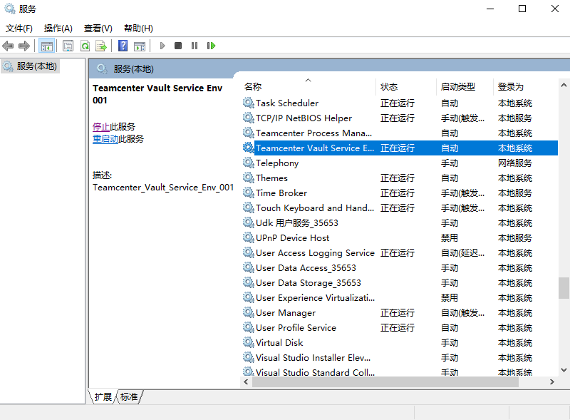

可以看到 Teamcenter Process Manager 已经停了，但是 Teamcenter_Vault_Service_Env_001 没停，手动停止服务，再次运行部署脚本：

```cmd
C:\Siemens\DeploymentCenter\repository\deploy_scripts\DevEnv\install\20250914153857CST\deploy_TC2412>.\deploy.bat -dcusername=dcadmin -dcpassword=dcadmin -softwareLocation=default

Performing deployment operations for envrionment:"DevEnv"

Validating connection to the Deployment Center server "http://TC2412:7080/deploymentcenter"
Deployment Center Authentication Successful...
Validating that the scripts are running on machine "TC2412"...Success
Validating that the TC2412 OS is "wntx64"...Success
Validating Java version for Teamcenter 2412...Success
Scanning software for the deployment actions...
  ** Note: The duration of the scanning process may vary depending on the number of software, applications, and components being deployed.
Executing Deployment Steps
Setting the environment variable for Windows OS
Executing the following command to set environment variable: cmd /c setx.exe VAULT_TLS_ROOT "C:\Siemens\TEAMCE~1\tc_vault_tls"
Response Message: SUCCESS|
成功: 指定的值已得到保存。

Response Code: 0
Deployment Center Deploy Task [diagnosticChecks]: 1 of 466 for [Business Modeler IDE 2 tier] Component --> fnd0_2TierBmideClientArtifact...Success
Deployment Center Deploy Task [diagnosticChecks]: 2 of 466 for [Rich client two-tier] Component --> fnd0_2TierRichclientArtifact...Success
Deployment Center Deploy Task [diagnosticChecks]: 3 of 466 for [Rich client two-tier] Component --> fnd0_tccsConfigArtifact...Success
Deployment Center Deploy Task [diagnosticChecks]: 4 of 466 for [Indexer] Component --> aws2_ftsIndexerArtifact...Success
Deployment Center Deploy Task [diagnosticChecks]: 5 of 466 for [FSC] Component --> fnd0_fscArtifact...Success
Deployment Center Deploy Task [diagnosticChecks]: 6 of 466 for [Server Manager] Component --> fnd0_serverManagerArtifact...Success
Deployment Center Deploy Task [diagnosticChecks]: 7 of 466 for [Teamcenter Security Service Session Agent] Component --> fnd0_tcsssessionagentArtifact...Success
Deployment Center Deploy Task [diagnosticChecks]: 8 of 466 for [Corporate Server] Component --> fnd0_dbArtifact...Success
Deployment Center Deploy Task [diagnosticChecks]: 9 of 466 for [Teamcenter Client Communication System] Component --> fnd0_tccsArtifact...Success
Deployment Center Deploy Task [diagnosticChecks]: 10 of 466 for [Teamcenter Client Communication System] Component --> fnd0_tccsConfigArtifact...Success
Deployment Center Deploy Task [diagnosticChecks]: 11 of 466 for [Teamcenter Foundation] Application/Package --> fnd0_dataModelArtifact...Success
Deployment Center Deploy Task [diagnosticChecks]: 12 of 466 for [Teamcenter Foundation] Application/Package --> fnd0_dataArtifact...Success
Deployment Center Deploy Task [diagnosticChecks]: 13 of 466 for [Active Workspace Base] Application/Package --> aws2_clientBuilderArtifact...Success
Deployment Center Deploy Task [analyseDiagnosticChecks]: 14 of 466 for [Business Modeler IDE 2 tier] Component --> fnd0_tpcArtifact...Success
Deployment Center Deploy Task [init]: 15 of 466 for [Teamcenter Secrets Manager (by HashiCorp)] Component --> fnd0_vaultArtifact...Success
Deployment Center Deploy Task [init]: 16 of 466 for [Teamcenter Client Communication System] Component --> fnd0_tccsArtifact...Success
Deployment Center Deploy Task [init]: 17 of 466 for [Teamcenter Client Communication System] Component --> fnd0_tccsConfigArtifact...Success
Deployment Center Deploy Task [init]: 18 of 466 for [Teamcenter Foundation] Application/Package --> fnd0_dataModelArtifact...Success
Deployment Center Deploy Task [init]: 19 of 466 for [Teamcenter Foundation] Application/Package --> fnd0_serverArtifact...Success
Deployment Center Deploy Task [postInit]: 20 of 466 for [Teamcenter Secrets Manager (by HashiCorp)] Component --> fnd0_vaultArtifact...
###############################################################################
Error while executing deployment actions for --> Teamcenter Secrets Manager (by HashiCorp) --> fnd0_vaultArtifact --> postInit...
Deploy task will retry in 10 seconds...
Retrying Failed Deploy Task --> Teamcenter Secrets Manager (by HashiCorp) --> fnd0_vaultArtifact --> postInit...
Debug settings are turned ON
###############################################################################

## Error while executing deployment actions for Teamcenter Secrets Manager (by HashiCorp)-->postInit Failed

Location of attempted software installed/updated directory: [C:\Siemens\Teamcenter2412]

Deployment Log File Location: C:\Siemens\DEPLOY~1\REPOSI~1\DEPLOY~1\DevEnv\install\206C97~1\DEPLOY~1\logs\deployer_2025-09-14_15_53_08.log

Location of BMIDE and Teamcenter utility logs:[C:\Siemens\Teamcenter2412\logs]

Please review deployment Debug Log present in Location: C:\Siemens\DEPLOY~1\REPOSI~1\DEPLOY~1\DevEnv\install\206C97~1\DEPLOY~1\logs\deployer_debug_2025-09-14_15_53_08.log
#################################################
Status: Deploy Script Execution Failed ##########
#################################################

Please review the above log file to find the failed step and identify the issue.
If the issue can be fixed on this machine, fix the issue then rerun this deploy script again.
If to fix the issue you must go back to the Deployment Center and update a field,
then update the field in the Deployment Center, regenerate the deploy script, and execute the new script on this machine.

When re-running the deploy script after a failed deploy, the script will not re-deploy any components that were already successfully deployed.
The deploy script will start at the failed deploy step and continue forward from that step to complete.
```

可以看到上次报错的 [init]: 115 of 566 for [Teamcenter Secrets Manager (by HashiCorp)] Component 这次已经成功了，但是在 [postInit]: 20 of 466 for [Teamcenter Secrets Manager (by HashiCorp)] Component 的时候失败了，查看日志：

```cmd
--------------------------------------------------------------------------
Deployment Center Deploy Task [postInit]: 20 of 466 for [Teamcenter Secrets Manager (by HashiCorp)] Component
--------------------------------------------------------------------------

[Teamcenter Secrets Manager (by HashiCorp)] DC Artifact file location: C:\Siemens\DEPLOY~1\REPOSI~1\software\Tc2412.0008_wntx64\wntx64\dc_contributions\packages\fnd0_vault_artifact.xml
Executing Deployment Action [UPDATE] in DC Artifact for DC Component's Target [postInit]
Application ID: NA
Application GUID: NA
Artifact Type: fnd0_vaultArtifact
Artifact GUID: VHPE4S7HRBF3U9GK4NLGPYYX2E1NBFWQ
Installation Path: C:\Siemens\TEAMCE~1
Start Time: 周日, 9月 14 2025 03:53:46 下午

Copying 1 file to C:\Siemens\TEAMCE~1\tc_vault
Copying C:\Siemens\DEPLOY~1\REPOSI~1\DEPLOY~1\DevEnv\install\206C97~1\DEPLOY~1\data\tls_configuration\vault_installer.properties to C:\Siemens\TEAMCE~1\tc_vault\vault_installer.properties
Current OS is Windows Server 2022
Executing 'C:\Siemens\TEAMCE~1\tc_vault\installTcVaultService.bat' with arguments:
'C:\Siemens\TEAMCE~1/tc_vault'


The service Teamcenter_Vault_Service_Env_001 has been installed.
The service Teamcenter_Vault_Service_Env_001 has been started.
Checking Teamcenter Vault URL: https://TC2412:8200
Current OS is Windows Server 2022
Output redirected to property: svcStatus
Executing 'sc' with arguments:
'query'
'Teamcenter_Vault_Service_DevEnv'


Result: 1060
The service Teamcenter_Vault_Service_DevEnv is not running.

Sun Sep 14 15:54:32 CST 2025	Execution of "FAIL" task failed with Teamcenter Vault URL: https://TC2412:8200 is not up and running. Corrective action: Please ensure Teamcenter Vault is installed in this machine.

Sun Sep 14 15:54:32 CST 2025	Execution of "IF" task failed with Teamcenter Vault URL: https://TC2412:8200 is not up and running. Corrective action: Please ensure Teamcenter Vault is installed in this machine.

Sun Sep 14 15:54:32 CST 2025	Execution of "IF" task failed with Teamcenter Vault URL: https://TC2412:8200 is not up and running. Corrective action: Please ensure Teamcenter Vault is installed in this machine.

Sun Sep 14 15:54:32 CST 2025	Execution of "IF" task failed with Teamcenter Vault URL: https://TC2412:8200 is not up and running. Corrective action: Please ensure Teamcenter Vault is installed in this machine.

Sun Sep 14 15:54:32 CST 2025	Execution of "postInit" target of "Feature/Artifact: fnd0_vault (VHPE4S7HRBF3U9GK4NLGPYYX2E1NBFWQ) - ArtifactType( fnd0_vaultArtifact ) failed with Teamcenter Vault URL: https://TC2412:8200 is not up and running. Corrective action: Please ensure Teamcenter Vault is installed in this machine.

###############################################################################
Deploy Task failure occurred
Deploy Task will retry in 10 seconds...
--------------------------------------------------------------------------
Retrying Failed Deploy Task  --> Teamcenter Secrets Manager (by HashiCorp) --> postInit
--------------------------------------------------------------------------
Debug settings are turned ON
###############################################################################


Current OS is Windows Server 2022
Executing 'C:\Siemens\TEAMCE~1\tc_vault\installTcVaultService.bat' with arguments:
'C:\Siemens\TEAMCE~1/tc_vault'


The service Teamcenter_Vault_Service_Env_001 has been installed.
The service Teamcenter_Vault_Service_Env_001 has been started.
Checking Teamcenter Vault URL: https://TC2412:8200
Current OS is Windows Server 2022
Output redirected to property: svcStatus
Executing 'sc' with arguments:
'query'
'Teamcenter_Vault_Service_DevEnv'


Result: 1060
The service Teamcenter_Vault_Service_DevEnv is not running.

Sun Sep 14 15:55:32 CST 2025	Execution of "FAIL" task failed with Teamcenter Vault URL: https://TC2412:8200 is not up and running. Corrective action: Please ensure Teamcenter Vault is installed in this machine.

Sun Sep 14 15:55:32 CST 2025	Execution of "IF" task failed with Teamcenter Vault URL: https://TC2412:8200 is not up and running. Corrective action: Please ensure Teamcenter Vault is installed in this machine.

Sun Sep 14 15:55:32 CST 2025	Execution of "IF" task failed with Teamcenter Vault URL: https://TC2412:8200 is not up and running. Corrective action: Please ensure Teamcenter Vault is installed in this machine.

Sun Sep 14 15:55:32 CST 2025	Execution of "IF" task failed with Teamcenter Vault URL: https://TC2412:8200 is not up and running. Corrective action: Please ensure Teamcenter Vault is installed in this machine.

Sun Sep 14 15:55:32 CST 2025	Execution of "postInit" target of "Feature/Artifact: fnd0_vault (VHPE4S7HRBF3U9GK4NLGPYYX2E1NBFWQ) - ArtifactType( fnd0_vaultArtifact ) failed with Teamcenter Vault URL: https://TC2412:8200 is not up and running. Corrective action: Please ensure Teamcenter Vault is installed in this machine.
Auto Retry is disabled. Deployment will terminate due to the current failure.

End Time: 周日, 9月 14 2025 03:55:32 下午
Duration: 106.7740 seconds (1.7796 minutes)

########################
Status: Failed #########
########################
com.siemens.deploymentcenter.deployer.ant.exception.AntExecutionException: com.siemens.deploymentcenter.deployer.ant.exception.AntInvocationException: Deployment Failed
Deployment Failed


--------------------------------------------------------------------------
Deploy Script Execution Summary
--------------------------------------------------------------------------
Deploy Script End Time: 周日, 9月 14 2025 03:55:33 下午
Duration: 2.4018 minutes

Location of attempted software installed/updated directory: [C:\Siemens\Teamcenter2412]

Deployment Log File Location: C:\Siemens\DEPLOY~1\REPOSI~1\DEPLOY~1\DevEnv\install\206C97~1\DEPLOY~1\logs\deployer_2025-09-14_15_53_08.log

Location of BMIDE and Teamcenter utility logs:[C:\Siemens\Teamcenter2412\logs]


Please review deployment Debug Log present in Location: C:\Siemens\DEPLOY~1\REPOSI~1\DEPLOY~1\DevEnv\install\206C97~1\DEPLOY~1\logs\deployer_debug_2025-09-14_15_53_08.log
#################################################
Status: Deploy Script Execution Failed ##########
#################################################
--------------------------------------------------------------------------
---------------------------  DEPLOYMENT FAILED  --------------------------
The Deployment Center script encountered a failure. To gather and zip the deployment logs and artifact files used during this execution, please run the deploy script with the -runLogAccumulator option. The zip file will be created in the deployer logs folder on this machine.
--------------------------------------------------------------------------
--------------------------------------------------------------------------
```

注意第 32 行：The service Teamcenter_Vault_Service_DevEnv is not running.

但是观察服务，我们的服务名是 Teamcenter_Vault_Service_Env_001，推测是之前改过一次环境名导致的

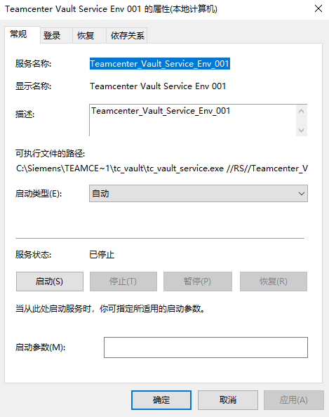

在尝试了多种办法诸如修改服务名，删除服务重新注册等等都不行后，选择在部署时将环境名改回去

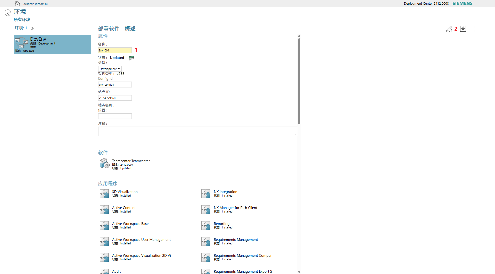

重新生成部署脚本再部署

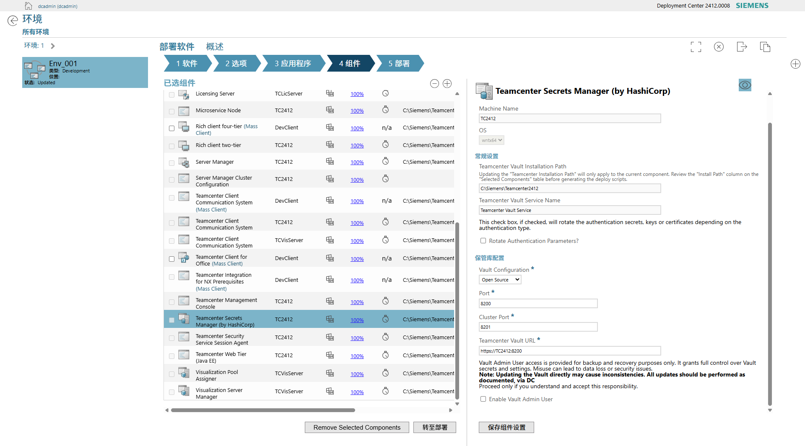

这里注意下，原先的组件名为 Teamcenter Vault，现在改成了 Teamcenter Secrets Manager (by HashiCorp)

TC服务器部署日志：

```cmd
C:\Users\Administrator>cd C:\Siemens\DeploymentCenter\repository\deploy_scripts\Env_001\install\20250914180832CST\deploy_TC2412

C:\Siemens\DeploymentCenter\repository\deploy_scripts\Env_001\install\20250914180832CST\deploy_TC2412>.\deploy.bat -dcusername=dcadmin -dcpassword=dcadmin -softwareLocation=default

Performing deployment operations for envrionment:"Env_001"

Validating connection to the Deployment Center server "http://TC2412:7080/deploymentcenter"
Deployment Center Authentication Successful...
Validating that the scripts are running on machine "TC2412"...Success
Validating that the TC2412 OS is "wntx64"...Success
Validating Java version for Teamcenter 2412.0008...Success
Scanning software for the deployment actions...
  ** Note: The duration of the scanning process may vary depending on the number of software, applications, and components being deployed.
Executing Deployment Steps
Setting the environment variable for Windows OS
Executing the following command to set environment variable: cmd /c setx.exe VAULT_TLS_ROOT "C:\Siemens\TEAMCE~1\tc_vault_tls"
Response Message: SUCCESS|
成功: 指定的值已得到保存。

Response Code: 0
Deployment Center Deploy Task [envSettings]: 1 of 566 for [Business Modeler IDE 2 tier] Component --> fnd0_tpcArtifact...Success
Deployment Center Deploy Task [envSettings]: 2 of 566 for [Business Modeler IDE 2 tier] Component --> fnd0_vcredistArtifact...Success
Deployment Center Deploy Task [envSettings]: 3 of 566 for [Rich client two-tier] Component --> fnd0_tpcArtifact...Success
Deployment Center Deploy Task [envSettings]: 4 of 566 for [Rich client two-tier] Component --> fnd0_vcredistArtifact...Success
Deployment Center Deploy Task [envSettings]: 5 of 566 for [Rich client two-tier] Component --> fnd0_webview2Artifact...Success
Deployment Center Deploy Task [envSettings]: 6 of 566 for [Microservice Node] Component --> fnd0_tpcArtifact...Success
Deployment Center Deploy Task [envSettings]: 7 of 566 for [Indexer] Component --> fnd0_vcredistArtifact...Success
Deployment Center Deploy Task [envSettings]: 8 of 566 for [Indexer] Component --> fnd0_tpcArtifact...Success
Deployment Center Deploy Task [envSettings]: 9 of 566 for [FSC] Component --> fnd0_vcredistArtifact...Success
Deployment Center Deploy Task [envSettings]: 10 of 566 for [Server Manager] Component --> fnd0_serverManagerArtifact...Success
Deployment Center Deploy Task [envSettings]: 11 of 566 for [Server Manager] Component --> fnd0_tpcArtifact...Success
Deployment Center Deploy Task [envSettings]: 12 of 566 for [Corporate Server] Component --> fnd0_tpcArtifact...Success
Deployment Center Deploy Task [envSettings]: 13 of 566 for [Corporate Server] Component --> fnd0_serverArtifact...Success
Deployment Center Deploy Task [envSettings]: 14 of 566 for [Corporate Server] Component --> fnd0_dataModelArtifact...Success
Deployment Center Deploy Task [envSettings]: 15 of 566 for [Corporate Server] Component --> fnd0_vcredistArtifact...Success
Deployment Center Deploy Task [envSettings]: 16 of 566 for [Indexing Engine] Component --> fnd0_vcredistArtifact...Success
Deployment Center Deploy Task [envSettings]: 17 of 566 for [Teamcenter Web Tier (Java EE)] Component --> fnd0_vcredistArtifact...Success
Deployment Center Deploy Task [envSettings]: 18 of 566 for [Teamcenter Web Tier (Java EE)] Component --> fnd0_tpcArtifact...Success
Deployment Center Deploy Task [envSettings]: 19 of 566 for [Teamcenter Client Communication System] Component --> fnd0_vcredistArtifact...Success
Deployment Center Deploy Task [envSettings]: 20 of 566 for [Active Workspace Client Builder] Component --> fnd0_vcredistArtifact...Success
Deployment Center Deploy Task [envSettings]: 21 of 566 for [Active Workspace Gateway] Component --> fnd0_vcredistArtifact...Success
Deployment Center Deploy Task [envSettings]: 22 of 566 for [Active Workspace Gateway] Component --> fnd0_tpcArtifact...Success
Deployment Center Deploy Task [envSettings]: 23 of 566 for [Teamcenter Foundation] Application/Package --> fnd0_serverArtifact...Success
Deployment Center Deploy Task [envSettings]: 24 of 566 for [Teamcenter Foundation] Application/Package --> fnd0_dbdrevcfgaccArtifact...Success
Deployment Center Deploy Task [diagnosticChecks]: 25 of 566 for [Business Modeler IDE 2 tier] Component --> fnd0_tpcArtifact...Success
Deployment Center Deploy Task [diagnosticChecks]: 26 of 566 for [Business Modeler IDE 2 tier] Component --> fnd0_2TierBmideClientArtifact...Success
Deployment Center Deploy Task [diagnosticChecks]: 27 of 566 for [Rich client two-tier] Component --> fnd0_tpcArtifact...Success
Deployment Center Deploy Task [diagnosticChecks]: 28 of 566 for [Rich client two-tier] Component --> fnd0_2TierRichclientArtifact...Success
Deployment Center Deploy Task [diagnosticChecks]: 29 of 566 for [Rich client two-tier] Component --> fnd0_tccsConfigArtifact...Success
Deployment Center Deploy Task [diagnosticChecks]: 30 of 566 for [Microservice Node] Component --> fnd0_msfArtifact...Success
Deployment Center Deploy Task [diagnosticChecks]: 31 of 566 for [Microservice Node] Component --> fnd0_tpcArtifact...Success
Deployment Center Deploy Task [diagnosticChecks]: 32 of 566 for [Indexer] Component --> aws2_ftsIndexerArtifact...Success
Deployment Center Deploy Task [diagnosticChecks]: 33 of 566 for [Indexer] Component --> fnd0_tpcArtifact...Success
Deployment Center Deploy Task [diagnosticChecks]: 34 of 566 for [FSC] Component --> fnd0_fscArtifact...Success
Deployment Center Deploy Task [diagnosticChecks]: 35 of 566 for [Server Manager] Component --> fnd0_serverManagerArtifact...Success
Deployment Center Deploy Task [diagnosticChecks]: 36 of 566 for [Server Manager] Component --> fnd0_tpcArtifact...Success
Deployment Center Deploy Task [diagnosticChecks]: 37 of 566 for [Teamcenter Secrets Manager (by HashiCorp)] Component --> fnd0_vaultArtifact...Success
Deployment Center Deploy Task [diagnosticChecks]: 38 of 566 for [Teamcenter Management Console] Component --> fnd0_serverMgrConsoleArtifact...Success
Deployment Center Deploy Task [diagnosticChecks]: 39 of 566 for [Teamcenter Security Service Session Agent] Component --> fnd0_tcsssessionagentArtifact...Success
Deployment Center Deploy Task [diagnosticChecks]: 40 of 566 for [Corporate Server] Component --> fnd0_tpcArtifact...Success
Deployment Center Deploy Task [diagnosticChecks]: 41 of 566 for [Corporate Server] Component --> fnd0_dataModelArtifact...Success
Deployment Center Deploy Task [diagnosticChecks]: 42 of 566 for [Corporate Server] Component --> fnd0_dbArtifact...Success
Deployment Center Deploy Task [diagnosticChecks]: 43 of 566 for [Indexing Engine] Component --> aws2_indexingEngineArtifact...Success
Deployment Center Deploy Task [diagnosticChecks]: 44 of 566 for [Teamcenter Web Tier (Java EE)] Component --> fnd0_j2eeWebtierArtifact...Success
Deployment Center Deploy Task [diagnosticChecks]: 45 of 566 for [Teamcenter Web Tier (Java EE)] Component --> fnd0_tpcArtifact...Success
Deployment Center Deploy Task [diagnosticChecks]: 46 of 566 for [Teamcenter Client Communication System] Component --> fnd0_tccsArtifact...Success
Deployment Center Deploy Task [diagnosticChecks]: 47 of 566 for [Teamcenter Client Communication System] Component --> fnd0_tccsConfigArtifact...Success
Deployment Center Deploy Task [diagnosticChecks]: 48 of 566 for [Active Workspace Client Builder] Component --> aws2_clientArtifact...Success
Deployment Center Deploy Task [diagnosticChecks]: 49 of 566 for [Active Workspace Gateway] Component --> fnd0_tpcArtifact...Success
Deployment Center Deploy Task [diagnosticChecks]: 50 of 566 for [Teamcenter Foundation] Application/Package --> fnd0_dataModelArtifact...Success
Deployment Center Deploy Task [diagnosticChecks]: 51 of 566 for [Teamcenter Foundation] Application/Package --> fnd0_dataArtifact...Success
Deployment Center Deploy Task [diagnosticChecks]: 52 of 566 for [Active Workspace Base] Application/Package --> aws2_clientBuilderArtifact...Success
Deployment Center Deploy Task [diagnosticChecks]: 53 of 566 for [File Repository Service] Application/Package --> fnd0_microserviceArtifact...Success
Deployment Center Deploy Task [analyseDiagnosticChecks]: 54 of 566 for [Business Modeler IDE 2 tier] Component --> fnd0_tpcArtifact...Success
Deployment Center Deploy Task [preRequisite]: 55 of 566 for [Business Modeler IDE 2 tier] Component --> fnd0_tpcArtifact...Success
Deployment Center Deploy Task [preRequisite]: 56 of 566 for [Rich client two-tier] Component --> fnd0_tpcArtifact...Success
Deployment Center Deploy Task [preRequisite]: 57 of 566 for [Rich client two-tier] Component --> fnd0_tccsConfigArtifact...Success
Deployment Center Deploy Task [preRequisite]: 58 of 566 for [Microservice Node] Component --> fnd0_tpcArtifact...Success
Deployment Center Deploy Task [preRequisite]: 59 of 566 for [Indexer] Component --> fnd0_tpcArtifact...Success
Deployment Center Deploy Task [preRequisite]: 60 of 566 for [Server Manager] Component --> fnd0_tpcArtifact...Success
Deployment Center Deploy Task [preRequisite]: 61 of 566 for [Corporate Server] Component --> fnd0_tpcArtifact...Success
Deployment Center Deploy Task [preRequisite]: 62 of 566 for [Teamcenter Web Tier (Java EE)] Component --> fnd0_tpcArtifact...Success
Deployment Center Deploy Task [preRequisite]: 63 of 566 for [Teamcenter Client Communication System] Component --> fnd0_tccsConfigArtifact...Success
Deployment Center Deploy Task [preRequisite]: 64 of 566 for [HTTPS Config] Component --> fnd0_httpsconfigArtifact...Success
Deployment Center Deploy Task [preRequisite]: 65 of 566 for [Active Workspace Gateway] Component --> fnd0_tpcArtifact...Success
Deployment Center Deploy Task [backup]: 66 of 566 for [FSC] Component --> fnd0_fscArtifact...Success
Deployment Center Deploy Task [backup]: 67 of 566 for [Teamcenter Secrets Manager (by HashiCorp)] Component --> fnd0_vaultArtifact...Success
Deployment Center Deploy Task [backup]: 68 of 566 for [Corporate Server] Component --> fnd0_dataModelArtifact...Success
Deployment Center Deploy Task [backup]: 69 of 566 for [Active Workspace Client Builder] Component --> aws2_clientArtifact...Success
Deployment Center Deploy Task [stop]: 70 of 566 for [Microservice Node] Component --> fnd0_msfArtifact...Success
Deployment Center Deploy Task [stop]: 71 of 566 for [Microservice Node] Component --> fnd0_microserviceArtifact...Success
Deployment Center Deploy Task [stop]: 72 of 566 for [Indexer] Component --> aws2_ftsIndexerArtifact...Success
Deployment Center Deploy Task [stop]: 73 of 566 for [FSC] Component --> fnd0_fscArtifact...Success
Deployment Center Deploy Task [stop]: 74 of 566 for [Server Manager] Component --> fnd0_serverManagerArtifact...Success
Deployment Center Deploy Task [stop]: 75 of 566 for [Corporate Server] Component --> fnd0_serverArtifact...Success
Deployment Center Deploy Task [stop]: 76 of 566 for [Corporate Server] Component --> fnd0_dataModelArtifact...Success
Deployment Center Deploy Task [stop]: 77 of 566 for [Indexing Engine] Component --> aws2_indexingEngineArtifact...Success
Deployment Center Deploy Task [stop]: 78 of 566 for [Teamcenter Foundation] Application/Package --> fnd0_dataModelArtifact...Success
Deployment Center Deploy Task [stop]: 79 of 566 for [Teamcenter Foundation] Application/Package --> fnd0_dbdrevcfgaccArtifact...Success
Deployment Center Deploy Task [stop]: 80 of 566 for [Active Workspace Base] Application/Package --> fnd0_dataModelArtifact...Success
Deployment Center Deploy Task [stop]: 81 of 566 for [Active Workspace Base] Application/Package --> fnd0_serverArtifact...Success
Deployment Center Deploy Task [stop]: 82 of 566 for [Teamcenter Read Expression Manager Service] Application/Package --> fnd0_dataModelArtifact...Success
Deployment Center Deploy Task [cleanUp]: 83 of 566 for [Microservice Node] Component --> fnd0_microserviceArtifact...Success
Deployment Center Deploy Task [cleanUp]: 84 of 566 for [Microservice Node] Component --> fnd0_tpcArtifact...Success
Deployment Center Deploy Task [cleanUp]: 85 of 566 for [Indexer] Component --> aws2_ftsIndexerArtifact...Success
Deployment Center Deploy Task [cleanUp]: 86 of 566 for [Indexer] Component --> fnd0_tpcArtifact...Success
Deployment Center Deploy Task [cleanUp]: 87 of 566 for [FSC] Component --> fnd0_fscArtifact...Success
Deployment Center Deploy Task [cleanUp]: 88 of 566 for [Server Manager] Component --> fnd0_serverManagerArtifact...Success
Deployment Center Deploy Task [cleanUp]: 89 of 566 for [Server Manager] Component --> fnd0_tpcArtifact...Success
Deployment Center Deploy Task [cleanUp]: 90 of 566 for [Teamcenter Management Console] Component --> fnd0_serverMgrConsoleArtifact...Success
Deployment Center Deploy Task [cleanUp]: 91 of 566 for [Teamcenter Security Service Session Agent] Component --> fnd0_tcsssessionagentArtifact...Success
Deployment Center Deploy Task [cleanUp]: 92 of 566 for [Corporate Server] Component --> fnd0_tpcArtifact...Success
Deployment Center Deploy Task [cleanUp]: 93 of 566 for [Corporate Server] Component --> fnd0_serverArtifact...Success
Deployment Center Deploy Task [cleanUp]: 94 of 566 for [Corporate Server] Component --> fnd0_dataModelArtifact...Success
Deployment Center Deploy Task [cleanUp]: 95 of 566 for [Indexing Engine] Component --> aws2_indexingEngineArtifact...Success
Deployment Center Deploy Task [cleanUp]: 96 of 566 for [Teamcenter Web Tier (Java EE)] Component --> fnd0_j2eeWebtierArtifact...Success
Deployment Center Deploy Task [cleanUp]: 97 of 566 for [Teamcenter Web Tier (Java EE)] Component --> fnd0_j2eeWebtierArtifact...Success
Deployment Center Deploy Task [cleanUp]: 98 of 566 for [Teamcenter Web Tier (Java EE)] Component --> fnd0_tpcArtifact...Success
Deployment Center Deploy Task [cleanUp]: 99 of 566 for [Teamcenter Client Communication System] Component --> fnd0_tccsArtifact...Success
Deployment Center Deploy Task [cleanUp]: 100 of 566 for [Active Workspace Client Builder] Component --> aws2_clientArtifact...Success
Deployment Center Deploy Task [cleanUp]: 101 of 566 for [Active Workspace Gateway] Component --> aws2_gatewayclientArtifact...Success
Deployment Center Deploy Task [cleanUp]: 102 of 566 for [Active Workspace Gateway] Component --> fnd0_processManagerArtifact...Success
Deployment Center Deploy Task [cleanUp]: 103 of 566 for [Active Workspace Gateway] Component --> fnd0_tpcArtifact...Success
Deployment Center Deploy Task [cleanUp]: 104 of 566 for [Teamcenter Foundation] Application/Package --> fnd0_dataModelArtifact...Success
Deployment Center Deploy Task [cleanUp]: 105 of 566 for [Teamcenter Foundation] Application/Package --> fnd0_serverArtifact...Success
Deployment Center Deploy Task [cleanUp]: 106 of 566 for [Teamcenter Foundation] Application/Package --> fnd0_dbdrevcfgaccArtifact...Success
Deployment Center Deploy Task [cleanUp]: 107 of 566 for [Active Workspace Base] Application/Package --> aws2_clientBuilderArtifact...Success
Deployment Center Deploy Task [cleanUp]: 108 of 566 for [Teamcenter Read Expression Manager Service] Application/Package --> fnd0_dataModelArtifact...Success
Deployment Center Deploy Task [cleanUp]: 109 of 566 for [Audit] Application/Package --> aws2_clientArtifact...Success
Deployment Center Deploy Task [cleanUp]: 110 of 566 for [Teamcenter Microservice Framework] Application/Package --> fnd0_msfArtifact...Success
Deployment Center Deploy Task [cleanUp]: 111 of 566 for [File Repository Service] Application/Package --> fnd0_microserviceArtifact...Success
Deployment Center Deploy Task [cleanUp]: 112 of 566 for [Microservice Parameter Store] Application/Package --> fnd0_microserviceArtifact...Success
Deployment Center Deploy Task [cleanUp]: 113 of 566 for [Teamcenter GraphQL Service] Application/Package --> fnd0_microserviceArtifact...Success
Deployment Center Deploy Task [cleanUp]: 114 of 566 for [Declarative Artifact Service] Application/Package --> fnd0_microserviceArtifact...Success
Deployment Center Deploy Task [init]: 115 of 566 for [Teamcenter Secrets Manager (by HashiCorp)] Component --> fnd0_vaultArtifact...Success
Deployment Center Deploy Task [init]: 116 of 566 for [Teamcenter Client Communication System] Component --> fnd0_tccsArtifact...Success
Deployment Center Deploy Task [init]: 117 of 566 for [Teamcenter Client Communication System] Component --> fnd0_tccsConfigArtifact...Success
Deployment Center Deploy Task [init]: 118 of 566 for [Teamcenter Foundation] Application/Package --> fnd0_dataModelArtifact...Success
Deployment Center Deploy Task [init]: 119 of 566 for [Teamcenter Foundation] Application/Package --> fnd0_serverArtifact...Success
Deployment Center Deploy Task [postInit]: 120 of 566 for [Teamcenter Secrets Manager (by HashiCorp)] Component --> fnd0_vaultArtifact...Success
Deployment Center Deploy Task [fileProcessing]: 121 of 566 for [Microservice Node] Component --> fnd0_msfArtifact...Success
Deployment Center Deploy Task [fileProcessing]: 122 of 566 for [Microservice Node] Component --> fnd0_logForwarderArtifact...Success
Deployment Center Deploy Task [fileProcessing]: 123 of 566 for [Indexer] Component --> aws2_ftsIndexerObjDataArtifact...Success
Deployment Center Deploy Task [fileProcessing]: 124 of 566 for [FSC] Component --> fnd0_fscArtifact...Success
Deployment Center Deploy Task [fileProcessing]: 125 of 566 for [Server Manager] Component --> fnd0_serverManagerArtifact...Success
Deployment Center Deploy Task [fileProcessing]: 126 of 566 for [Server Manager] Component --> fnd0_serverpoolDBConfigArtifact...Success
Deployment Center Deploy Task [fileProcessing]: 127 of 566 for [Teamcenter Security Service Session Agent] Component --> fnd0_tcsssessionagentArtifact...Success
Deployment Center Deploy Task [fileProcessing]: 128 of 566 for [Corporate Server] Component --> fnd0_serverArtifact...Success
Deployment Center Deploy Task [fileProcessing]: 129 of 566 for [Corporate Server] Component --> fnd0_dataModelArtifact...Success
Deployment Center Deploy Task [fileProcessing]: 130 of 566 for [Corporate Server] Component --> fnd0_logForwarderArtifact...Success
Deployment Center Deploy Task [fileProcessing]: 131 of 566 for [Indexing Engine] Component --> aws2_indexingEngineArtifact...Success
Deployment Center Deploy Task [fileProcessing]: 132 of 566 for [Teamcenter Web Tier (Java EE)] Component --> fnd0_j2eeWebtierArtifact...Success
Deployment Center Deploy Task [fileProcessing]: 133 of 566 for [Teamcenter Client Communication System] Component --> fnd0_tccsArtifact...Success
Deployment Center Deploy Task [fileProcessing]: 134 of 566 for [Active Workspace Client Builder] Component --> aws2_clientArtifact...Success
Deployment Center Deploy Task [fileProcessing]: 135 of 566 for [Active Workspace Gateway] Component --> aws2_gatewayclientArtifact...Success
Deployment Center Deploy Task [fileProcessing]: 136 of 566 for [Active Workspace Gateway] Component --> fnd0_processManagerArtifact...Success
Deployment Center Deploy Task [fileProcessing]: 137 of 566 for [Teamcenter Foundation] Application/Package --> fnd0_dataModelArtifact...Success
Deployment Center Deploy Task [fileProcessing]: 138 of 566 for [Teamcenter Foundation] Application/Package --> fnd0_serverArtifact...Success
Deployment Center Deploy Task [fileProcessing]: 139 of 566 for [Teamcenter Foundation] Application/Package --> fnd0_dataArtifact...Success
Deployment Center Deploy Task [fileProcessing]: 140 of 566 for [Teamcenter Foundation] Application/Package --> fnd0_dbArtifact...Success
Deployment Center Deploy Task [fileProcessing]: 141 of 566 for [Teamcenter Foundation] Application/Package --> fnd0_logForwarderArtifact...Success
Deployment Center Deploy Task [fileProcessing]: 142 of 566 for [Security] Application/Package --> aws2_clientArtifact...Success
Deployment Center Deploy Task [fileProcessing]: 143 of 566 for [Relations Component] Application/Package --> aws2_clientArtifact...Success
Deployment Center Deploy Task [fileProcessing]: 144 of 566 for [Configured Search Framework] Application/Package --> fnd0_dataModelArtifact...Success
Deployment Center Deploy Task [fileProcessing]: 145 of 566 for [Configured Search Framework] Application/Package --> fnd0_serverArtifact...Success
Deployment Center Deploy Task [fileProcessing]: 146 of 566 for [Build Conditions] Application/Package --> fnd0_dataModelArtifact...Success
Deployment Center Deploy Task [fileProcessing]: 147 of 566 for [Build Conditions] Application/Package --> fnd0_serverArtifact...Success
Deployment Center Deploy Task [fileProcessing]: 148 of 566 for [NX Foundation] Application/Package --> fnd0_dataModelArtifact...Success
Deployment Center Deploy Task [fileProcessing]: 149 of 566 for [NX Foundation] Application/Package --> fnd0_serverArtifact...Success
Deployment Center Deploy Task [fileProcessing]: 150 of 566 for [Branch Data Organization] Application/Package --> fnd0_dataModelArtifact...Success
Deployment Center Deploy Task [fileProcessing]: 151 of 566 for [Branch Data Organization] Application/Package --> fnd0_serverArtifact...Success
Deployment Center Deploy Task [fileProcessing]: 152 of 566 for [Active Workspace Base] Application/Package --> fnd0_dataModelArtifact...Success
Deployment Center Deploy Task [fileProcessing]: 153 of 566 for [Active Workspace Base] Application/Package --> fnd0_serverArtifact...Success
Deployment Center Deploy Task [fileProcessing]: 154 of 566 for [Active Workspace Base] Application/Package --> aws2_clientBuilderArtifact...Success
Deployment Center Deploy Task [fileProcessing]: 155 of 566 for [Active Workspace Base] Application/Package --> aws2_ftsIndexerObjDataArtifact...Success
Deployment Center Deploy Task [fileProcessing]: 156 of 566 for [Active Workspace Base] Application/Package --> aws2_indexingEngineArtifact...Success
Deployment Center Deploy Task [fileProcessing]: 157 of 566 for [Active Workspace Base] Application/Package --> aws2_ftsIndexerObjDataArtifact...Success
Deployment Center Deploy Task [fileProcessing]: 158 of 566 for [Active Workspace Base] Application/Package --> aws2_ftsIndexerArtifact...Success
Deployment Center Deploy Task [fileProcessing]: 159 of 566 for [Active Workspace Base] Application/Package --> fnd0_microserviceArtifact...Success
Deployment Center Deploy Task [fileProcessing]: 160 of 566 for [Data Discovery Services] Application/Package --> fnd0_dataModelArtifact...Success
Deployment Center Deploy Task [fileProcessing]: 161 of 566 for [Data Discovery Services] Application/Package --> fnd0_serverArtifact...Success
Deployment Center Deploy Task [fileProcessing]: 162 of 566 for [Data Discovery Services] Application/Package --> aws2_clientArtifact...Success
Deployment Center Deploy Task [fileProcessing]: 163 of 566 for [Reporting] Application/Package --> fnd0_dataModelArtifact...Success
Deployment Center Deploy Task [fileProcessing]: 164 of 566 for [Reporting] Application/Package --> fnd0_serverArtifact...Success
Deployment Center Deploy Task [fileProcessing]: 165 of 566 for [Reporting] Application/Package --> aws2_clientArtifact...Success
Deployment Center Deploy Task [fileProcessing]: 166 of 566 for [ganttinterface_client.displayName] Application/Package --> aws2_clientArtifact...Success
Deployment Center Deploy Task [fileProcessing]: 167 of 566 for [Markup] Application/Package --> aws2_clientArtifact...Success
Deployment Center Deploy Task [fileProcessing]: 168 of 566 for [Rich Text Editor] Application/Package --> aws2_clientArtifact...Success
Deployment Center Deploy Task [fileProcessing]: 169 of 566 for [Active Architect Core] Application/Package --> fnd0_dataModelArtifact...Success
Deployment Center Deploy Task [fileProcessing]: 170 of 566 for [TC XML Import and Export] Application/Package --> fnd0_dataModelArtifact...Success
Deployment Center Deploy Task [fileProcessing]: 171 of 566 for [TC XML Import and Export] Application/Package --> fnd0_serverArtifact...Success
Deployment Center Deploy Task [fileProcessing]: 172 of 566 for [Active Admin Core] Application/Package --> fnd0_dataModelArtifact...Success
Deployment Center Deploy Task [fileProcessing]: 173 of 566 for [Active Workspace User Management] Application/Package --> fnd0_dataModelArtifact...Success
Deployment Center Deploy Task [fileProcessing]: 174 of 566 for [Active Workspace User Management] Application/Package --> fnd0_serverArtifact...Success
Deployment Center Deploy Task [fileProcessing]: 175 of 566 for [kanbaninterface_client.displayName] Application/Package --> aws2_clientArtifact...Success
Deployment Center Deploy Task [fileProcessing]: 176 of 566 for [Authorization Active Workspace] Application/Package --> fnd0_dataModelArtifact...Success
Deployment Center Deploy Task [fileProcessing]: 177 of 566 for [Authorization Active Workspace] Application/Package --> fnd0_serverArtifact...Success
Deployment Center Deploy Task [fileProcessing]: 178 of 566 for [Change Management] Application/Package --> fnd0_dataModelArtifact...Success
Deployment Center Deploy Task [fileProcessing]: 179 of 566 for [Change and Schedule Management Interface] Application/Package --> fnd0_dataModelArtifact...Success
Deployment Center Deploy Task [fileProcessing]: 180 of 566 for [Change and Schedule Management Interface] Application/Package --> fnd0_serverArtifact...Success
Deployment Center Deploy Task [fileProcessing]: 181 of 566 for [Project Assignment] Application/Package --> aws2_clientArtifact...Success
Deployment Center Deploy Task [fileProcessing]: 182 of 566 for [Engineering Views] Application/Package --> fnd0_dataModelArtifact...Success
Deployment Center Deploy Task [fileProcessing]: 183 of 566 for [Engineering Views] Application/Package --> fnd0_serverArtifact...Success
Deployment Center Deploy Task [fileProcessing]: 184 of 566 for [Workflow] Application/Package --> fnd0_serverArtifact...Success
Deployment Center Deploy Task [fileProcessing]: 185 of 566 for [Workflow] Application/Package --> aws2_clientArtifact...Success
Deployment Center Deploy Task [fileProcessing]: 186 of 566 for [Branching and Versioning Foundation] Application/Package --> fnd0_dataModelArtifact...Success
Deployment Center Deploy Task [fileProcessing]: 187 of 566 for [Branching and Versioning Foundation] Application/Package --> fnd0_serverArtifact...Success
Deployment Center Deploy Task [fileProcessing]: 188 of 566 for [Advanced PLM Services core Template] Application/Package --> fnd0_dataModelArtifact...Success
Deployment Center Deploy Task [fileProcessing]: 189 of 566 for [Advanced PLM Services core Template] Application/Package --> fnd0_serverArtifact...Success
Deployment Center Deploy Task [fileProcessing]: 190 of 566 for [Advanced PLM Services for Applications] Application/Package --> fnd0_dataModelArtifact...Success
Deployment Center Deploy Task [fileProcessing]: 191 of 566 for [Advanced PLM Services for Applications] Application/Package --> fnd0_serverArtifact...Success
Deployment Center Deploy Task [fileProcessing]: 192 of 566 for [Advanced PLM Services for Realization] Application/Package --> fnd0_dataModelArtifact...Success
Deployment Center Deploy Task [fileProcessing]: 193 of 566 for [Advanced PLM Services for Realization] Application/Package --> fnd0_serverArtifact...Success
Deployment Center Deploy Task [fileProcessing]: 194 of 566 for [fgc0cm4g.displayName] Application/Package --> fnd0_dataModelArtifact...Success
Deployment Center Deploy Task [fileProcessing]: 195 of 566 for [fgc0cm4g.displayName] Application/Package --> fnd0_serverArtifact...Success
Deployment Center Deploy Task [fileProcessing]: 196 of 566 for [Advanced PLM Services for Partitioning] Application/Package --> fnd0_dataModelArtifact...Success
Deployment Center Deploy Task [fileProcessing]: 197 of 566 for [Advanced PLM Services for Partitioning] Application/Package --> fnd0_serverArtifact...Success
Deployment Center Deploy Task [fileProcessing]: 198 of 566 for [Presentation Layer - Next Generation Classification Foundation] Application/Package --> fnd0_dataModelArtifact...Success
Deployment Center Deploy Task [fileProcessing]: 199 of 566 for [Presentation Layer - Next Generation Classification Foundation] Application/Package --> fnd0_serverArtifact...Success
Deployment Center Deploy Task [fileProcessing]: 200 of 566 for [Classification Interface] Application/Package --> fnd0_dataModelArtifact...Success
Deployment Center Deploy Task [fileProcessing]: 201 of 566 for [Classification Interface] Application/Package --> fnd0_serverArtifact...Success
Deployment Center Deploy Task [fileProcessing]: 202 of 566 for [Gateway for modeling] Application/Package --> fnd0_dataModelArtifact...Success
Deployment Center Deploy Task [fileProcessing]: 203 of 566 for [Gateway for modeling] Application/Package --> fnd0_serverArtifact...Success
Deployment Center Deploy Task [fileProcessing]: 204 of 566 for [Support for Concurrent Modeling] Application/Package --> fnd0_serverArtifact...Success
Deployment Center Deploy Task [fileProcessing]: 205 of 566 for [Search] Application/Package --> aws2_clientArtifact...Success
Deployment Center Deploy Task [fileProcessing]: 206 of 566 for [Calendar Management] Application/Package --> aws2_clientArtifact...Success
Deployment Center Deploy Task [fileProcessing]: 207 of 566 for [Schedule Manager] Application/Package --> fnd0_dataModelArtifact...Success
Deployment Center Deploy Task [fileProcessing]: 208 of 566 for [Schedule Manager] Application/Package --> fnd0_serverArtifact...Success
Deployment Center Deploy Task [fileProcessing]: 209 of 566 for [Schedule Manager] Application/Package --> aws2_clientArtifact...Success
Deployment Center Deploy Task [fileProcessing]: 210 of 566 for [Change Management Realization Interface] Application/Package --> fnd0_dataModelArtifact...Success
Deployment Center Deploy Task [fileProcessing]: 211 of 566 for [Change Management Realization Interface] Application/Package --> fnd0_serverArtifact...Success
Deployment Center Deploy Task [fileProcessing]: 212 of 566 for [XRT Editor] Application/Package --> fnd0_serverArtifact...Success
Deployment Center Deploy Task [fileProcessing]: 213 of 566 for [Document Management] Application/Package --> fnd0_dataModelArtifact...Success
Deployment Center Deploy Task [fileProcessing]: 214 of 566 for [Document Management] Application/Package --> fnd0_serverArtifact...Success
Deployment Center Deploy Task [fileProcessing]: 215 of 566 for [Document Management] Application/Package --> aws2_clientArtifact...Success
Deployment Center Deploy Task [fileProcessing]: 216 of 566 for [Common Integration Framework] Application/Package --> fnd0_dataModelArtifact...Success
Deployment Center Deploy Task [fileProcessing]: 217 of 566 for [Common Integration Framework] Application/Package --> fnd0_serverArtifact...Success
Deployment Center Deploy Task [fileProcessing]: 218 of 566 for [Audit] Application/Package --> fnd0_dataModelArtifact...Success
Deployment Center Deploy Task [fileProcessing]: 219 of 566 for [Audit] Application/Package --> fnd0_serverArtifact...Success
Deployment Center Deploy Task [fileProcessing]: 220 of 566 for [Audit] Application/Package --> aws2_clientArtifact...Success
Deployment Center Deploy Task [fileProcessing]: 221 of 566 for [Subscription] Application/Package --> fnd0_dataModelArtifact...Success
Deployment Center Deploy Task [fileProcessing]: 222 of 566 for [Subscription] Application/Package --> fnd0_serverArtifact...Success
Deployment Center Deploy Task [fileProcessing]: 223 of 566 for [Subscription] Application/Package --> aws2_clientArtifact...Success
Deployment Center Deploy Task [fileProcessing]: 224 of 566 for [Translation Service Database Module] Application/Package --> fnd0_dataModelArtifact...Success
Deployment Center Deploy Task [fileProcessing]: 225 of 566 for [Open in tool] Application/Package --> aws2_clientArtifact...Success
Deployment Center Deploy Task [fileProcessing]: 226 of 566 for [Teamcenter Microservice Framework] Application/Package --> fnd0_msfArtifact...Success
Deployment Center Deploy Task [fileProcessing]: 227 of 566 for [File Repository Service] Application/Package --> fnd0_microserviceArtifact...Success
Deployment Center Deploy Task [fileProcessing]: 228 of 566 for [Requirements Management Compare Service] Application/Package --> fnd0_microserviceArtifact...Success
Deployment Center Deploy Task [fileProcessing]: 229 of 566 for [Requirements Management Export Service] Application/Package --> fnd0_microserviceArtifact...Success
Deployment Center Deploy Task [fileProcessing]: 230 of 566 for [Microservice Parameter Store] Application/Package --> fnd0_microserviceArtifact...Success
Deployment Center Deploy Task [fileProcessing]: 231 of 566 for [Requirements Management Import Service] Application/Package --> fnd0_microserviceArtifact...Success
Deployment Center Deploy Task [fileProcessing]: 232 of 566 for [Teamcenter GraphQL Service] Application/Package --> fnd0_microserviceArtifact...Success
Deployment Center Deploy Task [fileProcessing]: 233 of 566 for [Declarative Artifact Service] Application/Package --> fnd0_microserviceArtifact...Success
Deployment Center Deploy Task [fileProcessing]: 234 of 566 for [Declarative Artifact Service] Application/Package --> aws2_clientArtifact...Success
Deployment Center Deploy Task [fileProcessing]: 235 of 566 for [PS Component] Application/Package --> aws2_clientArtifact...Success
Deployment Center Deploy Task [fileProcessing]: 236 of 566 for [Active Content] Application/Package --> fnd0_dataModelArtifact...Success
Deployment Center Deploy Task [fileProcessing]: 237 of 566 for [Active Content] Application/Package --> fnd0_serverArtifact...Success
Deployment Center Deploy Task [fileProcessing]: 238 of 566 for [Active Content] Application/Package --> aws2_clientArtifact...Success
Deployment Center Deploy Task [fileProcessing]: 239 of 566 for [Active Content] Application/Package --> aws2_ftsIndexerArtifact...Success
Deployment Center Deploy Task [fileProcessing]: 240 of 566 for [Concurrent Modeling] Application/Package --> fnd0_dataModelArtifact...Success
Deployment Center Deploy Task [fileProcessing]: 241 of 566 for [Concurrent Modeling] Application/Package --> fnd0_serverArtifact...Success
Deployment Center Deploy Task [fileProcessing]: 242 of 566 for [Concurrent Modeling] Application/Package --> aws2_clientArtifact...Success
Deployment Center Deploy Task [fileProcessing]: 243 of 566 for [Modeling Gateway Active Workspace Interface] Application/Package --> fnd0_dataModelArtifact...Success
Deployment Center Deploy Task [fileProcessing]: 244 of 566 for [Modeling Gateway Active Workspace Interface] Application/Package --> aws2_clientArtifact...Success
Deployment Center Deploy Task [fileProcessing]: 245 of 566 for [NX Integration] Application/Package --> aws2_clientArtifact...Success
Deployment Center Deploy Task [fileProcessing]: 246 of 566 for [Requirements and Systems Engineering] Application/Package --> fnd0_dataModelArtifact...Success
Deployment Center Deploy Task [fileProcessing]: 247 of 566 for [Requirements and Systems Engineering] Application/Package --> fnd0_serverArtifact...Success
Deployment Center Deploy Task [fileProcessing]: 248 of 566 for [Requirements and Systems Engineering] Application/Package --> fnd0_microserviceArtifact...Success
Deployment Center Deploy Task [fileProcessing]: 249 of 566 for [Engineering Views Active Workspace] Application/Package --> fnd0_dataModelArtifact...Success
Deployment Center Deploy Task [fileProcessing]: 250 of 566 for [Engineering Views Active Workspace] Application/Package --> fnd0_serverArtifact...Success
Deployment Center Deploy Task [fileProcessing]: 251 of 566 for [Engineering Views Active Workspace] Application/Package --> aws2_clientArtifact...Success
Deployment Center Deploy Task [fileProcessing]: 252 of 566 for [MBSE services] Application/Package --> fnd0_serverArtifact...Success
Deployment Center Deploy Task [fileProcessing]: 253 of 566 for [MBSE services] Application/Package --> aws2_clientArtifact...Success
Deployment Center Deploy Task [fileProcessing]: 254 of 566 for [Requirements Management] Application/Package --> fnd0_dataModelArtifact...Success
Deployment Center Deploy Task [fileProcessing]: 255 of 566 for [Requirements Management] Application/Package --> fnd0_serverArtifact...Success
Deployment Center Deploy Task [fileProcessing]: 256 of 566 for [Requirements Management] Application/Package --> aws2_clientArtifact...Success
Deployment Center Deploy Task [fileProcessing]: 257 of 566 for [NX for Active Workspace] Application/Package --> fnd0_dataModelArtifact...Success
Deployment Center Deploy Task [fileProcessing]: 258 of 566 for [NX for Active Workspace] Application/Package --> fnd0_serverArtifact...Success
Deployment Center Deploy Task [fileProcessing]: 259 of 566 for [Change Management for Active Workspace] Application/Package --> fnd0_dataModelArtifact...Success
Deployment Center Deploy Task [fileProcessing]: 260 of 566 for [Change Management for Active Workspace] Application/Package --> fnd0_serverArtifact...Success
Deployment Center Deploy Task [fileProcessing]: 261 of 566 for [Change Management for Active Workspace] Application/Package --> aws2_clientArtifact...Success
Deployment Center Deploy Task [fileProcessing]: 262 of 566 for [Change Management Schedule Manager] Application/Package --> fnd0_dataModelArtifact...Success
Deployment Center Deploy Task [fileProcessing]: 263 of 566 for [Change Management Schedule Manager] Application/Package --> fnd0_serverArtifact...Success
Deployment Center Deploy Task [fileProcessing]: 264 of 566 for [Change Management Schedule Manager] Application/Package --> aws2_clientArtifact...Success
Deployment Center Deploy Task [fileProcessing]: 265 of 566 for [Visualization Extension] Application/Package --> fnd0_dataModelArtifact...Success
Deployment Center Deploy Task [fileProcessing]: 266 of 566 for [Visualization Extension] Application/Package --> fnd0_serverArtifact...Success
Deployment Center Deploy Task [fileProcessing]: 267 of 566 for [Active Workspace Visualization 2D Viewer] Application/Package --> aws2_clientArtifact...Success
Deployment Center Deploy Task [fileProcessing]: 268 of 566 for [3D Visualization] Application/Package --> aws2_clientArtifact...Success
Deployment Center Deploy Task [fileProcessing]: 269 of 566 for [Viewer Snapshot Tool] Application/Package --> aws2_clientArtifact...Success
Deployment Center Deploy Task [fileProcessing]: 270 of 566 for [PMI Tool] Application/Package --> aws2_clientArtifact...Success
Deployment Center Deploy Task [fileProcessing]: 271 of 566 for [Capture Tool] Application/Package --> aws2_clientArtifact...Success
Deployment Center Deploy Task [fileProcessing]: 272 of 566 for [Viewer Administration] Application/Package --> fnd0_serverArtifact...Success
Deployment Center Deploy Task [fileProcessing]: 273 of 566 for [Geometric Tool] Application/Package --> aws2_clientArtifact...Success
Deployment Center Deploy Task [fileProcessing]: 274 of 566 for [Viewer Administration] Application/Package --> aws2_clientArtifact...Success
Deployment Center Deploy Task [fileProcessing]: 275 of 566 for [Viewer Tool Client Utilities] Application/Package --> aws2_clientArtifact...Success
Deployment Center Deploy Task [fileProcessing]: 276 of 566 for [Structure Viewer] Application/Package --> aws2_clientArtifact...Success
Deployment Center Deploy Task [fileProcessing]: 277 of 566 for [hostedvis.displayName] Application/Package --> aws2_clientArtifact...Success
Deployment Center Deploy Task [fileProcessingBinary]: 278 of 566 for [Indexer] Component --> aws2_ftsIndexerArtifact...Success
Deployment Center Deploy Task [fileProcessingBinary]: 279 of 566 for [Teamcenter Web Tier (Java EE)] Component --> fnd0_j2eeWebtierArtifact...Success
Deployment Center Deploy Task [fileProcessingBinary]: 280 of 566 for [Microservice Web Tier Support] Application/Package --> fnd0_j2eeWebtierArtifact...Success
Deployment Center Deploy Task [fileProcessingConfig]: 281 of 566 for [Indexer] Component --> aws2_ftsIndexerArtifact...Success
Deployment Center Deploy Task [fileProcessingConfig]: 282 of 566 for [FSC] Component --> fnd0_fscArtifact...Success
Deployment Center Deploy Task [fileProcessingConfig]: 283 of 566 for [Server Manager] Component --> fnd0_serverManagerArtifact...Success
Deployment Center Deploy Task [fileProcessingConfig]: 284 of 566 for [Teamcenter Management Console] Component --> fnd0_serverMgrConsoleArtifact...Success
Deployment Center Deploy Task [fileProcessingConfig]: 285 of 566 for [Indexing Engine] Component --> aws2_indexingEngineArtifact...Success
Deployment Center Deploy Task [fileProcessingConfig]: 286 of 566 for [Teamcenter Web Tier (Java EE)] Component --> fnd0_j2eeWebtierArtifact...Success
Deployment Center Deploy Task [fileProcessingConfig]: 287 of 566 for [Active Workspace Gateway] Component --> aws2_gatewayclientArtifact...Success
Deployment Center Deploy Task [fileProcessingConfig]: 288 of 566 for [Teamcenter Foundation] Application/Package --> fnd0_serverArtifact...Success
Deployment Center Deploy Task [fileProcessingConfig]: 289 of 566 for [Teamcenter Foundation] Application/Package --> fnd0_dataArtifact...Success
Deployment Center Deploy Task [fileProcessingConfig]: 290 of 566 for [Active Workspace Base] Application/Package --> fnd0_dataArtifact...Success
Deployment Center Deploy Task [fileProcessingConfig]: 291 of 566 for [Support for Concurrent Modeling] Application/Package --> fnd0_serverArtifact...Success
Deployment Center Deploy Task [fileProcessingConfig]: 292 of 566 for [Teamcenter Microservice Framework] Application/Package --> fnd0_msfArtifact...Success
Deployment Center Deploy Task [fileProcessingConfig]: 293 of 566 for [Teamcenter GraphQL Service] Application/Package --> fnd0_microserviceArtifact...Success
Deployment Center Deploy Task [fileProcessingConfig]: 294 of 566 for [Microservice Web Tier Support] Application/Package --> fnd0_j2eeWebtierArtifact...Success
Deployment Center Deploy Task [fileProcessingConfig]: 295 of 566 for [Microservice Web Tier Support] Application/Package --> fnd0_dataArtifact...Success
Deployment Center Deploy Task [fileProcessingConfig]: 296 of 566 for [Active Content] Application/Package --> aws2_ftsIndexerArtifact...Success
Deployment Center Deploy Task [fileProcessingConfig]: 297 of 566 for [MBSE services] Application/Package --> fnd0_serverArtifact...Success
Deployment Center Deploy Task [fileProcessingConfig]: 298 of 566 for [Viewer Administration] Application/Package --> fnd0_serverArtifact...Success
Deployment Center Deploy Task [preDatabaseUpdate]: 299 of 566 for [Microservice Node] Component --> fnd0_msfArtifact...Success
Deployment Center Deploy Task [preDatabaseUpdate]: 300 of 566 for [Indexer] Component --> aws2_ftsIndexerArtifact...Success
Deployment Center Deploy Task [preDatabaseUpdate]: 301 of 566 for [FSC] Component --> fnd0_fscArtifact...Success
Deployment Center Deploy Task [preDatabaseUpdate]: 302 of 566 for [Server Manager] Component --> fnd0_serverManagerArtifact...Success
Deployment Center Deploy Task [preDatabaseUpdate]: 303 of 566 for [Teamcenter Management Console] Component --> fnd0_serverMgrConsoleArtifact...Success
Deployment Center Deploy Task [preDatabaseUpdate]: 304 of 566 for [Indexing Engine] Component --> aws2_indexingEngineArtifact...Success
Deployment Center Deploy Task [preDatabaseUpdate]: 305 of 566 for [Teamcenter Web Tier (Java EE)] Component --> fnd0_j2eeWebtierArtifact...Success
Deployment Center Deploy Task [preDatabaseUpdate]: 306 of 566 for [Teamcenter Client Communication System] Component --> fnd0_tccsArtifact...Success
Deployment Center Deploy Task [preDatabaseUpdate]: 307 of 566 for [Active Workspace Client Builder] Component --> aws2_clientArtifact...Success
Deployment Center Deploy Task [preDatabaseUpdate]: 308 of 566 for [Active Workspace Gateway] Component --> aws2_gatewayclientArtifact...Success
Deployment Center Deploy Task [preDatabaseUpdate]: 309 of 566 for [Active Workspace Gateway] Component --> fnd0_processManagerArtifact...Success
Deployment Center Deploy Task [preDatabaseUpdate]: 310 of 566 for [Teamcenter Foundation] Application/Package --> fnd0_dataModelArtifact...Success
Deployment Center Deploy Task [preDatabaseUpdate]: 311 of 566 for [Teamcenter Foundation] Application/Package --> fnd0_serverArtifact...Success
Deployment Center Deploy Task [preDatabaseUpdate]: 312 of 566 for [Teamcenter Foundation] Application/Package --> fnd0_dataArtifact...Success
Deployment Center Deploy Task [preDatabaseUpdate]: 313 of 566 for [Teamcenter Foundation] Application/Package --> fnd0_dbArtifact...Success
Deployment Center Deploy Task [preDatabaseUpdate]: 314 of 566 for [Configured Search Framework] Application/Package --> fnd0_dataModelArtifact...Success
Deployment Center Deploy Task [preDatabaseUpdate]: 315 of 566 for [Configured Search Framework] Application/Package --> fnd0_serverArtifact...Success
Deployment Center Deploy Task [preDatabaseUpdate]: 316 of 566 for [Build Conditions] Application/Package --> fnd0_dataModelArtifact...Success
Deployment Center Deploy Task [preDatabaseUpdate]: 317 of 566 for [Build Conditions] Application/Package --> fnd0_serverArtifact...Success
Deployment Center Deploy Task [preDatabaseUpdate]: 318 of 566 for [NX Foundation] Application/Package --> fnd0_dataModelArtifact...Success
Deployment Center Deploy Task [preDatabaseUpdate]: 319 of 566 for [NX Foundation] Application/Package --> fnd0_serverArtifact...Success
Deployment Center Deploy Task [preDatabaseUpdate]: 320 of 566 for [Branch Data Organization] Application/Package --> fnd0_dataModelArtifact...Success
Deployment Center Deploy Task [preDatabaseUpdate]: 321 of 566 for [Branch Data Organization] Application/Package --> fnd0_serverArtifact...Success
Deployment Center Deploy Task [preDatabaseUpdate]: 322 of 566 for [Active Workspace Base] Application/Package --> fnd0_dataModelArtifact...Success
Deployment Center Deploy Task [preDatabaseUpdate]: 323 of 566 for [Active Workspace Base] Application/Package --> fnd0_serverArtifact...Success
Deployment Center Deploy Task [preDatabaseUpdate]: 324 of 566 for [Data Discovery Services] Application/Package --> fnd0_dataModelArtifact...Success
Deployment Center Deploy Task [preDatabaseUpdate]: 325 of 566 for [Data Discovery Services] Application/Package --> fnd0_serverArtifact...Success
Deployment Center Deploy Task [preDatabaseUpdate]: 326 of 566 for [Reporting] Application/Package --> fnd0_dataModelArtifact...Success
Deployment Center Deploy Task [preDatabaseUpdate]: 327 of 566 for [Reporting] Application/Package --> fnd0_serverArtifact...Success
Deployment Center Deploy Task [preDatabaseUpdate]: 328 of 566 for [Active Architect Core] Application/Package --> fnd0_dataModelArtifact...Success
Deployment Center Deploy Task [preDatabaseUpdate]: 329 of 566 for [TC XML Import and Export] Application/Package --> fnd0_dataModelArtifact...Success
Deployment Center Deploy Task [preDatabaseUpdate]: 330 of 566 for [Active Admin Core] Application/Package --> fnd0_dataModelArtifact...Success
Deployment Center Deploy Task [preDatabaseUpdate]: 331 of 566 for [Active Workspace User Management] Application/Package --> fnd0_dataModelArtifact...Success
Deployment Center Deploy Task [preDatabaseUpdate]: 332 of 566 for [Active Workspace User Management] Application/Package --> fnd0_serverArtifact...Success
Deployment Center Deploy Task [preDatabaseUpdate]: 333 of 566 for [Authorization Active Workspace] Application/Package --> fnd0_dataModelArtifact...Success
Deployment Center Deploy Task [preDatabaseUpdate]: 334 of 566 for [Authorization Active Workspace] Application/Package --> fnd0_serverArtifact...Success
Deployment Center Deploy Task [preDatabaseUpdate]: 335 of 566 for [Change Management] Application/Package --> fnd0_dataModelArtifact...Success
Deployment Center Deploy Task [preDatabaseUpdate]: 336 of 566 for [Change and Schedule Management Interface] Application/Package --> fnd0_dataModelArtifact...Success
Deployment Center Deploy Task [preDatabaseUpdate]: 337 of 566 for [Change and Schedule Management Interface] Application/Package --> fnd0_serverArtifact...Success
Deployment Center Deploy Task [preDatabaseUpdate]: 338 of 566 for [Engineering Views] Application/Package --> fnd0_dataModelArtifact...Success
Deployment Center Deploy Task [preDatabaseUpdate]: 339 of 566 for [Engineering Views] Application/Package --> fnd0_serverArtifact...Success
Deployment Center Deploy Task [preDatabaseUpdate]: 340 of 566 for [Workflow] Application/Package --> fnd0_serverArtifact...Success
Deployment Center Deploy Task [preDatabaseUpdate]: 341 of 566 for [Branching and Versioning Foundation] Application/Package --> fnd0_dataModelArtifact...Success
Deployment Center Deploy Task [preDatabaseUpdate]: 342 of 566 for [Branching and Versioning Foundation] Application/Package --> fnd0_serverArtifact...Success
Deployment Center Deploy Task [preDatabaseUpdate]: 343 of 566 for [Advanced PLM Services core Template] Application/Package --> fnd0_dataModelArtifact...Success
Deployment Center Deploy Task [preDatabaseUpdate]: 344 of 566 for [Advanced PLM Services core Template] Application/Package --> fnd0_serverArtifact...Success
Deployment Center Deploy Task [preDatabaseUpdate]: 345 of 566 for [Advanced PLM Services for Applications] Application/Package --> fnd0_dataModelArtifact...Success
Deployment Center Deploy Task [preDatabaseUpdate]: 346 of 566 for [Advanced PLM Services for Applications] Application/Package --> fnd0_serverArtifact...Success
Deployment Center Deploy Task [preDatabaseUpdate]: 347 of 566 for [Advanced PLM Services for Realization] Application/Package --> fnd0_dataModelArtifact...Success
Deployment Center Deploy Task [preDatabaseUpdate]: 348 of 566 for [Advanced PLM Services for Realization] Application/Package --> fnd0_serverArtifact...Success
Deployment Center Deploy Task [preDatabaseUpdate]: 349 of 566 for [fgc0cm4g.displayName] Application/Package --> fnd0_dataModelArtifact...Success
Deployment Center Deploy Task [preDatabaseUpdate]: 350 of 566 for [fgc0cm4g.displayName] Application/Package --> fnd0_serverArtifact...Success
Deployment Center Deploy Task [preDatabaseUpdate]: 351 of 566 for [Advanced PLM Services for Partitioning] Application/Package --> fnd0_dataModelArtifact...Success
Deployment Center Deploy Task [preDatabaseUpdate]: 352 of 566 for [Advanced PLM Services for Partitioning] Application/Package --> fnd0_serverArtifact...Success
Deployment Center Deploy Task [preDatabaseUpdate]: 353 of 566 for [Presentation Layer - Next Generation Classification Foundation] Application/Package --> fnd0_dataModelArtifact...Success
Deployment Center Deploy Task [preDatabaseUpdate]: 354 of 566 for [Presentation Layer - Next Generation Classification Foundation] Application/Package --> fnd0_serverArtifact...Success
Deployment Center Deploy Task [preDatabaseUpdate]: 355 of 566 for [Classification Interface] Application/Package --> fnd0_dataModelArtifact...Success
Deployment Center Deploy Task [preDatabaseUpdate]: 356 of 566 for [Classification Interface] Application/Package --> fnd0_serverArtifact...Success
Deployment Center Deploy Task [preDatabaseUpdate]: 357 of 566 for [Gateway for modeling] Application/Package --> fnd0_dataModelArtifact...Success
Deployment Center Deploy Task [preDatabaseUpdate]: 358 of 566 for [Schedule Manager] Application/Package --> fnd0_dataModelArtifact...Success
Deployment Center Deploy Task [preDatabaseUpdate]: 359 of 566 for [Schedule Manager] Application/Package --> fnd0_serverArtifact...Success
Deployment Center Deploy Task [preDatabaseUpdate]: 360 of 566 for [Change Management Realization Interface] Application/Package --> fnd0_dataModelArtifact...Success
Deployment Center Deploy Task [preDatabaseUpdate]: 361 of 566 for [Change Management Realization Interface] Application/Package --> fnd0_serverArtifact...Success
Deployment Center Deploy Task [preDatabaseUpdate]: 362 of 566 for [XRT Editor] Application/Package --> fnd0_serverArtifact...Success
Deployment Center Deploy Task [preDatabaseUpdate]: 363 of 566 for [Document Management] Application/Package --> fnd0_dataModelArtifact...Success
Deployment Center Deploy Task [preDatabaseUpdate]: 364 of 566 for [Document Management] Application/Package --> fnd0_serverArtifact...Success
Deployment Center Deploy Task [preDatabaseUpdate]: 365 of 566 for [Common Integration Framework] Application/Package --> fnd0_dataModelArtifact...Success
Deployment Center Deploy Task [preDatabaseUpdate]: 366 of 566 for [Audit] Application/Package --> fnd0_dataModelArtifact...Success
Deployment Center Deploy Task [preDatabaseUpdate]: 367 of 566 for [Audit] Application/Package --> fnd0_serverArtifact...Success
Deployment Center Deploy Task [preDatabaseUpdate]: 368 of 566 for [Subscription] Application/Package --> fnd0_dataModelArtifact...Success
Deployment Center Deploy Task [preDatabaseUpdate]: 369 of 566 for [Subscription] Application/Package --> fnd0_serverArtifact...Success
Deployment Center Deploy Task [preDatabaseUpdate]: 370 of 566 for [Translation Service Database Module] Application/Package --> fnd0_dataModelArtifact...Success
Deployment Center Deploy Task [preDatabaseUpdate]: 371 of 566 for [Teamcenter Microservice Framework] Application/Package --> fnd0_microserviceArtifact...Success
Deployment Center Deploy Task [preDatabaseUpdate]: 372 of 566 for [Microservice Web Tier Support] Application/Package --> fnd0_j2eeWebtierArtifact...Success
Deployment Center Deploy Task [preDatabaseUpdate]: 373 of 566 for [Active Content] Application/Package --> fnd0_dataModelArtifact...Success
Deployment Center Deploy Task [preDatabaseUpdate]: 374 of 566 for [Active Content] Application/Package --> fnd0_serverArtifact...Success
Deployment Center Deploy Task [preDatabaseUpdate]: 375 of 566 for [Active Content] Application/Package --> aws2_ftsIndexerArtifact...Success
Deployment Center Deploy Task [preDatabaseUpdate]: 376 of 566 for [Concurrent Modeling] Application/Package --> fnd0_dataModelArtifact...Success
Deployment Center Deploy Task [preDatabaseUpdate]: 377 of 566 for [Concurrent Modeling] Application/Package --> fnd0_serverArtifact...Success
Deployment Center Deploy Task [preDatabaseUpdate]: 378 of 566 for [Modeling Gateway Active Workspace Interface] Application/Package --> fnd0_dataModelArtifact...Success
Deployment Center Deploy Task [preDatabaseUpdate]: 379 of 566 for [Requirements and Systems Engineering] Application/Package --> fnd0_dataModelArtifact...Success
Deployment Center Deploy Task [preDatabaseUpdate]: 380 of 566 for [Requirements and Systems Engineering] Application/Package --> fnd0_serverArtifact...Success
Deployment Center Deploy Task [preDatabaseUpdate]: 381 of 566 for [Engineering Views Active Workspace] Application/Package --> fnd0_dataModelArtifact...Success
Deployment Center Deploy Task [preDatabaseUpdate]: 382 of 566 for [Engineering Views Active Workspace] Application/Package --> fnd0_serverArtifact...Success
Deployment Center Deploy Task [preDatabaseUpdate]: 383 of 566 for [Requirements Management] Application/Package --> fnd0_dataModelArtifact...Success
Deployment Center Deploy Task [preDatabaseUpdate]: 384 of 566 for [Requirements Management] Application/Package --> fnd0_serverArtifact...Success
Deployment Center Deploy Task [preDatabaseUpdate]: 385 of 566 for [NX for Active Workspace] Application/Package --> fnd0_dataModelArtifact...Success
Deployment Center Deploy Task [preDatabaseUpdate]: 386 of 566 for [NX for Active Workspace] Application/Package --> fnd0_serverArtifact...Success
Deployment Center Deploy Task [preDatabaseUpdate]: 387 of 566 for [Change Management for Active Workspace] Application/Package --> fnd0_dataModelArtifact...Success
Deployment Center Deploy Task [preDatabaseUpdate]: 388 of 566 for [Change Management for Active Workspace] Application/Package --> fnd0_serverArtifact...Success
Deployment Center Deploy Task [preDatabaseUpdate]: 389 of 566 for [Change Management Schedule Manager] Application/Package --> fnd0_dataModelArtifact...Success
Deployment Center Deploy Task [preDatabaseUpdate]: 390 of 566 for [Change Management Schedule Manager] Application/Package --> fnd0_serverArtifact...Success
Deployment Center Deploy Task [preDatabaseUpdate]: 391 of 566 for [Visualization Extension] Application/Package --> fnd0_dataModelArtifact...Success
Deployment Center Deploy Task [preDatabaseUpdate]: 392 of 566 for [Visualization Extension] Application/Package --> fnd0_serverArtifact...Success
Deployment Center Deploy Task [databaseUpdateInit]: 393 of 566 for [FSC] Component --> fnd0_fscArtifact...Success
Deployment Center Deploy Task [databaseUpdateInit]: 394 of 566 for [Teamcenter Client Communication System] Component --> fnd0_tccsConfigArtifact...Success
Deployment Center Deploy Task [databaseUpdate]: 395 of 566 for [Microservice Node] Component --> fnd0_msfArtifact...Success
Deployment Center Deploy Task [databaseUpdate]: 396 of 566 for [Microservice Node] Component --> fnd0_microserviceArtifact...Success
Deployment Center Deploy Task [databaseUpdate]: 397 of 566 for [Teamcenter Management Console] Component --> fnd0_serverMgrConsoleArtifact...Success
Deployment Center Deploy Task [databaseUpdate]: 398 of 566 for [Corporate Server] Component --> fnd0_serverArtifact...Success
Deployment Center Deploy Task [databaseUpdate]: 399 of 566 for [Corporate Server] Component --> fnd0_dataModelArtifact...Success
Deployment Center Deploy Task [databaseUpdate]: 400 of 566 for [Active Workspace Gateway] Component --> aws2_gatewayclientArtifact...Success
Deployment Center Deploy Task [postDatabaseUpdateInit]: 401 of 566 for [FSC] Component --> fnd0_fscArtifact...Success
Deployment Center Deploy Task [postDatabaseUpdateInit]: 402 of 566 for [Corporate Server] Component --> fnd0_serverArtifact...Success
Deployment Center Deploy Task [postDatabaseUpdateInit]: 403 of 566 for [Corporate Server] Component --> fnd0_dataModelArtifact...Success
Deployment Center Deploy Task [postDatabaseUpdate]: 404 of 566 for [Microservice Node] Component --> fnd0_msfArtifact...Success
Deployment Center Deploy Task [postDatabaseUpdate]: 405 of 566 for [Microservice Node] Component --> fnd0_microserviceArtifact...Success
Deployment Center Deploy Task [postDatabaseUpdate]: 406 of 566 for [Indexer] Component --> aws2_ftsIndexerArtifact...Success
Deployment Center Deploy Task [postDatabaseUpdate]: 407 of 566 for [Server Manager] Component --> fnd0_serverManagerArtifact...Success
Deployment Center Deploy Task [postDatabaseUpdate]: 408 of 566 for [Corporate Server] Component --> fnd0_serverArtifact...Success
Deployment Center Deploy Task [postDatabaseUpdate]: 409 of 566 for [Corporate Server] Component --> fnd0_dataModelArtifact...Success
Deployment Center Deploy Task [postDatabaseUpdate]: 410 of 566 for [Indexing Engine] Component --> aws2_indexingEngineArtifact...Success
Deployment Center Deploy Task [postDatabaseUpdate]: 411 of 566 for [Teamcenter Web Tier (Java EE)] Component --> fnd0_j2eeWebtierArtifact...Success
Deployment Center Deploy Task [postDatabaseUpdate]: 412 of 566 for [Active Workspace Gateway] Component --> aws2_gatewayclientArtifact...Success
Deployment Center Deploy Task [postDatabaseUpdate]: 413 of 566 for [Teamcenter Foundation] Application/Package --> fnd0_dataModelArtifact...Success
Deployment Center Deploy Task [postDatabaseUpdate]: 414 of 566 for [Teamcenter Foundation] Application/Package --> fnd0_serverArtifact...Success
Deployment Center Deploy Task [postDatabaseUpdate]: 415 of 566 for [NX Foundation] Application/Package --> fnd0_dataModelArtifact...Success
Deployment Center Deploy Task [postDatabaseUpdate]: 416 of 566 for [Active Workspace Base] Application/Package --> fnd0_dataModelArtifact...Success
Deployment Center Deploy Task [postDatabaseUpdate]: 417 of 566 for [Active Workspace Base] Application/Package --> aws2_clientBuilderArtifact...Success
Deployment Center Deploy Task [postDatabaseUpdate]: 418 of 566 for [TC XML Import and Export] Application/Package --> fnd0_serverArtifact...Success
Deployment Center Deploy Task [postDatabaseUpdate]: 419 of 566 for [Presentation Layer - Next Generation Classification Foundation] Application/Package --> fnd0_dataModelArtifact...Success
Deployment Center Deploy Task [postDatabaseUpdate]: 420 of 566 for [Audit] Application/Package --> fnd0_dataModelArtifact...Success
Deployment Center Deploy Task [postDatabaseUpdate]: 421 of 566 for [File Repository Service] Application/Package --> fnd0_microserviceArtifact...Success
Deployment Center Deploy Task [postDatabaseUpdate]: 422 of 566 for [Requirements Management Compare Service] Application/Package --> fnd0_microserviceArtifact...Success
Deployment Center Deploy Task [postDatabaseUpdate]: 423 of 566 for [Requirements Management Export Service] Application/Package --> fnd0_microserviceArtifact...Success
Deployment Center Deploy Task [postDatabaseUpdate]: 424 of 566 for [Microservice Parameter Store] Application/Package --> fnd0_microserviceArtifact...Success
Deployment Center Deploy Task [postDatabaseUpdate]: 425 of 566 for [Requirements Management Import Service] Application/Package --> fnd0_microserviceArtifact...Success
Deployment Center Deploy Task [postDatabaseUpdate]: 426 of 566 for [Teamcenter GraphQL Service] Application/Package --> fnd0_microserviceArtifact...Success
Deployment Center Deploy Task [postDatabaseUpdate]: 427 of 566 for [Declarative Artifact Service] Application/Package --> fnd0_microserviceArtifact...Success
Deployment Center Deploy Task [postDatabaseUpdate]: 428 of 566 for [Active Content] Application/Package --> fnd0_serverArtifact...Success
Deployment Center Deploy Task [postDatabaseUpdate]: 429 of 566 for [MBSE services] Application/Package --> fnd0_serverArtifact...Success
Deployment Center Deploy Task [postDatabaseUpdate]: 430 of 566 for [Change Management for Active Workspace] Application/Package --> fnd0_serverArtifact...Success
Deployment Center Deploy Task [postDatabaseUpdate]: 431 of 566 for [Visualization Extension] Application/Package --> fnd0_dataModelArtifact...Success
Deployment Center Deploy Task [postDatabaseUpdate]: 432 of 566 for [Visualization Extension] Application/Package --> fnd0_serverArtifact...Success
Deployment Center Deploy Task [installDBServices]: 433 of 566 for [Corporate Server] Component --> fnd0_dbdrevcfgaccArtifact...Success
Deployment Center Deploy Task [installDBServices]: 434 of 566 for [Teamcenter Foundation] Application/Package --> fnd0_dbdrevcfgaccArtifact...Success
Deployment Center Deploy Task [installDBServices]: 435 of 566 for [Teamcenter Read Expression Manager Service] Application/Package --> fnd0_dataModelArtifact...Success
Deployment Center Deploy Task [smokeTests]: 436 of 566 for [Indexing Engine] Component --> aws2_indexingEngineArtifact...Success
Deployment Center Deploy Task [smokeTests]: 437 of 566 for [Active Workspace Client Builder] Component --> aws2_clientBuilderArtifact...Success
Deployment Center Deploy Task [smokeTests]: 438 of 566 for [Active Workspace Gateway] Component --> fnd0_processManagerArtifact...Success
Deployment Center Deploy Task [postMaintenanceUpdate]: 439 of 566 for [Microservice Node] Component --> fnd0_msfArtifact...Success
Deployment Center Deploy Task [finalization]: 440 of 566 for [Microservice Node] Component --> fnd0_msfArtifact...Success
Deployment Center Deploy Task [finalization]: 441 of 566 for [Server Manager] Component --> fnd0_serverManagerArtifact...Success
Deployment Center Deploy Task [finalization]: 442 of 566 for [Server Manager] Component --> fnd0_serverpoolDBConfigArtifact...Success
Deployment Center Deploy Task [finalization]: 443 of 566 for [Teamcenter Secrets Manager (by HashiCorp)] Component --> fnd0_vaultArtifact...Success
Deployment Center Deploy Task [finalization]: 444 of 566 for [Corporate Server] Component --> fnd0_dataModelArtifact...Success
Deployment Center Deploy Task [finalization]: 445 of 566 for [Teamcenter Web Tier (Java EE)] Component --> fnd0_j2eeWebtierArtifact...Success
Deployment Center Deploy Task [finalization]: 446 of 566 for [Active Workspace Client Builder] Component --> aws2_clientArtifact...Success
Deployment Center Deploy Task [finalization]: 447 of 566 for [Active Workspace Gateway] Component --> fnd0_processManagerArtifact...Success
Deployment Center Deploy Task [finalization]: 448 of 566 for [Teamcenter Foundation] Application/Package --> fnd0_dataModelArtifact...Success
Deployment Center Deploy Task [finalization]: 449 of 566 for [Teamcenter Foundation] Application/Package --> fnd0_serverArtifact...Success
Deployment Center Deploy Task [finalization]: 450 of 566 for [Teamcenter Foundation] Application/Package --> fnd0_dataArtifact...Success
Deployment Center Deploy Task [finalization]: 451 of 566 for [Teamcenter Microservice Framework] Application/Package --> fnd0_msfArtifact...Success
Deployment Center Deploy Task [finalization]: 452 of 566 for [Requirements Management Compare Service] Application/Package --> fnd0_microserviceArtifact...Success
Deployment Center Deploy Task [finalization]: 453 of 566 for [Requirements Management Export Service] Application/Package --> fnd0_microserviceArtifact...Success
Deployment Center Deploy Task [finalization]: 454 of 566 for [Microservice Parameter Store] Application/Package --> fnd0_microserviceArtifact...Success
Deployment Center Deploy Task [finalization]: 455 of 566 for [Requirements Management Import Service] Application/Package --> fnd0_microserviceArtifact...Success
Deployment Center Deploy Task [finalization]: 456 of 566 for [Teamcenter GraphQL Service] Application/Package --> fnd0_microserviceArtifact...Success
Deployment Center Deploy Task [finalization]: 457 of 566 for [Requirements and Systems Engineering] Application/Package --> fnd0_serverArtifact...Success
Deployment Center Deploy Task [finalization]: 458 of 566 for [Requirements Management] Application/Package --> fnd0_dataModelArtifact...Success
Deployment Center Deploy Task [cleanUp]: 459 of 566 for [Business Modeler IDE 2 tier] Component --> fnd0_tpcArtifact...Success
Deployment Center Deploy Task [cleanUp]: 460 of 566 for [Business Modeler IDE 2 tier] Component --> fnd0_bmideClientArtifact...Success
Deployment Center Deploy Task [cleanUp]: 461 of 566 for [Business Modeler IDE 2 tier] Component --> fnd0_bmideTemplatesArtifact...Success
Deployment Center Deploy Task [cleanUp]: 462 of 566 for [Rich client two-tier] Component --> fnd0_tpcArtifact...Success
Deployment Center Deploy Task [cleanUp]: 463 of 566 for [Rich client two-tier] Component --> fnd0_richClientArtifact...Success
Deployment Center Deploy Task [cleanUp]: 464 of 566 for [Rich client two-tier] Component --> fnd0_2TierRichclientArtifact...Success
Deployment Center Deploy Task [cleanUp]: 465 of 566 for [Rich client two-tier] Component --> fnd0_dataShareManagerArtifact...Success
Deployment Center Deploy Task [init]: 466 of 566 for [Rich client two-tier] Component --> fnd0_tccsConfigArtifact...Success
Deployment Center Deploy Task [fileProcessing]: 467 of 566 for [Business Modeler IDE 2 tier] Component --> fnd0_bmideClientArtifact...Success
Deployment Center Deploy Task [fileProcessing]: 468 of 566 for [Business Modeler IDE 2 tier] Component --> fnd0_bmideTemplatesArtifact...Success
Deployment Center Deploy Task [fileProcessing]: 469 of 566 for [Rich client two-tier] Component --> fnd0_richClientArtifact...Success
Deployment Center Deploy Task [fileProcessing]: 470 of 566 for [Rich client two-tier] Component --> fnd0_dataShareManagerArtifact...Success
Deployment Center Deploy Task [fileProcessing]: 471 of 566 for [Rich client two-tier] Component --> fnd0_jtutilsArtifact...Success
Deployment Center Deploy Task [fileProcessing]: 472 of 566 for [Rich client two-tier] Component --> fnd0_acrobatInstallArtifact...Success
Deployment Center Deploy Task [fileProcessing]: 473 of 566 for [Configured Search Framework] Application/Package --> fnd0_dataModelArtifact...Success
Deployment Center Deploy Task [fileProcessing]: 474 of 566 for [Build Conditions] Application/Package --> fnd0_dataModelArtifact...Success
Deployment Center Deploy Task [fileProcessing]: 475 of 566 for [NX Foundation] Application/Package --> fnd0_dataModelArtifact...Success
Deployment Center Deploy Task [fileProcessing]: 476 of 566 for [Branch Data Organization] Application/Package --> fnd0_dataModelArtifact...Success
Deployment Center Deploy Task [fileProcessing]: 477 of 566 for [Active Workspace Base] Application/Package --> fnd0_dataModelArtifact...Success
Deployment Center Deploy Task [fileProcessing]: 478 of 566 for [Active Workspace Base] Application/Package --> fnd0_bmideClientArtifact...Success
Deployment Center Deploy Task [fileProcessing]: 479 of 566 for [Data Discovery Services] Application/Package --> fnd0_dataModelArtifact...Success
Deployment Center Deploy Task [fileProcessing]: 480 of 566 for [Reporting] Application/Package --> fnd0_dataModelArtifact...Success
Deployment Center Deploy Task [fileProcessing]: 481 of 566 for [Authorization Active Workspace] Application/Package --> fnd0_dataModelArtifact...Success
Deployment Center Deploy Task [fileProcessing]: 482 of 566 for [Schedule Manager] Application/Package --> fnd0_dataModelArtifact...Success
Deployment Center Deploy Task [fileProcessing]: 483 of 566 for [Branching and Versioning Foundation] Application/Package --> fnd0_dataModelArtifact...Success
Deployment Center Deploy Task [fileProcessing]: 484 of 566 for [Change Management] Application/Package --> fnd0_dataModelArtifact...Success
Deployment Center Deploy Task [fileProcessing]: 485 of 566 for [Change and Schedule Management Interface] Application/Package --> fnd0_dataModelArtifact...Success
Deployment Center Deploy Task [fileProcessing]: 486 of 566 for [Change and Schedule Management Interface] Application/Package --> fnd0_richClientArtifact...Success
Deployment Center Deploy Task [fileProcessing]: 487 of 566 for [Change and Schedule Management Interface] Application/Package --> fnd0_richClientArtifact...Success
Deployment Center Deploy Task [fileProcessing]: 488 of 566 for [Advanced PLM Services core Template] Application/Package --> fnd0_dataModelArtifact...Success
Deployment Center Deploy Task [fileProcessing]: 489 of 566 for [Advanced PLM Services core Template] Application/Package --> fnd0_richClientArtifact...Success
Deployment Center Deploy Task [fileProcessing]: 490 of 566 for [Advanced PLM Services core Template] Application/Package --> fnd0_richClientArtifact...Success
Deployment Center Deploy Task [fileProcessing]: 491 of 566 for [Advanced PLM Services for Applications] Application/Package --> fnd0_dataModelArtifact...Success
Deployment Center Deploy Task [fileProcessing]: 492 of 566 for [Advanced PLM Services for Applications] Application/Package --> fnd0_richClientArtifact...Success
Deployment Center Deploy Task [fileProcessing]: 493 of 566 for [Advanced PLM Services for Applications] Application/Package --> fnd0_richClientArtifact...Success
Deployment Center Deploy Task [fileProcessing]: 494 of 566 for [Advanced PLM Services for Realization] Application/Package --> fnd0_dataModelArtifact...Success
Deployment Center Deploy Task [fileProcessing]: 495 of 566 for [Gateway for modeling] Application/Package --> fnd0_dataModelArtifact...Success
Deployment Center Deploy Task [fileProcessing]: 496 of 566 for [Gateway for modeling] Application/Package --> fnd0_richClientArtifact...Success
Deployment Center Deploy Task [fileProcessing]: 497 of 566 for [Gateway for modeling] Application/Package --> fnd0_richClientArtifact...Success
Deployment Center Deploy Task [fileProcessing]: 498 of 566 for [Active Architect Core] Application/Package --> fnd0_dataModelArtifact...Success
Deployment Center Deploy Task [fileProcessing]: 499 of 566 for [TC XML Import and Export] Application/Package --> fnd0_dataModelArtifact...Success
Deployment Center Deploy Task [fileProcessing]: 500 of 566 for [Active Admin Core] Application/Package --> fnd0_dataModelArtifact...Success
Deployment Center Deploy Task [fileProcessing]: 501 of 566 for [Active Workspace User Management] Application/Package --> fnd0_dataModelArtifact...Success
Deployment Center Deploy Task [fileProcessing]: 502 of 566 for [Document Management] Application/Package --> fnd0_dataModelArtifact...Success
Deployment Center Deploy Task [fileProcessing]: 503 of 566 for [Engineering Views] Application/Package --> fnd0_dataModelArtifact...Success
Deployment Center Deploy Task [fileProcessing]: 504 of 566 for [fgc0cm4g.displayName] Application/Package --> fnd0_dataModelArtifact...Success
Deployment Center Deploy Task [fileProcessing]: 505 of 566 for [fgc0cm4g.displayName] Application/Package --> fnd0_richClientArtifact...Success
Deployment Center Deploy Task [fileProcessing]: 506 of 566 for [fgc0cm4g.displayName] Application/Package --> fnd0_richClientArtifact...Success
Deployment Center Deploy Task [fileProcessing]: 507 of 566 for [Change Management Realization Interface] Application/Package --> fnd0_dataModelArtifact...Success
Deployment Center Deploy Task [fileProcessing]: 508 of 566 for [Common Integration Framework] Application/Package --> fnd0_dataModelArtifact...Success
Deployment Center Deploy Task [fileProcessing]: 509 of 566 for [Advanced PLM Services for Partitioning] Application/Package --> fnd0_dataModelArtifact...Success
Deployment Center Deploy Task [fileProcessing]: 510 of 566 for [Advanced PLM Services for Partitioning] Application/Package --> fnd0_richClientArtifact...Success
Deployment Center Deploy Task [fileProcessing]: 511 of 566 for [Advanced PLM Services for Partitioning] Application/Package --> fnd0_richClientArtifact...Success
Deployment Center Deploy Task [fileProcessing]: 512 of 566 for [Presentation Layer - Next Generation Classification Foundation] Application/Package --> fnd0_dataModelArtifact...Success
Deployment Center Deploy Task [fileProcessing]: 513 of 566 for [Classification Interface] Application/Package --> fnd0_dataModelArtifact...Success
Deployment Center Deploy Task [fileProcessing]: 514 of 566 for [Audit] Application/Package --> fnd0_dataModelArtifact...Success
Deployment Center Deploy Task [fileProcessing]: 515 of 566 for [Subscription] Application/Package --> fnd0_dataModelArtifact...Success
Deployment Center Deploy Task [fileProcessing]: 516 of 566 for [Translation Service Database Module] Application/Package --> fnd0_dataModelArtifact...Success
Deployment Center Deploy Task [fileProcessing]: 517 of 566 for [NX Manager for Rich Client] Application/Package --> fnd0_dataShareManagerArtifact...Success
Deployment Center Deploy Task [fileProcessing]: 518 of 566 for [Active Content] Application/Package --> fnd0_dataModelArtifact...Success
Deployment Center Deploy Task [fileProcessing]: 519 of 566 for [Concurrent Modeling] Application/Package --> fnd0_dataModelArtifact...Success
Deployment Center Deploy Task [fileProcessing]: 520 of 566 for [Modeling Gateway Active Workspace Interface] Application/Package --> fnd0_dataModelArtifact...Success
Deployment Center Deploy Task [fileProcessing]: 521 of 566 for [Requirements and Systems Engineering] Application/Package --> fnd0_dataModelArtifact...Success
Deployment Center Deploy Task [fileProcessing]: 522 of 566 for [Requirements Management] Application/Package --> fnd0_dataModelArtifact...Success
Deployment Center Deploy Task [fileProcessing]: 523 of 566 for [NX for Active Workspace] Application/Package --> fnd0_dataModelArtifact...Success
Deployment Center Deploy Task [fileProcessing]: 524 of 566 for [Engineering Views Active Workspace] Application/Package --> fnd0_dataModelArtifact...Success
Deployment Center Deploy Task [fileProcessing]: 525 of 566 for [Change Management for Active Workspace] Application/Package --> fnd0_dataModelArtifact...Success
Deployment Center Deploy Task [fileProcessing]: 526 of 566 for [Change Management Schedule Manager] Application/Package --> fnd0_dataModelArtifact...Success
Deployment Center Deploy Task [fileProcessing]: 527 of 566 for [Visualization Extension] Application/Package --> fnd0_dataModelArtifact...Success
Deployment Center Deploy Task [preDatabaseUpdate]: 528 of 566 for [Business Modeler IDE 2 tier] Component --> fnd0_bmideClientArtifact...Success
Deployment Center Deploy Task [preDatabaseUpdate]: 529 of 566 for [Business Modeler IDE 2 tier] Component --> fnd0_2TierBmideClientArtifact...Success
Deployment Center Deploy Task [preDatabaseUpdate]: 530 of 566 for [Rich client two-tier] Component --> fnd0_richClientArtifact...Success
Deployment Center Deploy Task [preDatabaseUpdate]: 531 of 566 for [Rich client two-tier] Component --> fnd0_2TierRichclientArtifact...Success
Deployment Center Deploy Task [preDatabaseUpdate]: 532 of 566 for [Rich client two-tier] Component --> fnd0_dataShareManagerArtifact...Success
Deployment Center Deploy Task [preDatabaseUpdate]: 533 of 566 for [Rich client two-tier] Component --> fnd0_ofcLiveArtifact...Success
Deployment Center Deploy Task [databaseUpdateInit]: 534 of 566 for [Business Modeler IDE 2 tier] Component --> fnd0_bmideTemplatesArtifact...Success
Deployment Center Deploy Task [databaseUpdateInit]: 535 of 566 for [Rich client two-tier] Component --> fnd0_dataShareManagerArtifact...Success
Deployment Center Deploy Task [databaseUpdateInit]: 536 of 566 for [Rich client two-tier] Component --> fnd0_tccsConfigArtifact...Success
Deployment Center Deploy Task [databaseUpdate]: 537 of 566 for [NX Manager for Rich Client] Application/Package --> fnd0_richClientArtifact...Success
Deployment Center Deploy Task [postDatabaseUpdate]: 538 of 566 for [Business Modeler IDE 2 tier] Component --> fnd0_bmideClientArtifact...Success
Deployment Center Deploy Task [postDatabaseUpdate]: 539 of 566 for [Business Modeler IDE 2 tier] Component --> fnd0_bmideTemplatesArtifact...Success
Deployment Center Deploy Task [postDatabaseUpdate]: 540 of 566 for [Rich client two-tier] Component --> fnd0_richClientArtifact...Success
Deployment Center Deploy Task [postDatabaseUpdate]: 541 of 566 for [Rich client two-tier] Component --> fnd0_2TierRichclientArtifact...Success
Deployment Center Deploy Task [finalization]: 542 of 566 for [Business Modeler IDE 2 tier] Component --> fnd0_bmideClientArtifact...Success
Deployment Center Deploy Task [finalization]: 543 of 566 for [Rich client two-tier] Component --> fnd0_richClientArtifact...Success
Deployment Center Deploy Task [finalization]: 544 of 566 for [Rich client two-tier] Component --> fnd0_dataShareManagerArtifact...Success
Deployment Center Deploy Task [fileProcessingConfig]: 545 of 566 for [Workflow] Application/Package --> fnd0_adminDataArtifact...Success
Deployment Center Deploy Task [fileProcessingConfig]: 546 of 566 for [XRT Editor] Application/Package --> fnd0_adminDataArtifact...Success
Deployment Center Deploy Task [preDatabaseUpdate]: 547 of 566 for [Workflow] Application/Package --> fnd0_adminDataArtifact...Success
Deployment Center Deploy Task [preDatabaseUpdate]: 548 of 566 for [XRT Editor] Application/Package --> fnd0_adminDataArtifact...Success
Deployment Center Deploy Task [postDatabaseUpdate]: 549 of 566 for [Corporate Server] Component --> fnd0_adminDataArtifact...Success
Deployment Center Deploy Task [start]: 550 of 566 for [Microservice Node] Component --> fnd0_msfArtifact...Success
Deployment Center Deploy Task [start]: 551 of 566 for [Indexer] Component --> aws2_ftsIndexerArtifact...Success
Deployment Center Deploy Task [start]: 552 of 566 for [FSC] Component --> fnd0_fscArtifact...Success
Deployment Center Deploy Task [start]: 553 of 566 for [Server Manager] Component --> fnd0_serverManagerArtifact...Success
Deployment Center Deploy Task [start]: 554 of 566 for [Corporate Server] Component --> fnd0_serverArtifact...Success
Deployment Center Deploy Task [start]: 555 of 566 for [Corporate Server] Component --> fnd0_dataModelArtifact...Success
Deployment Center Deploy Task [start]: 556 of 566 for [Indexing Engine] Component --> aws2_indexingEngineArtifact...Success
Deployment Center Deploy Task [start]: 557 of 566 for [Active Workspace Gateway] Component --> fnd0_processManagerArtifact...Success
Deployment Center Deploy Task [start]: 558 of 566 for [Teamcenter Foundation] Application/Package --> fnd0_dbdrevcfgaccArtifact...Success
Deployment Center Deploy Task [start]: 559 of 566 for [Active Workspace Base] Application/Package --> fnd0_dataModelArtifact...Success
Deployment Center Deploy Task [start]: 560 of 566 for [Active Workspace Base] Application/Package --> fnd0_serverArtifact...Success
Deployment Center Deploy Task [start]: 561 of 566 for [Teamcenter Read Expression Manager Service] Application/Package --> fnd0_dataModelArtifact...Success
Deployment Center Deploy Task [ssoEnablement]: 562 of 566 for [Rich client two-tier] Component --> fnd0_richClientArtifact...Success
Deployment Center Deploy Task [ssoEnablement]: 563 of 566 for [Active Workspace Gateway] Component --> aws2_gatewayclientArtifact...Success
Deployment Center Deploy Task [ssoEnablement]: 564 of 566 for [Teamcenter Foundation] Application/Package --> fnd0_dataArtifact...Success
Deployment Center Deploy Task [ssoEnablement]: 565 of 566 for [Active Workspace Base] Application/Package --> fnd0_dataArtifact...Success
Deploy Task: 566 of 566 Interoperability started...Success

Location of software installed/updated directory: [C:\Siemens\Teamcenter2412]

Status: Deploy Script Execution Successful !!!
```

可视化服务器部署日志：

```powershell
PS C:\Users\Administrator\Downloads\deploy_TCVisServer> .\deploy.bat -dcusername=dcadmin -dcpassword=dcadmin

Performing deployment operations for envrionment:"Env_001"

Validating connection to the Deployment Center server "http://TC2412:7080/deploymentcenter"
Deployment Center Authentication Successful...
Validating that the scripts are running on machine "TCVisServer"...Success
Validating that the TCVisServer OS is "wntx64"...Success
Validating Java version for Teamcenter 2412...Success
Scanning software for the deployment actions...
  ** Note: The duration of the scanning process may vary depending on the number of software, applications, and components being deployed.
Executing Deployment Steps
Setting the environment variable for Windows OS
Executing the following command to set environment variable: cmd /c setx.exe VAULT_TLS_ROOT "C:\Siemens\TEAMCE~1\tc_vault_tls"
Response Message: SUCCESS|
成功: 指定的值已得到保存。

Response Code: 0
Deployment Center Deploy Task [envSettings]: 1 of 23 for [Teamcenter Client Communication System] Component --> fnd0_vcredistArtifact...Success
Deployment Center Deploy Task [envSettings]: 2 of 23 for [Visualization Server Manager] Component --> fnd0_vcredistArtifact...Success
Deployment Center Deploy Task [envSettings]: 3 of 23 for [Visualization Pool Assigner] Component --> fnd0_vcredistArtifact...Success
Deployment Center Deploy Task [diagnosticChecks]: 4 of 23 for [Teamcenter Client Communication System] Component --> fnd0_tccsArtifact...Success
Deployment Center Deploy Task [diagnosticChecks]: 5 of 23 for [Teamcenter Client Communication System] Component --> fnd0_tccsConfigArtifact...Success
Deployment Center Deploy Task [analyseDiagnosticChecks]: 6 of 23 for [Teamcenter Client Communication System] Component --> fnd0_tccsArtifact...Success
Deployment Center Deploy Task [preRequisite]: 7 of 23 for [Teamcenter Client Communication System] Component --> fnd0_tccsConfigArtifact...Success
Deployment Center Deploy Task [cleanUp]: 8 of 23 for [Teamcenter Client Communication System] Component --> fnd0_tccsArtifact...Success
Deployment Center Deploy Task [cleanUp]: 9 of 23 for [Visualization Extension] Application/Package --> aws2_visServerManagerArtifact...Success
Deployment Center Deploy Task [cleanUp]: 10 of 23 for [Visualization Extension] Application/Package --> aws2_visPoolAssignerArtifact...Success
Deployment Center Deploy Task [init]: 11 of 23 for [Teamcenter Client Communication System] Component --> fnd0_tccsArtifact...Success
Deployment Center Deploy Task [init]: 12 of 23 for [Teamcenter Client Communication System] Component --> fnd0_tccsConfigArtifact...Success
Deployment Center Deploy Task [fileProcessing]: 13 of 23 for [Teamcenter Client Communication System] Component --> fnd0_tccsArtifact...Success
Deployment Center Deploy Task [fileProcessingBinary]: 14 of 23 for [Visualization Extension] Application/Package --> aws2_visServerManagerArtifact...Success
Deployment Center Deploy Task [fileProcessingBinary]: 15 of 23 for [Visualization Extension] Application/Package --> aws2_visPoolAssignerArtifact...Success
Deployment Center Deploy Task [fileProcessingConfig]: 16 of 23 for [Visualization Extension] Application/Package --> aws2_visServerManagerArtifact...Success
Deployment Center Deploy Task [fileProcessingConfig]: 17 of 23 for [Visualization Extension] Application/Package --> aws2_visPoolAssignerArtifact...Success
Deployment Center Deploy Task [preDatabaseUpdate]: 18 of 23 for [Teamcenter Client Communication System] Component --> fnd0_tccsArtifact...Success
Deployment Center Deploy Task [preDatabaseUpdate]: 19 of 23 for [Visualization Server Manager] Component --> aws2_visServerManagerArtifact...Success
Deployment Center Deploy Task [preDatabaseUpdate]: 20 of 23 for [Visualization Pool Assigner] Component --> aws2_visPoolAssignerArtifact...Success
Deployment Center Deploy Task [databaseUpdateInit]: 21 of 23 for [Teamcenter Client Communication System] Component --> fnd0_tccsConfigArtifact...Success
Deployment Center Deploy Task [postDatabaseUpdate]: 22 of 23 for [Visualization Server Manager] Component --> aws2_visServerManagerArtifact...Success
Deploy Task: 23 of 23 Interoperability started...Success

Location of software installed/updated directory: [C:\Siemens\Teamcenter2412]

Status: Deploy Script Execution Successful !!!
```

开发客户端部署日志：

```cmd
C:\Users\james\Downloads\deploy_mass_client_DevClient>.\deploy.bat -dcusername=dcadmin -dcpassword=dcadmin
Validating that the DevClient OS is "wntx64"...Success
Validating Java version for Teamcenter 2412.0008...Success
Scanning software for the deployment actions...
  ** Note: The duration of the scanning process may vary depending on the number of software, applications, and components being deployed.
Executing Deployment Steps
Setting the environment variable for Windows OS
Executing the following command to set environment variable: cmd /c setx.exe VAULT_TLS_ROOT "C:\Siemens\TEAMCE~1\tc_vault_tls"
Response Message: SUCCESS|
成功: 指定的值已得到保存。

Response Code: 0
Deployment Center Deploy Task [envSettings]: 1 of 126 for [Business Modeler IDE 4 tier] Component --> fnd0_tpcArtifact...Success
Deployment Center Deploy Task [envSettings]: 2 of 126 for [Business Modeler IDE 4 tier] Component --> fnd0_vcredistArtifact...Success
Deployment Center Deploy Task [envSettings]: 3 of 126 for [Rich client four-tier] Component --> fnd0_tpcArtifact...Success
Deployment Center Deploy Task [envSettings]: 4 of 126 for [Rich client four-tier] Component --> fnd0_vcredistArtifact...Success
Deployment Center Deploy Task [envSettings]: 5 of 126 for [Rich client four-tier] Component --> fnd0_webview2Artifact...Success
Deployment Center Deploy Task [envSettings]: 6 of 126 for [Teamcenter Client Communication System] Component --> fnd0_vcredistArtifact...Success
Deployment Center Deploy Task [envSettings]: 7 of 126 for [Teamcenter Client for Office] Component --> fnd0_vcredistArtifact...Success
Deployment Center Deploy Task [envSettings]: 8 of 126 for [Teamcenter Client for Office] Component --> fnd0_webview2Artifact...Success
Deployment Center Deploy Task [envSettings]: 9 of 126 for [Teamcenter Client for Office] Component --> fnd0_tpcArtifact...Success
Deployment Center Deploy Task [diagnosticChecks]: 10 of 126 for [Business Modeler IDE 4 tier] Component --> fnd0_tpcArtifact...Success
Deployment Center Deploy Task [diagnosticChecks]: 11 of 126 for [Rich client four-tier] Component --> fnd0_tpcArtifact...Success
Deployment Center Deploy Task [diagnosticChecks]: 12 of 126 for [Teamcenter Client Communication System] Component --> fnd0_tccsArtifact...Success
Deployment Center Deploy Task [diagnosticChecks]: 13 of 126 for [Teamcenter Client Communication System] Component --> fnd0_tccsConfigArtifact...Success
Deployment Center Deploy Task [diagnosticChecks]: 14 of 126 for [Teamcenter Client for Office] Component --> fnd0_tpcArtifact...Success
Deployment Center Deploy Task [analyseDiagnosticChecks]: 15 of 126 for [Business Modeler IDE 4 tier] Component --> fnd0_tpcArtifact...Success
Deployment Center Deploy Task [preRequisite]: 16 of 126 for [Business Modeler IDE 4 tier] Component --> fnd0_tpcArtifact...Success
Deployment Center Deploy Task [preRequisite]: 17 of 126 for [Rich client four-tier] Component --> fnd0_tpcArtifact...Success
Deployment Center Deploy Task [preRequisite]: 18 of 126 for [Teamcenter Client Communication System] Component --> fnd0_tccsConfigArtifact...Success
Deployment Center Deploy Task [preRequisite]: 19 of 126 for [Teamcenter Client for Office] Component --> fnd0_tpcArtifact...Success
Deployment Center Deploy Task [cleanUp]: 20 of 126 for [Teamcenter Client Communication System] Component --> fnd0_tccsArtifact...Success
Deployment Center Deploy Task [cleanUp]: 21 of 126 for [Teamcenter Client for Office] Component --> fnd0_officeClientArtifact...Success
Deployment Center Deploy Task [cleanUp]: 22 of 126 for [Teamcenter Client for Office] Component --> fnd0_tpcArtifact...Success
Deployment Center Deploy Task [cleanUp]: 23 of 126 for [Teamcenter Integration for NX Prerequisites] Component --> nx_clientArtifact...Success
Deployment Center Deploy Task [init]: 24 of 126 for [Teamcenter Client Communication System] Component --> fnd0_tccsArtifact...Success
Deployment Center Deploy Task [init]: 25 of 126 for [Teamcenter Client Communication System] Component --> fnd0_tccsConfigArtifact...Success
Deployment Center Deploy Task [fileProcessing]: 26 of 126 for [Teamcenter Client Communication System] Component --> fnd0_tccsArtifact...
###############################################################################
Error while executing deployment actions for --> Teamcenter Client Communication System --> fnd0_tccsArtifact --> fileProcessing...
Deploy task will retry in 10 seconds...
Retrying Failed Deploy Task --> Teamcenter Client Communication System --> fnd0_tccsArtifact --> fileProcessing...
Debug settings are turned ON
###############################################################################
Successful retry of Deploy Task  --> Teamcenter Client Communication System --> fileProcessing
Debug settings are turned OFF
###############################################################################
Success
Deployment Center Deploy Task [fileProcessing]: 27 of 126 for [Teamcenter Client for Office] Component --> fnd0_officeClientArtifact...Success
Deployment Center Deploy Task [fileProcessing]: 28 of 126 for [Teamcenter Integration for NX Prerequisites] Component --> nx_clientArtifact...Success
Deployment Center Deploy Task [fileProcessing]: 29 of 126 for [Integration for NX Foundation] Application/Package --> nx_clientArtifact...Success
Deployment Center Deploy Task [preDatabaseUpdate]: 30 of 126 for [Teamcenter Client Communication System] Component --> fnd0_tccsArtifact...Success
Deployment Center Deploy Task [preDatabaseUpdate]: 31 of 126 for [Teamcenter Client for Office] Component --> fnd0_officeClientArtifact...Success
Deployment Center Deploy Task [databaseUpdateInit]: 32 of 126 for [Teamcenter Client Communication System] Component --> fnd0_tccsConfigArtifact...Success
Deployment Center Deploy Task [finalization]: 33 of 126 for [Teamcenter Integration for NX Prerequisites] Component --> nx_clientArtifact...Success
Deployment Center Deploy Task [cleanUp]: 34 of 126 for [Business Modeler IDE 4 tier] Component --> fnd0_tpcArtifact...Success
Deployment Center Deploy Task [cleanUp]: 35 of 126 for [Business Modeler IDE 4 tier] Component --> fnd0_bmideClientArtifact...Success
Deployment Center Deploy Task [cleanUp]: 36 of 126 for [Business Modeler IDE 4 tier] Component --> fnd0_bmideTemplatesArtifact...Success
Deployment Center Deploy Task [cleanUp]: 37 of 126 for [Rich client four-tier] Component --> fnd0_tpcArtifact...Success
Deployment Center Deploy Task [cleanUp]: 38 of 126 for [Rich client four-tier] Component --> fnd0_richClientArtifact...Success
Deployment Center Deploy Task [cleanUp]: 39 of 126 for [Rich client four-tier] Component --> fnd0_4TierRichclientArtifact...Success
Deployment Center Deploy Task [cleanUp]: 40 of 126 for [Rich client four-tier] Component --> fnd0_dataShareManagerArtifact...Success
Deployment Center Deploy Task [fileProcessing]: 41 of 126 for [Business Modeler IDE 4 tier] Component --> fnd0_bmideClientArtifact...Success
Deployment Center Deploy Task [fileProcessing]: 42 of 126 for [Business Modeler IDE 4 tier] Component --> fnd0_bmideTemplatesArtifact...Success
Deployment Center Deploy Task [fileProcessing]: 43 of 126 for [Rich client four-tier] Component --> fnd0_richClientArtifact...Success
Deployment Center Deploy Task [fileProcessing]: 44 of 126 for [Rich client four-tier] Component --> fnd0_dataShareManagerArtifact...Success
Deployment Center Deploy Task [fileProcessing]: 45 of 126 for [Rich client four-tier] Component --> fnd0_jtutilsArtifact...Success
Deployment Center Deploy Task [fileProcessing]: 46 of 126 for [Rich client four-tier] Component --> fnd0_acrobatInstallArtifact...Success
Deployment Center Deploy Task [fileProcessing]: 47 of 126 for [Configured Search Framework] Application/Package --> fnd0_dataModelArtifact...Success
Deployment Center Deploy Task [fileProcessing]: 48 of 126 for [Build Conditions] Application/Package --> fnd0_dataModelArtifact...Success
Deployment Center Deploy Task [fileProcessing]: 49 of 126 for [NX Foundation] Application/Package --> fnd0_dataModelArtifact...Success
Deployment Center Deploy Task [fileProcessing]: 50 of 126 for [Branch Data Organization] Application/Package --> fnd0_dataModelArtifact...Success
Deployment Center Deploy Task [fileProcessing]: 51 of 126 for [Active Workspace Base] Application/Package --> fnd0_dataModelArtifact...Success
Deployment Center Deploy Task [fileProcessing]: 52 of 126 for [Active Workspace Base] Application/Package --> fnd0_bmideClientArtifact...Success
Deployment Center Deploy Task [fileProcessing]: 53 of 126 for [Data Discovery Services] Application/Package --> fnd0_dataModelArtifact...Success
Deployment Center Deploy Task [fileProcessing]: 54 of 126 for [Reporting] Application/Package --> fnd0_dataModelArtifact...Success
Deployment Center Deploy Task [fileProcessing]: 55 of 126 for [Authorization Active Workspace] Application/Package --> fnd0_dataModelArtifact...Success
Deployment Center Deploy Task [fileProcessing]: 56 of 126 for [Schedule Manager] Application/Package --> fnd0_dataModelArtifact...Success
Deployment Center Deploy Task [fileProcessing]: 57 of 126 for [Branching and Versioning Foundation] Application/Package --> fnd0_dataModelArtifact...Success
Deployment Center Deploy Task [fileProcessing]: 58 of 126 for [Advanced PLM Services core Template] Application/Package --> fnd0_dataModelArtifact...Success
Deployment Center Deploy Task [fileProcessing]: 59 of 126 for [Advanced PLM Services core Template] Application/Package --> fnd0_richClientArtifact...Success
Deployment Center Deploy Task [fileProcessing]: 60 of 126 for [Advanced PLM Services core Template] Application/Package --> fnd0_dataModelArtifact...Success
Deployment Center Deploy Task [fileProcessing]: 61 of 126 for [Advanced PLM Services core Template] Application/Package --> fnd0_richClientArtifact...Success
Deployment Center Deploy Task [fileProcessing]: 62 of 126 for [Advanced PLM Services for Applications] Application/Package --> fnd0_dataModelArtifact...Success
Deployment Center Deploy Task [fileProcessing]: 63 of 126 for [Advanced PLM Services for Applications] Application/Package --> fnd0_richClientArtifact...Success
Deployment Center Deploy Task [fileProcessing]: 64 of 126 for [Advanced PLM Services for Applications] Application/Package --> fnd0_dataModelArtifact...Success
Deployment Center Deploy Task [fileProcessing]: 65 of 126 for [Advanced PLM Services for Applications] Application/Package --> fnd0_richClientArtifact...Success
Deployment Center Deploy Task [fileProcessing]: 66 of 126 for [Advanced PLM Services for Realization] Application/Package --> fnd0_dataModelArtifact...Success
Deployment Center Deploy Task [fileProcessing]: 67 of 126 for [Change Management] Application/Package --> fnd0_dataModelArtifact...Success
Deployment Center Deploy Task [fileProcessing]: 68 of 126 for [Change and Schedule Management Interface] Application/Package --> fnd0_dataModelArtifact...Success
Deployment Center Deploy Task [fileProcessing]: 69 of 126 for [Change and Schedule Management Interface] Application/Package --> fnd0_richClientArtifact...Success
Deployment Center Deploy Task [fileProcessing]: 70 of 126 for [Change and Schedule Management Interface] Application/Package --> fnd0_dataModelArtifact...Success
Deployment Center Deploy Task [fileProcessing]: 71 of 126 for [Change and Schedule Management Interface] Application/Package --> fnd0_richClientArtifact...Success
Deployment Center Deploy Task [fileProcessing]: 72 of 126 for [Gateway for modeling] Application/Package --> fnd0_dataModelArtifact...Success
Deployment Center Deploy Task [fileProcessing]: 73 of 126 for [Gateway for modeling] Application/Package --> fnd0_richClientArtifact...Success
Deployment Center Deploy Task [fileProcessing]: 74 of 126 for [Gateway for modeling] Application/Package --> fnd0_dataModelArtifact...Success
Deployment Center Deploy Task [fileProcessing]: 75 of 126 for [Gateway for modeling] Application/Package --> fnd0_richClientArtifact...Success
Deployment Center Deploy Task [fileProcessing]: 76 of 126 for [Active Architect Core] Application/Package --> fnd0_dataModelArtifact...Success
Deployment Center Deploy Task [fileProcessing]: 77 of 126 for [TC XML Import and Export] Application/Package --> fnd0_dataModelArtifact...Success
Deployment Center Deploy Task [fileProcessing]: 78 of 126 for [Active Admin Core] Application/Package --> fnd0_dataModelArtifact...Success
Deployment Center Deploy Task [fileProcessing]: 79 of 126 for [Active Workspace User Management] Application/Package --> fnd0_dataModelArtifact...Success
Deployment Center Deploy Task [fileProcessing]: 80 of 126 for [Document Management] Application/Package --> fnd0_dataModelArtifact...Success
Deployment Center Deploy Task [fileProcessing]: 81 of 126 for [Engineering Views] Application/Package --> fnd0_dataModelArtifact...Success
Deployment Center Deploy Task [fileProcessing]: 82 of 126 for [fgc0cm4g.displayName] Application/Package --> fnd0_dataModelArtifact...Success
Deployment Center Deploy Task [fileProcessing]: 83 of 126 for [fgc0cm4g.displayName] Application/Package --> fnd0_richClientArtifact...Success
Deployment Center Deploy Task [fileProcessing]: 84 of 126 for [fgc0cm4g.displayName] Application/Package --> fnd0_dataModelArtifact...Success
Deployment Center Deploy Task [fileProcessing]: 85 of 126 for [fgc0cm4g.displayName] Application/Package --> fnd0_richClientArtifact...Success
Deployment Center Deploy Task [fileProcessing]: 86 of 126 for [Change Management Realization Interface] Application/Package --> fnd0_dataModelArtifact...Success
Deployment Center Deploy Task [fileProcessing]: 87 of 126 for [Common Integration Framework] Application/Package --> fnd0_dataModelArtifact...Success
Deployment Center Deploy Task [fileProcessing]: 88 of 126 for [Audit] Application/Package --> fnd0_dataModelArtifact...Success
Deployment Center Deploy Task [fileProcessing]: 89 of 126 for [Advanced PLM Services for Partitioning] Application/Package --> fnd0_dataModelArtifact...Success
Deployment Center Deploy Task [fileProcessing]: 90 of 126 for [Advanced PLM Services for Partitioning] Application/Package --> fnd0_richClientArtifact...Success
Deployment Center Deploy Task [fileProcessing]: 91 of 126 for [Advanced PLM Services for Partitioning] Application/Package --> fnd0_dataModelArtifact...Success
Deployment Center Deploy Task [fileProcessing]: 92 of 126 for [Advanced PLM Services for Partitioning] Application/Package --> fnd0_richClientArtifact...Success
Deployment Center Deploy Task [fileProcessing]: 93 of 126 for [Presentation Layer - Next Generation Classification Foundation] Application/Package --> fnd0_dataModelArtifact...Success
Deployment Center Deploy Task [fileProcessing]: 94 of 126 for [Classification Interface] Application/Package --> fnd0_dataModelArtifact...Success
Deployment Center Deploy Task [fileProcessing]: 95 of 126 for [Subscription] Application/Package --> fnd0_dataModelArtifact...Success
Deployment Center Deploy Task [fileProcessing]: 96 of 126 for [Translation Service Database Module] Application/Package --> fnd0_dataModelArtifact...Success
Deployment Center Deploy Task [fileProcessing]: 97 of 126 for [NX Manager for Rich Client] Application/Package --> fnd0_dataShareManagerArtifact...Success
Deployment Center Deploy Task [fileProcessing]: 98 of 126 for [Active Content] Application/Package --> fnd0_dataModelArtifact...Success
Deployment Center Deploy Task [fileProcessing]: 99 of 126 for [Concurrent Modeling] Application/Package --> fnd0_dataModelArtifact...Success
Deployment Center Deploy Task [fileProcessing]: 100 of 126 for [Modeling Gateway Active Workspace Interface] Application/Package --> fnd0_dataModelArtifact...Success
Deployment Center Deploy Task [fileProcessing]: 101 of 126 for [Requirements and Systems Engineering] Application/Package --> fnd0_dataModelArtifact...Success
Deployment Center Deploy Task [fileProcessing]: 102 of 126 for [Requirements Management] Application/Package --> fnd0_dataModelArtifact...Success
Deployment Center Deploy Task [fileProcessing]: 103 of 126 for [NX for Active Workspace] Application/Package --> fnd0_dataModelArtifact...Success
Deployment Center Deploy Task [fileProcessing]: 104 of 126 for [Engineering Views Active Workspace] Application/Package --> fnd0_dataModelArtifact...Success
Deployment Center Deploy Task [fileProcessing]: 105 of 126 for [Change Management for Active Workspace] Application/Package --> fnd0_dataModelArtifact...Success
Deployment Center Deploy Task [fileProcessing]: 106 of 126 for [Change Management Schedule Manager] Application/Package --> fnd0_dataModelArtifact...Success
Deployment Center Deploy Task [fileProcessing]: 107 of 126 for [Visualization Extension] Application/Package --> fnd0_dataModelArtifact...Success
Deployment Center Deploy Task [preDatabaseUpdate]: 108 of 126 for [Business Modeler IDE 4 tier] Component --> fnd0_bmideClientArtifact...Success
Deployment Center Deploy Task [preDatabaseUpdate]: 109 of 126 for [Business Modeler IDE 4 tier] Component --> fnd0_4TierBmideClientArtifact...Success
Deployment Center Deploy Task [preDatabaseUpdate]: 110 of 126 for [Rich client four-tier] Component --> fnd0_richClientArtifact...Success
Deployment Center Deploy Task [preDatabaseUpdate]: 111 of 126 for [Rich client four-tier] Component --> fnd0_4TierRichclientArtifact...Success
Deployment Center Deploy Task [preDatabaseUpdate]: 112 of 126 for [Rich client four-tier] Component --> fnd0_dataShareManagerArtifact...Success
Deployment Center Deploy Task [preDatabaseUpdate]: 113 of 126 for [Rich client four-tier] Component --> fnd0_ofcLiveArtifact...Success
Deployment Center Deploy Task [databaseUpdateInit]: 114 of 126 for [Business Modeler IDE 4 tier] Component --> fnd0_bmideTemplatesArtifact...Success
Deployment Center Deploy Task [databaseUpdateInit]: 115 of 126 for [Rich client four-tier] Component --> fnd0_dataShareManagerArtifact...Success
Deployment Center Deploy Task [databaseUpdate]: 116 of 126 for [NX Manager for Rich Client] Application/Package --> fnd0_richClientArtifact...Success
Deployment Center Deploy Task [postDatabaseUpdate]: 117 of 126 for [Business Modeler IDE 4 tier] Component --> fnd0_bmideClientArtifact...Success
Deployment Center Deploy Task [postDatabaseUpdate]: 118 of 126 for [Business Modeler IDE 4 tier] Component --> fnd0_bmideTemplatesArtifact...Success
Deployment Center Deploy Task [postDatabaseUpdate]: 119 of 126 for [Rich client four-tier] Component --> fnd0_richClientArtifact...Success
Deployment Center Deploy Task [postDatabaseUpdate]: 120 of 126 for [Rich client four-tier] Component --> fnd0_4TierRichclientArtifact...Success
Deployment Center Deploy Task [finalization]: 121 of 126 for [Business Modeler IDE 4 tier] Component --> fnd0_bmideClientArtifact...Success
Deployment Center Deploy Task [finalization]: 122 of 126 for [Rich client four-tier] Component --> fnd0_richClientArtifact...Success
Deployment Center Deploy Task [finalization]: 123 of 126 for [Rich client four-tier] Component --> fnd0_dataShareManagerArtifact...Success
Deployment Center Deploy Task [ssoEnablement]: 124 of 126 for [Rich client four-tier] Component --> fnd0_richClientArtifact...Success
Deploy Task: 125 of 126 Copy Uninstall Artifacts started...Success
Deploy Task: 126 of 126 Interoperability started...Success

Location of software installed/updated directory: [C:\Siemens\Teamcenter2412]

Status: Deploy Script Execution Successful !!!
```

中间出现了小插曲，看了下详细日志：

```cmd
--------------------------------------------------------------------------
Deployment Center Deploy Task [fileProcessing]: 26 of 126 for [Teamcenter Client Communication System] Component
--------------------------------------------------------------------------

[Teamcenter Client Communication System] DC Artifact file location: M:\Tc2412.0008_wntx64\wntx64\dc_contributions\packages\fnd0_tccs_artifact.xml
Executing Deployment Action [UPDATE] in DC Artifact for DC Component's Target [fileProcessing]
Application ID: NA
Application GUID: NA
Artifact Type: fnd0_tccsArtifact
Artifact GUID: WV56WDWGQRW3NDGOS4YEXNF55EKZHUEN
Installation Path: C:\Siemens\TEAMCE~1
Start Time: 周日, 9月 14 2025 07:16:02 下午

Expanding: M:\TC2412~2.000\wntx64\tc\fcc.zip into C:\Siemens\TEAMCE~1
Number of files unzipped: 42
Expanding: M:\TC2412~2.000\wntx64\tc\tsp.zip into C:\Siemens\TEAMCE~1

Sun Sep 14 19:16:03 CST 2025	Execution of "UNZIP" task failed with Error while expanding M:\TC2412~2.000\wntx64\tc\tsp.zip
java.nio.file.FileSystemException: C:\Siemens\TEAMCE~1\tccs\lib\TcServerBindingv17064.dll: 另一个程序正在使用此文件，进程无法访问。

Sun Sep 14 19:16:03 CST 2025	Execution of "IF" task failed with Error while expanding M:\TC2412~2.000\wntx64\tc\tsp.zip
java.nio.file.FileSystemException: C:\Siemens\TEAMCE~1\tccs\lib\TcServerBindingv17064.dll: 另一个程序正在使用此文件，进程无法访问。

Sun Sep 14 19:16:03 CST 2025	Execution of "IF" task failed with Error while expanding M:\TC2412~2.000\wntx64\tc\tsp.zip
java.nio.file.FileSystemException: C:\Siemens\TEAMCE~1\tccs\lib\TcServerBindingv17064.dll: 另一个程序正在使用此文件，进程无法访问。

Sun Sep 14 19:16:03 CST 2025	Execution of "fileProcessing" target of "Feature/Artifact: fnd0_tccs (WV56WDWGQRW3NDGOS4YEXNF55EKZHUEN) - ArtifactType( fnd0_tccsArtifact ) failed with Error while expanding M:\TC2412~2.000\wntx64\tc\tsp.zip
java.nio.file.FileSystemException: C:\Siemens\TEAMCE~1\tccs\lib\TcServerBindingv17064.dll: 另一个程序正在使用此文件，进程无法访问。

###############################################################################
Deploy Task failure occurred
Deploy Task will retry in 10 seconds...
--------------------------------------------------------------------------
Retrying Failed Deploy Task  --> Teamcenter Client Communication System --> fileProcessing
--------------------------------------------------------------------------
Debug settings are turned ON
###############################################################################


Expanding: M:\TC2412~2.000\wntx64\tc\fcc.zip into C:\Siemens\TEAMCE~1
Number of files unzipped: 42
Expanding: M:\TC2412~2.000\wntx64\tc\tsp.zip into C:\Siemens\TEAMCE~1
Number of files unzipped: 52
Expanding: M:\TC2412~2.000\wntx64\tc\tccs.zip into C:\Siemens\TEAMCE~1
Number of files unzipped: 85
Expanding: M:\TC2412~2.000\wntx64\tc\tcmem.zip into C:\Siemens\TEAMCE~1
Number of files unzipped: 51

###############################################################################
--------------------------------------------------------------------------
Successful retry of Deploy Task  --> Teamcenter Client Communication System --> fileProcessing
--------------------------------------------------------------------------
Debug settings are turned OFF

###############################################################################


End Time: 周日, 9月 14 2025 07:16:15 下午
Duration: 13.0540 seconds (0.2176 minutes)
Status: Success
```

是 TCCS 正在运行导致的，很可能是我打开了 BMIDE，看到这个错误的时候立马关闭了 BMIDE，后面自动成功了。

这次同时更新的 DC 部署时输出的内容比之前多了正在执行的动作如：envSettings、diagnosticChecks、preRequisite等。

## 4 移除旧版本

DC 中打开软件存储库，将之前的小版本移除

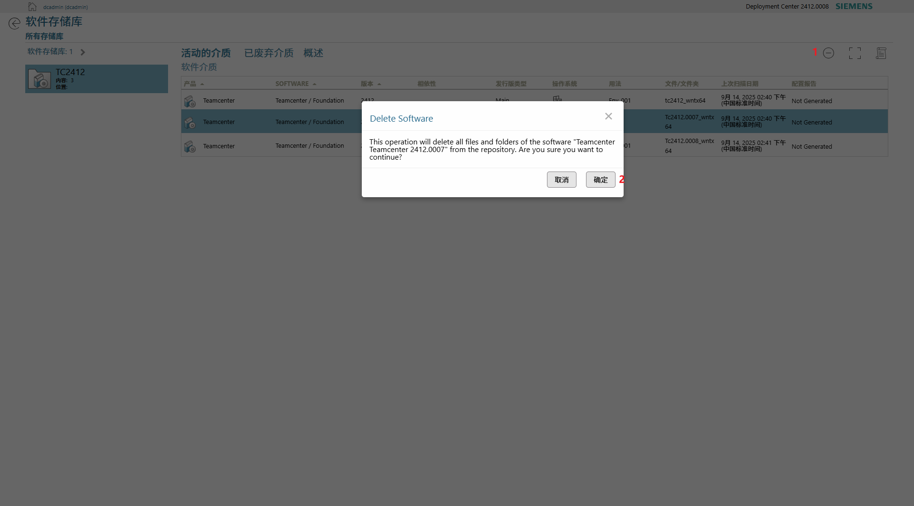

最后在已废弃的介质中移除

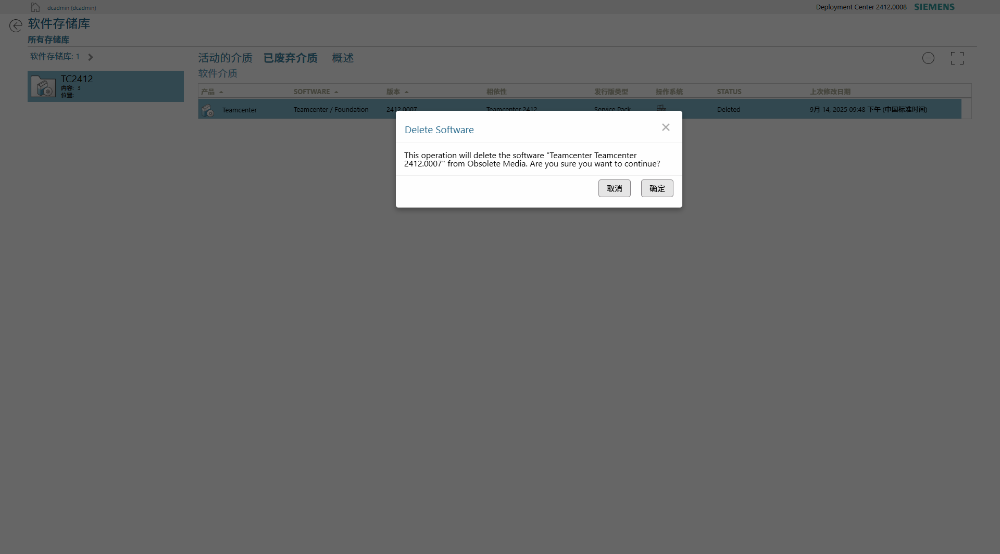

