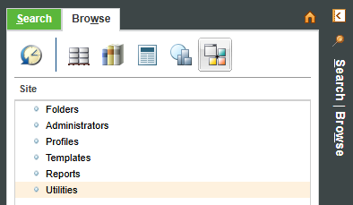
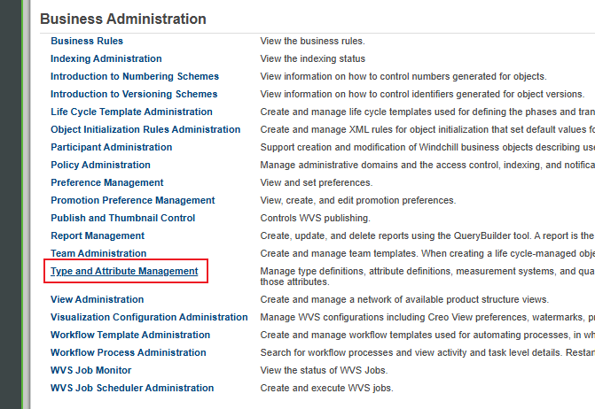
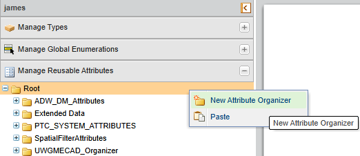
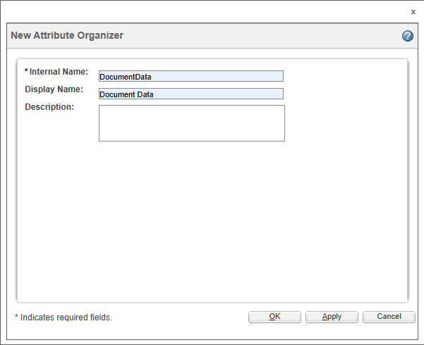
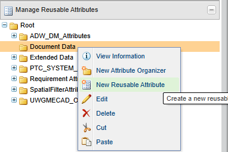
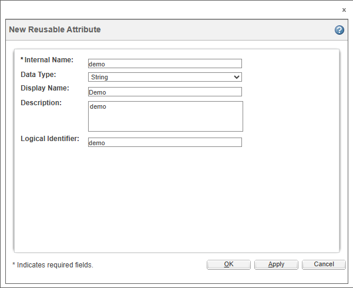
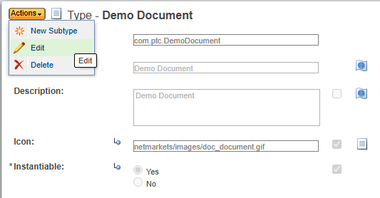
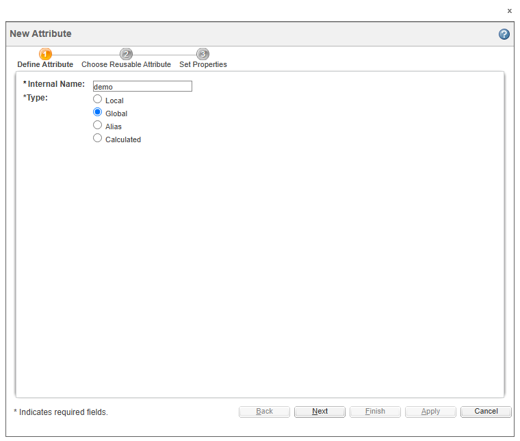
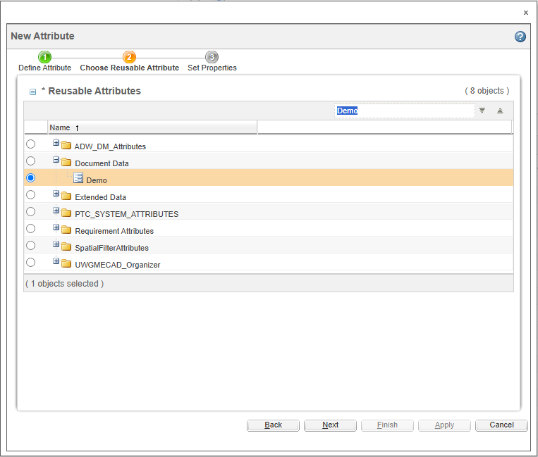
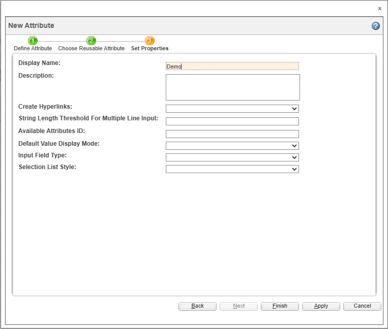

## 1 New Attribute Organizer

Open Navigator -> Browse -> Site -> Utilities

Find **Type and Attribute Management**

In the left panel, expand **Manage Reusable Attributes** and select Root, then right-click **New Attribute Organizer**

Enter the following information for the attribute organizer:

- **Internal Name**—(Required) The internal name for the attribute organizer. The internal name for an attribute organizer must be unique from the internal name of its sibling organizers. Only alphanumeric characters, underscores ( _ ), and periods ( . ) can be used in the **Internal Name**. The **Internal Name** field can be no more than 200 characters long.

  Windchill provides a suggested prefix for the internal name. The suggested prefix is the reverse internet domain for the organization owning the context, based on the context from which the **Type and Attribute Management** utility was launched. For example, for an organization with the internet domain, acme.com, the suggested prefix is com.acme.

- **Display Name**—(Optional) The name for the attribute organizer as it displays in the navigation pane tree structure. If the display name is not specified, the **Internal Name** is used as the display name.

- **Description**—(Optional) A description of the attribute organizer.

Click **OK** to create the attribute organizer. The organizer is created as a child of the organizer from which the **New Attribute Organizer** action was launched.

When the attribute organizer is created, the information page for the attribute organizer displays in [edit mode](https://support.ptc.com/help/windchill/cloud/r12.0.2.0/en/Windchill_Help_Center/TypeMgrViewEditMode.html#wwID0EF2YS). Clicking **Cancel** to exit edit mode does not undo the creation of the attribute organizer. To remove an attribute organizer, use the [**Delete** action](https://support.ptc.com/help/windchill/cloud/r12.0.2.0/en/Windchill_Help_Center/TypeMgrReusableAttrMgrOrgDelete.html#wwID0ECVJU).

Click **Apply** to create the attribute organizer, and refresh the **New Attribute Organizer** window to create another attribute organizer.

## 2 New Reusable Attribute

Select organizer created just now, then right-click **New Reusable Attribute**

Enter the following information for the reusable attribute:

- **Internal Name**—(Required) The internal name for the reusable attribute. Only alphanumeric characters, underscores ( _ ), and periods ( . ) are allowed in the **Internal Name**. The **Internal Name** field can be no more than 200 characters long. The internal name for a reusable attribute must be unique within the system.

  Windchill provides a suggested prefix for the internal name. The suggested prefix is the reverse internet domain for the organization owning the context, based on the context from which the **Type and Attribute Management** utility was launched. For example, for an organization with the internet domain, acme.com, the suggested prefix is com.acme.

- **Data Type**—(Required) The data type determines the values that the attribute can contain when a global attribute referencing this reusable attribute is added to a type. For more information, see [Supported Data Types](https://support.ptc.com/help/windchill/cloud/r12.0.2.0/en/Windchill_Help_Center/TypeMgrDataTypesRef.html#wwID0EVI6S).

  As only organizations are supported as a reference class for reusable attributes, **Organization Reference** is offered as the reference data type.

- **Display Name**—(Optional)The name for the reusable attribute as it displays in the navigation pane tree structure. If the display name is not specified, the **Internal Name** value is used as the display name.

- **Logical Identifier**—(Optional) A name to identify the attribute in external configuration and property files. It is often the same as the **Internal Name** and must be unique across all attributes in the system. Only letters, numbers, underscores ( _ ), and periods ( . ) are allowed in the **Logical Identifier**.

- **Description**—(Optional) A description of the reusable attribute. If a description is not entered, the **Internal Name** value is used as the description.

Click **OK** to create the reusable attribute. The information page for the reusable attribute displays in edit mode.

Click **Apply** to create the reusable attribute, and refresh the **New Reusable Attribute** window to create another reusable attribute.

When the reusable attribute is created, the information page for the reusable attribute displays in [edit mode](https://support.ptc.com/help/windchill/cloud/r12.0.2.0/en/Windchill_Help_Center/TypeMgrViewEditMode.html#wwID0EF2YS). Clicking **Cancel** to exit edit mode does not undo the creation of the reusable attribute . To remove a reusable attribute , use the [**Delete** action](https://support.ptc.com/help/windchill/cloud/r12.0.2.0/en/Windchill_Help_Center/TypeMgrReusableAttrMgrAttrDelete.html#wwID0EJHLU).

## 3 Create an Attribute

In the left pane, expand **Manage Types**, select a type.

In the type information page, from the **Actions** menu, select **Edit**.

In the **Attributes** tab, click  Create a new attribute.

In the **New Attribute** dialog box, create a new String attribute with the internal name as demo and type as **Global**. Click **Next**.

In the **Reusable Attributes** table, search for **Demo**, select it and click **Next**.

Change the display name to Demo and click **Finish**.

