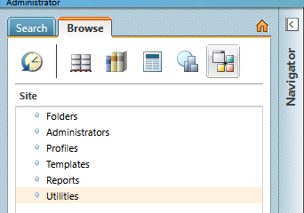
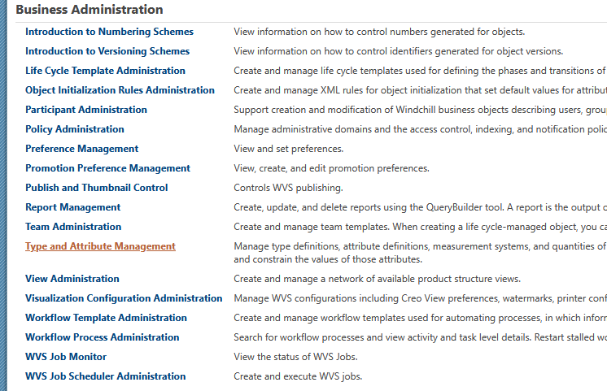
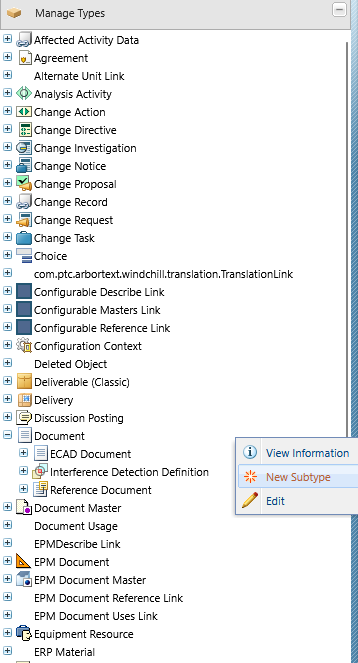
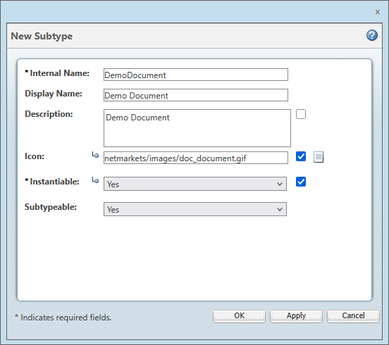
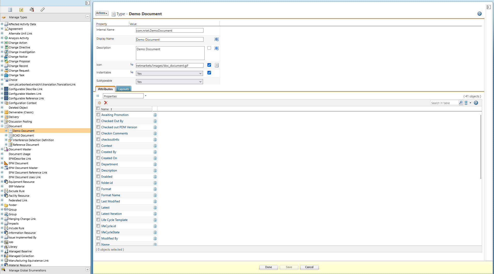

New subtypes of certain existing types can be created in order to meet your business needs. If the type is not subtypeable, the **New Subtype** action will not be available for that type or an error will be displayed when creating that type. Only site and organization administrators can create subtypes.

A subtype is created in the context from which the **Type and Attribute Management** utility was launched.

## 1 Open Utilities

Open Navigator -> Site -> Utilities

## 2 Find Type and Attribute Management

Find **Type and Attribute Management**

## 3 Create a New Subtype

In the left panel, expand **Manage Types**, select a parent type, then right-click New Subtype:

## 4 Fields

Enter information in each field as appropriate:

| Field         | Description                                                  |
| :------------ | ------------------------------------------------------------ |
| Internal Name | The unique name for the subtype. The reverse internet domain name for the owning organization is automatically pre-appended to the name you enter. This is a required field. |
| Display Name  | The name that is displayed in the user interface to represent the new type. If you do not provide a display name, the internal name is used. |
| Description   | Description of the new type. This value can be inherited from the parent type. |
| Icon          | The full file path, relative to codebase, of the icon image to represent the new type. Images to be used for icons must be located in a directory under codebase/com, for example codebase/com/mycompany/images. The value entered for the **Icon** property would then be com/mycompany/images/myicon.png. The path can have a maximum of 200 characters. This value can be inherited from the parent type. |
| Instantiable  | If **Yes**, a user can create an instance of the type. The type appears in the list of available types when creating an object such as a part or document. If **No**, then no instances of this type can be created. This value can be inherited from the parent type. This is a required field. If a type is not instantiable, you cannot use this type for creating an instance from the UI. However, you can still create an instance through other means (for example, by importing an object, or by using the supported APIs). |
| Subtypeable   | If **Yes**, then subtypes can be created for this type. If **No**, then subtypes cannot be created for this type. The TypeManaged types do not support **Subtypeable** property. If you try to edit the **Subtypeable** property of TypeManaged types, an error message appears on the screen. |

## 5 Finish

Click **OK**.

The type is created and available for use in the system. The information page for the new type displays in the **Manage Types** window, in edit mode.

You can edit the new type’s properties and attributes as needed. Click **Done** to save the changes and return to view mode, or click **Save** to save the changes but remain in edit mode.
