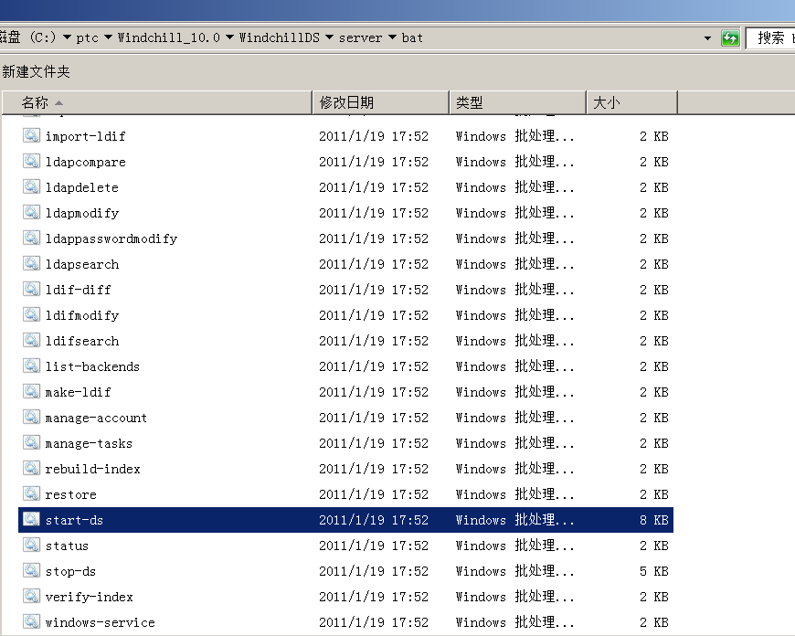
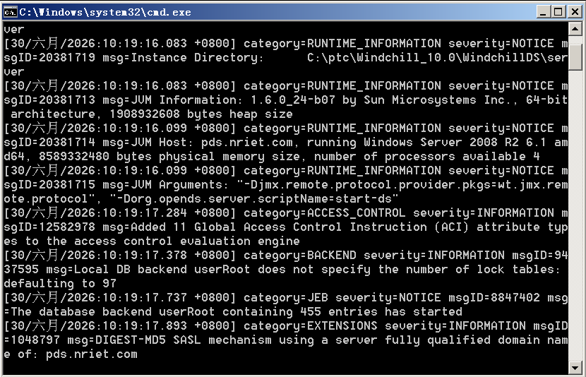
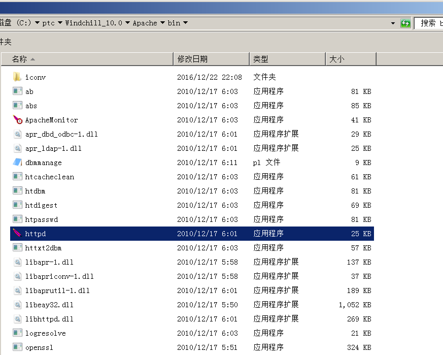
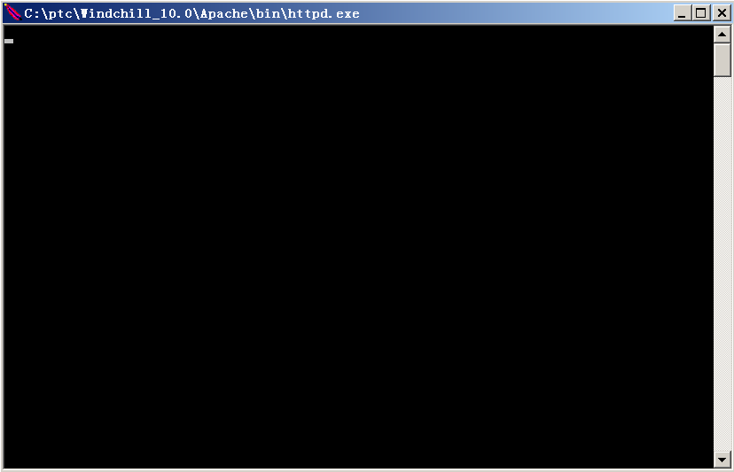
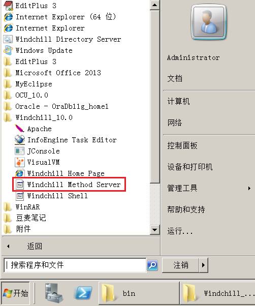
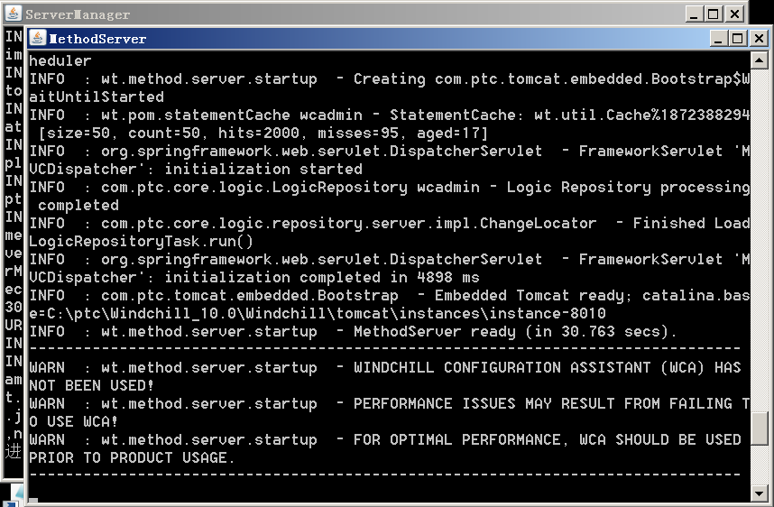
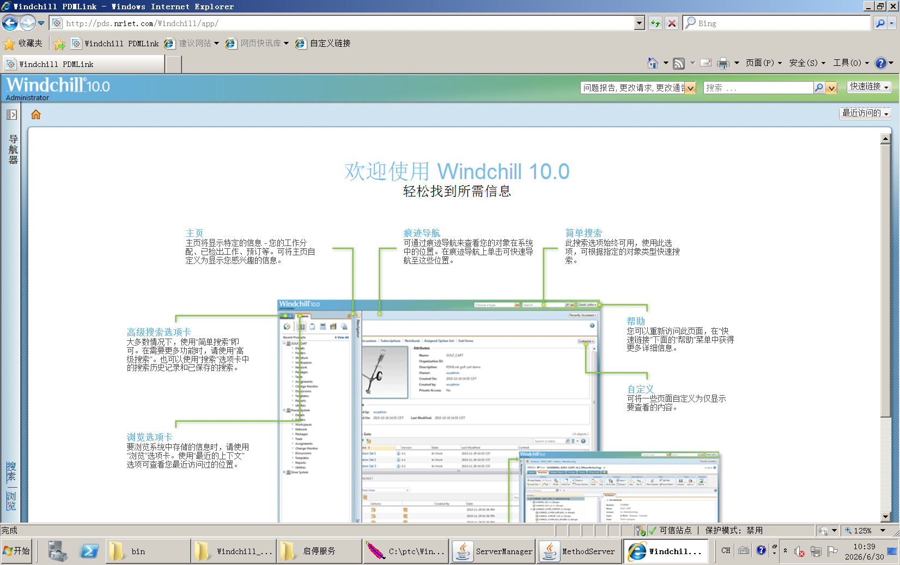

## 1 Starting DS

Enter the WindchillDS\sever\bat directory, run start-ds.bat

You’ll see some outputs that then shut down automatically, whitch is normal.

## 2 Starting the HTTP Server

Enter the {httpserver}\bin directory, run httpd.exe

No output is displayed after it is started.

## 3 Starting the Windchill Method Server

Open the Start menu, all programs, and in the Windchill directory, you can find Windchill Method Server, click and run.

It will start two Java processes, ServerManager and MethodServer, and wait for **MethodServer ready** to appear, indicating successful startup.

## 4 Testing

Open web browser, enter {Domain name}/Windchill/app

Maybe these can be configured as automatically satrting service.
