## 禁用 IPv6

Win + R 打开注册表 regedit

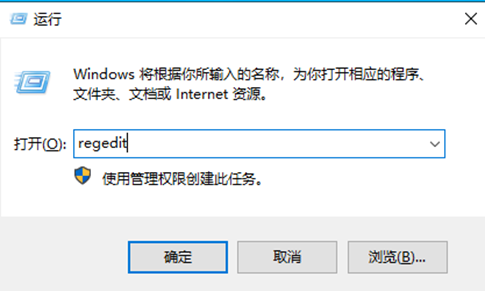

访问：计算机\HKEY_LOCAL_MACHINE\SYSTEM\CurrentControlSet\Services\Tcpip6\Parameters

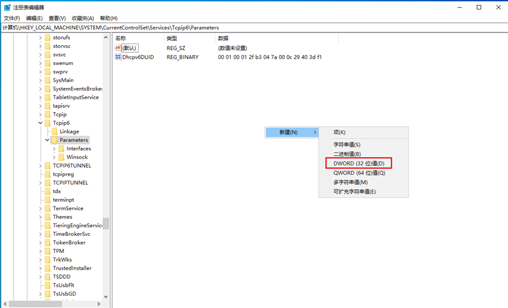

名称为：DisabledComponents

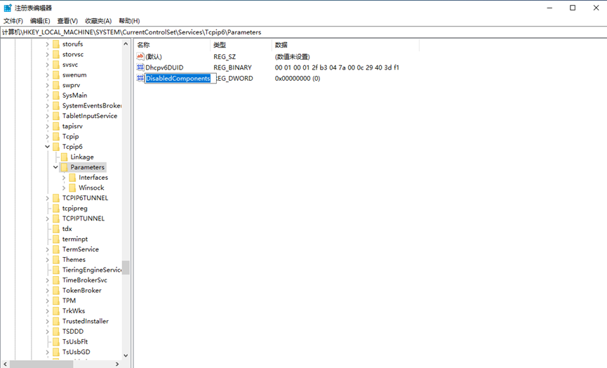

双击修改，设置值为：ffffffff

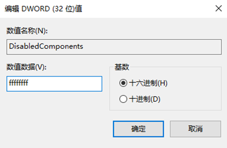

重启后生效

## 限制 DEP

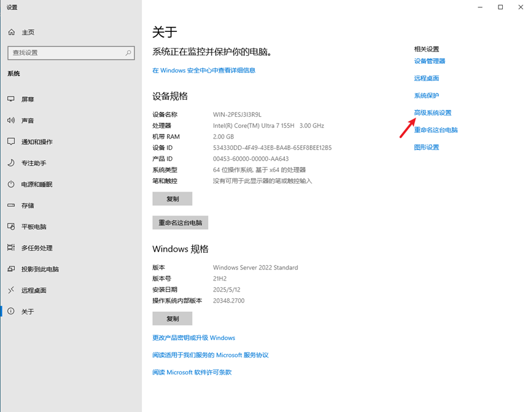

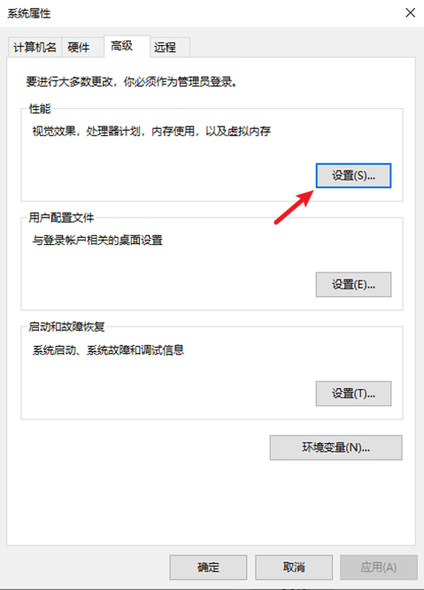

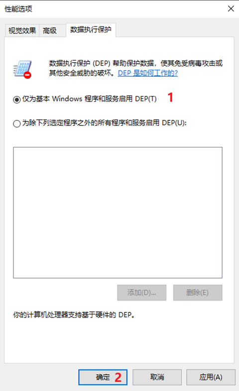

## 禁用防火墙

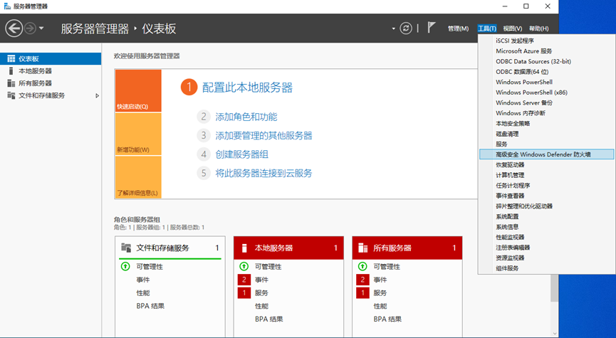

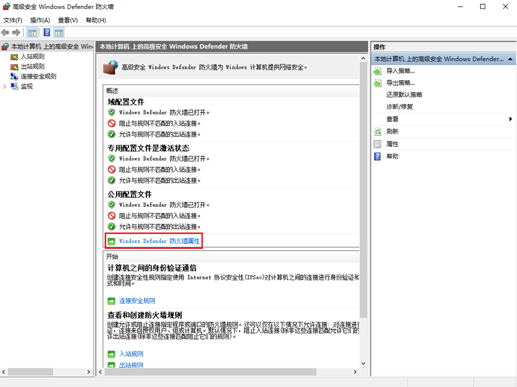

将域配置文件、专用配置文件、公用配置文件的防火墙状态都设置为关闭

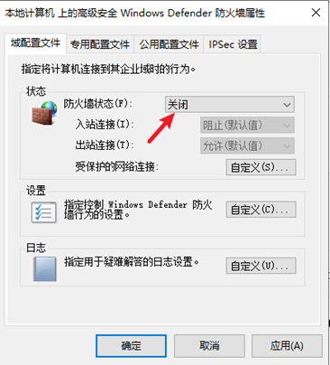

## 禁用实时保护

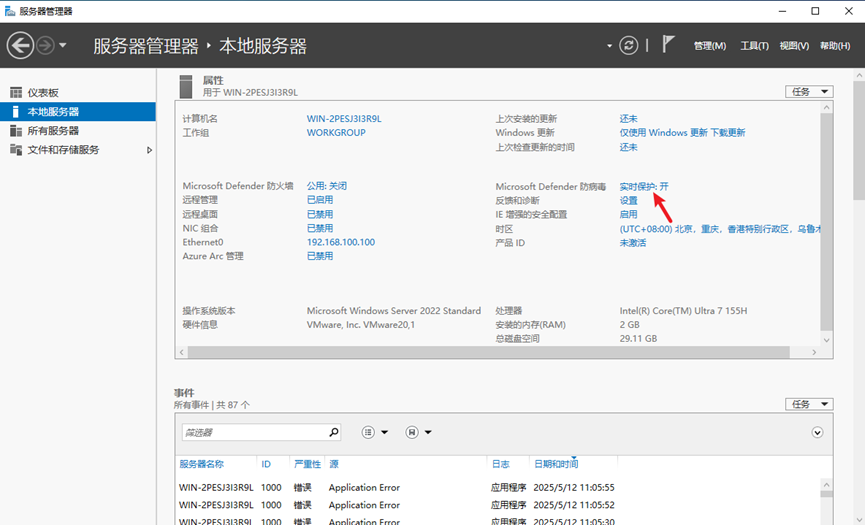

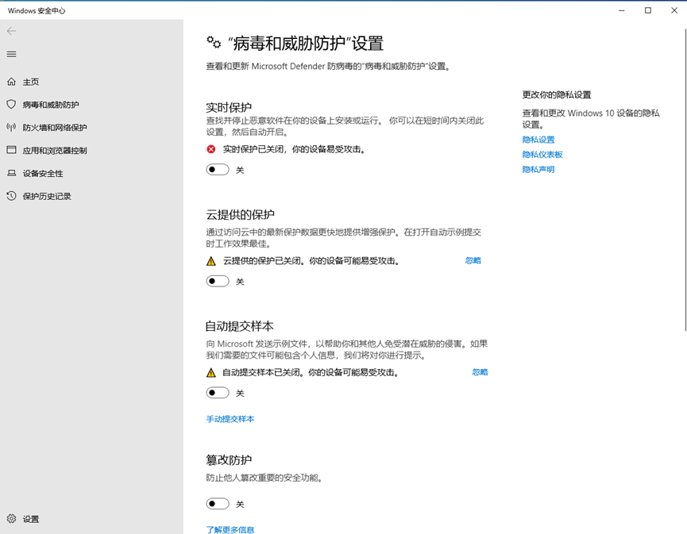

## 禁用IE的增强安全设置

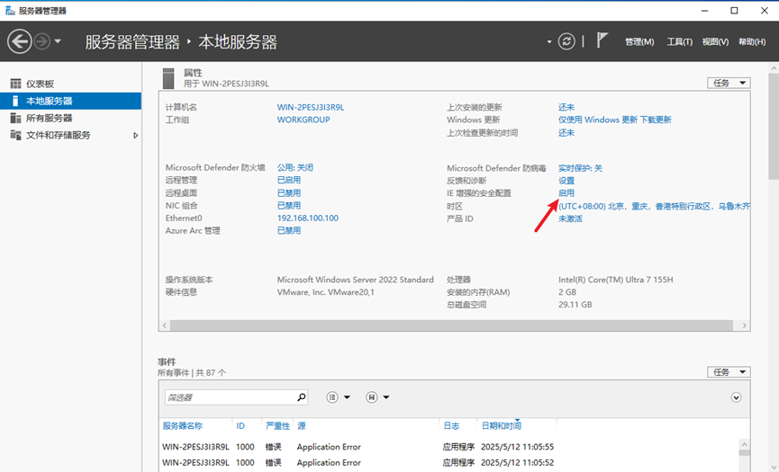

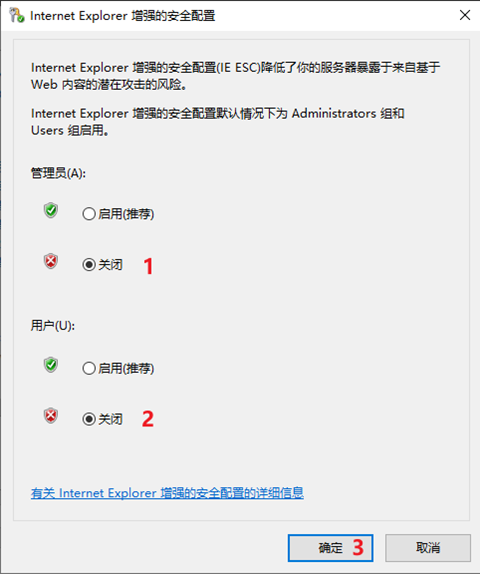

## 更改用户账户控制设置

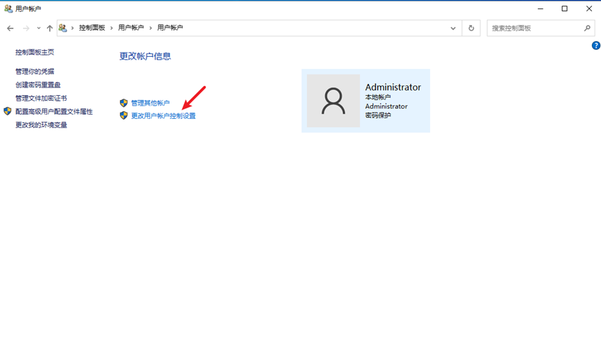

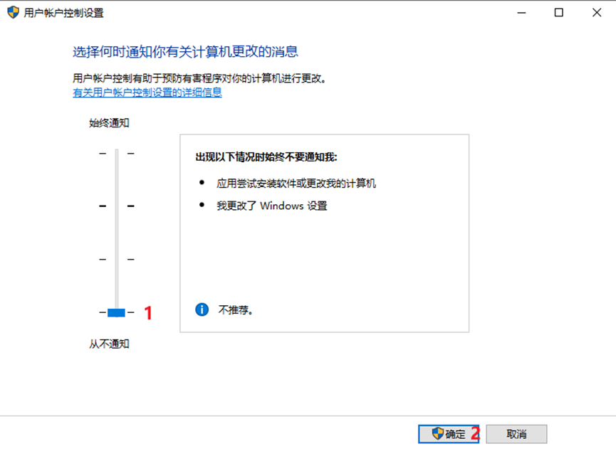

## 电源选项

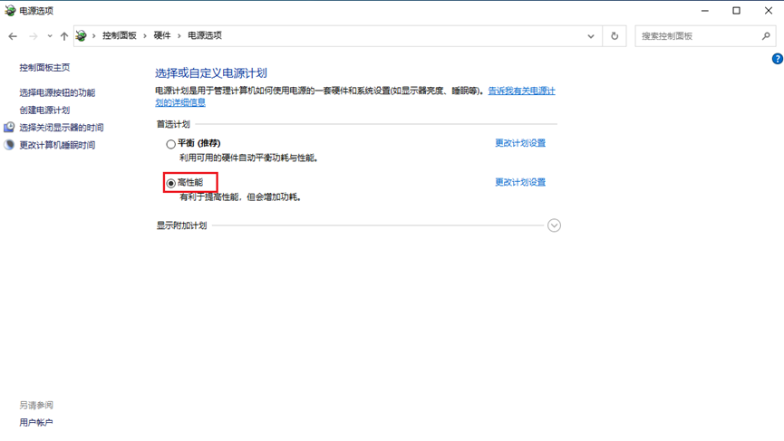

## 关闭 cmd 的快速编辑模式

打开 cmd，邮件窗口，打开属性

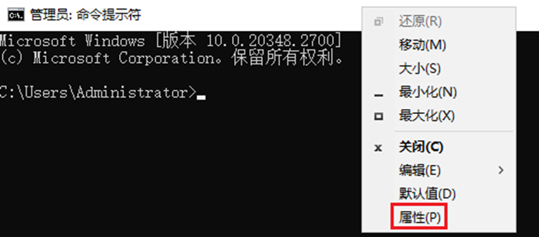

